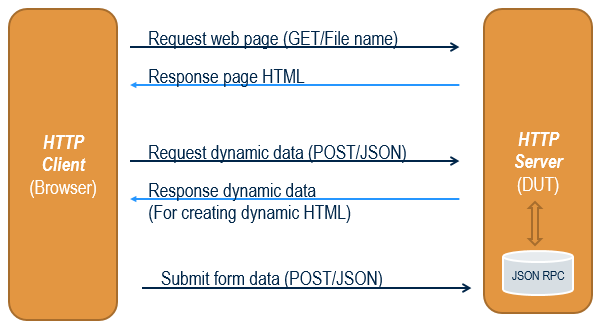
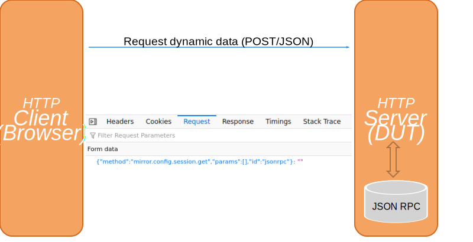
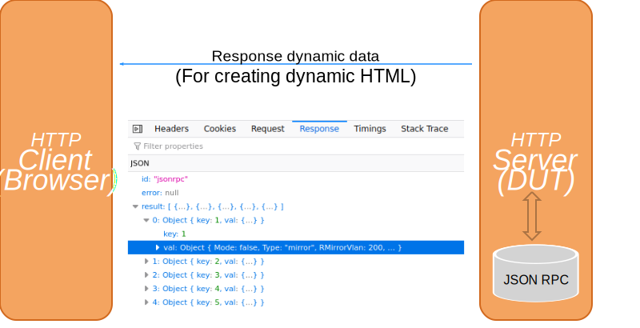
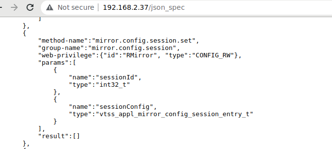
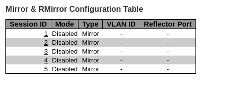
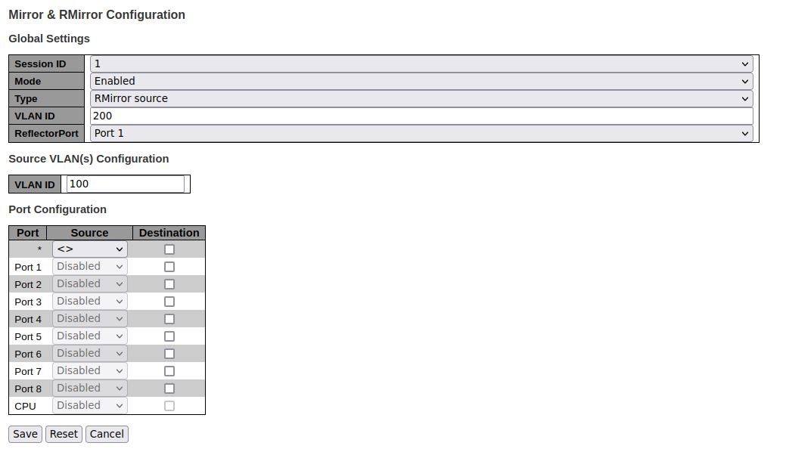

:sectnums:
:toc: left
:source-highlighter: pygments
:pygments-style: manni
:pygments-linenums-mode: inline
:sectnumlevels: 5
:toclevels: 5

= AN1256 - Web Programmers Guide via JSON
Peter Chen

== Introduction

JSON (JavaScript Object Notation) is an open-standard file format that uses
human-readable text for data exchanging. It is a common data format used for
asynchronous browser/server communication.

For the new web page design, JSON format can be a replacement for the original
AJAX style. Compare to AJAX, using JSON makes the Web implementation easier and
simpler. The developer only need to focus on web page design and the Web handler
implementation can be omitted since JSON access method is already supported in
each WebStaX software modules.

This document states the programmers guide for the software engineer who need
to develop the Web page via JSON. The detail procedures and examples also
included in the following sections.

== JSON data access flow

=== Overview
Here's the JSON data access flow which a HTTP connection is initiated from the
client(browser). The HTML table is created dynamically according to the received
JOSN data from the server(DUT) side.

.The access flow between client and server

=== Request/Response JSON data

The JSON request packet is based on HTTP request post method and the content
have to follow the MSCC JSON format.

* Request JSON syntax:
{"method":"<json_method_name>","params":[<json_parameters>], "id:"jsonrpc"}
* Response JSON syntax:
{"error":<error_message>,"result":<json_result>, "id:"jsonrpc"}

The following snapshots show the JSON content between the browser and
DUT.

.Snapshot of HTTP request from client

.Snapshot of HTTP response from server

=== MSCC JSON specification
To get the full JSON information including the method, parameter, description
and etc. Type "http://<target_ip>/json_spec" on your browser address bar. There is another access method via JSON method name "jsonRpc.status.introspection.specific.inventory.get", it is used for a specific method.

.Snapshot of JSON specification web page

== Web framework
The Web framework in WebStaX software is based on an open source MooTools. It is
a collection of JavaScript utilities with MIT license.
(http://mootools.net/license.txt)
The menu bar and most of web pages are based on the framework. Both AJAX and
JSON algorithm are already integrated in its utilities.

Besides, WebStaX software provides the other utilities which are useful for the
JSON web page design.

* json.js - Use for to transmit/receive the dynamic data with JSON syntax.
* dynforms.js - Use for create the HTML table dynamically.
* validate.js - Use for the validation of HTML form.

The full JavaScript libraries are located under the source tree
directory: webstax2\vtss_appl\web\html\lib.

== Guideline for JSON Web page design
This section guides how to design a web page based on MSCC JavaScript libraries.
We use the Mirror global configured web page as the example here. The asynchronous
communication are based on HTTP JSON access method and all global configured
parameters are listed in one dynamic HTML table.

The web page layout is listed below and the full source code is located under
the source tree directory:
webstax2\vtss_appl\mirror\html\mirror_ctrl.htm.
To get more typical web pages reference, see the appendix section.

.Example of global configured table

=== Edit Web page

==== HTML header
Include the JS libraries that needed in the HTML <head> tag.

[source,html,linenums]
----
<head>
  
  
  
  
</head>
----

==== Initialize the dynamic table resource
* When the HTML document is ready, call DynamicTable() to initialize the dynamic
table resource.
* The DynamicTable() is used to create the dynamic table after received the JSON
data.
* It will then call requestUpdate to initiate the JSON command flow.

[source,html,linenums]
----
window.addEvent('domready', function() {
    // Create a form with table body for receive/transmit JSON data
    myDynamicTable = new DynamicTable("myTableContent", "config", "plusRowCtrlBar");

    requestUpdate();
});
----

==== Request/Response JSON data
* When the HTML document is ready, use requestJsonDoc() to send the JSON request
"mirror.config.session.get" to get information about the configured sessions.
* After the JSON data for "mirror.capabilities.get" is received, the callback function
requestUpdate() will be processed. The function requestUpdate will then call
"mirror.config.session.get" to get the current configuration. When the current configuration
is received, the function processUpdate is called to build the table to be shown.

[source,html,linenums]
----
function requestUpdate()
{
    // Restore table content
    myDynamicTable.restore();

    // This table two JSON data.
    requestJsonDoc("mirror.config.session.get", null, processUpdate, "config");
}
----

==== Process the received JSON data
* The function processUpdate() is used to layout the dynamic table after
received the JSON data.
* The addRows() is used to add table rows.
myDynamicTable.update() layout the HTML table according the
data in table rows.

[source,html,linenums]
----
function processUpdate(recv_json, name)
{
    // Ignore the process if no data is received
    if (!recv_json) {
        alert("Get dynamic data failed.");
        return;
    }

    // Save the received JSON data
    myDynamicTable.saveRecvJson("config", recv_json);

    // Add table rows
    var table_rows = addRows(recv_json);
    myDynamicTable.addRows(table_rows);

    // Update this dynamic table
    myDynamicTable.update();

    // Refresh timer
    var autorefresh = document.getElementById("autorefresh");
    if (autorefresh && autorefresh.checked) {
        if (timerID) {
            clearTimeout(timerID);
        }
        timerID = setTimeout('requestUpdate()', settingsRefreshInterval());
    }
}

----

==== Add table rows
* In the addRows() function, we use the JSON format to fill each global
configured parameter in the table row.
* All HTML fields are listed in the JSON array ("table_rows") and the syntax of
table field is below.
+
Syntax:
+
table_rows:[<row_0>, <row_1>, ...<row_n>]
+
<row_n>: {<field_0>, <field_1>, ...<field_n>}
+
<field_n>: {"type":<type>, "params":[<params_0>, <params_1>, ..., <params_n>]}

* In this case, each row has five fields: "Session ID", "Mode", "Type", "VLAN ID" and "Reflector Port"
For example,

[cols="2*"]
|====
| *Session ID* (Name field: int32_t)
| *1* (Id of the mirror session)
| *Mode* (Name field: vtss_bool_t)
| *true* (Meaning the mirror session is enabled)
| *Type* (Name field: enumeration {mirror, rMirrorSource, rMirrorDestination}
| *RMirror Source* (this is the source of a remote mirror session
| *VLAN ID* (Name field: uint16_t)
| *200* (the vlan used for mirroring)
| *Reflector Port* (Name field: vtss_ifindex_t)
| *Gi 1/1* (The port to which the mirrored traffic is sent
|====

* The myDynamicTable.addRows() will convert the JSON data to HTML format and
output the HTML table.

[source,html,linenums]
----
function addRow(key, val)
{
    var none_map_val = 0xFFFFFFFF, none_map_text = "None", none_interface_text = "NONE";
    var tunnel_mode_suffix = val.TunnelMode == "useglobal" ? " (" + oTTunnelMode[oVTunnelMode.indexOf(global_conf.tunnelMode)] + ")" : "";

    var row = {fields:[
                {type:"link",   params:["cr", "mirror.htm?session_id=" + key, key]},

                {type:"text",  params:[oTMode[oVMode.indexOf(val.Mode)], "c"]},
                {type:"text",  params:[oTType[oVType.indexOf(val.Type)], "c"]},
                {type:"text", params:[val.Type == "mirror" ? "-": val.RMirrorVlan, "c"]},
                {type:"text",  params:[val.Type == "rMirrorSource" ? val.ReflectorPort : "-" , "c"]}
              ]};

    return row;
}

function addRows(recv_json)
{
    var row, empty_colspan = 7;
    var table_rows = new Array();

    // Add table header
    addHeader(table_rows);

    // Add single row
    Object.each(recv_json, function(record) {
        table_rows.push(addRow(record.key, record.val));
    });

    return table_rows;
}
----

=== Web help page
For the web help page design, the help description can refer to the JSON
specification, that the description text can consistent with JSON output and
helps to reduce the redundant descriptions. Example here is taken from dhcp6 relay configuration.

==== Hyper-link in the source file
Assign the help file location in its source file HTML <head> tag. The fixed
variable name "help_page" is used for the web help page assignment.

[source,html,linenums]
----
<head>
// Help page magic
var help_page = "/help/help_xxx.htm";
</head>
----

==== Update HTML field description from JSON specification
* Use 
 or <dl> HTML tag to declare the HTML table description and given a
unique ID for the tag.
* When the HTML document is ready, call loadXMLDoc() to get the
whole JSON specification or get the specific method description by JSON method
name "jsonRpc.status.introspection.specific.inventory.get".
* The processTableDesc() is used to update the table description and
processUpdate() is used to update the table parameter description.
* In processUpdate(), call updateTableParamsDesc() to update the JSON elements
which are matched the specific element names.
* Update the 
 or <dl> tag inner HTML according to the element description.

[source,html,linenums]
----

<body>
  

  <dl id="TableParamsDesc"></dl>
</body>
----

=== Hyper-link in menu bar
* The HTML source code of menu bar is generated from file
webstax2\vtss_appl\web\menu_default.cxx.
* Edit the items in this file for the Web page hyper-link.

[source,c,linenums]
----
#if defined(VTSS_SW_OPTION_DHCP6_RELAY)
    ITEM("  Relay,dhcp6_relay.htm");
#endif //VTSS_SW_OPTION_DHCP6_RELAY
----

[NOTE]
====
Notice that the number of space character in ITEM(""), which is used to decide
the group level in the menu bar. In this case, all web pages are under the
"DHCPv6" group.
====

.Example of global configured table

== Appendix

=== Typical web pages
There are several typical web pages can be used for the reference design. One additional
example to be show here is the configuration of a single mirror session found in
vtss_appl\mirror\html\mirror.htm.

The web page provides the detailed configuration for a single mirror session. All configured
parameters are listed.

* Click "Save" button to apply the current configuration.
* Click "Reset" button to reset the current configuration.
* Click "Cancel" to return to the overview of mirror sessions

.Example of detailed configuration of mirror session

The buttons "Save", "Reset" and "Cancel" are added by the html code:
[source,c,linenums]
----
<input type="button" value="Save" onclick="submitForms();">
<input type="button" value="Reset" onclick="resetForms();">
<input type="button" value="Cancel" onclick="clickCancel();">
----

==== JSON Command flow

This page requires a two step command flow:

* First it needs to get the capabilities of the device with the method "mirror.capabilities.get". The
capabilities do not change and do only have to be read once.

* Then it needs to get the current configuration of the device using the methods "mirror.config.session.get", 
"port.status.get" and in case of stacking "topo.config.stacking.get".

The call of "mirror.capabilities.get" is initiated by the "domready" event and
the result is configured to be handled by the function requestUpdate.

The requestUpdate will initiate the call of "mirror.config.session.get", 
"port.status.get" and in case of stacking "topo.config.stacking.get" and the results
of the these calls are configured to be handled by the function prepareUpdate.

The function prepareUpdate will collect all results, and only when the have all been received will it
call the function processUpdate that will construct the tables to be shown on the web.

== References
. Wikipedia JavaScript https://en.wikipedia.org/wiki/JavaScript
. JSON https://www.json.org/
. MoonTools https://mootools.net/
