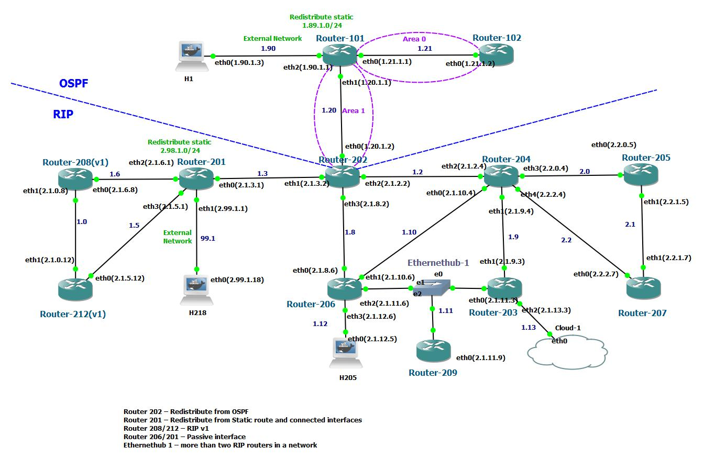

:sectnums:
:toc: left
:source-highlighter: pygments
:pygments-linenums-mode: inline
:sectnumlevels: 5
:toclevels: 5

= RIPv2 Configuration Guide

This document states the requirement specification for FRR RIP software module
in WebStaX.

== Introduction
The Routing Information Protocol (RIP) is a well-known routing protocol for
managing router information. It is classified by the Internet Engineering Task
Force (IETF) as one of several interior gateway protocols (IGP).

RIP is a simple vector routing protocol, the routers exchange network
information with their neighbors and communicate to each other with a set of
destinations which can be reached. RIP uses the hop count as a routing metric
and the lowest metric among its routing table is used as the next hop for the
traffic forwarding.

Hops are used to consider the routers along the packet path from its source to
a destination. In RIP, the hop count increases by one (default) when the
packet go through a router. RIP limits the maximum number of hops (15) to
prevent routing loops. If the number of hops is 16, the destination is
considered unreachable.

FRR is an open-source IP routing protocol suite for Linux and Unix platforms
which is a fork of the open-source Quagga router which supports a variety of
routing protocol daemons including BGP, IS-IS, LDP, OSPF, PIM, and RIP.

The FRR software module provides RIPv2 support in WebStaX by integrating the
open-source router Quagga/FRR.

== ICLI commands and examples
This section lists the ICLI commands and examples for the FRR RIP software
module.

=== Enable/Disable RIP process

Use the 'router rip' command in global configuration mode to enable the RIP
routing process. Use the no form to disable the RIP routing process.

Syntax::
* router rip
* no router rip

Default::
No RIP routing process is enabled.

Examples::
* This example shows how to enable the RIP routing process.
+
# configure terminal
+
(config)# router rip

* This example shows how to disable the RIP routing process.
+
# configure terminal
+
(config)# no router rip

=== RIP network
Use the 'network' command in RIP router mode to specify a number of networks
that participates in the RIP process. Multiple 'network' commands can be
applied on the router.
Use the no form to remove the entry.
Use the 'show ip rip' command to verify the current settings.

Syntax::
* network <ipv4_addr> [<wildcard_mask>]
* no network <ipv4_addr> [<wildcard_mask>]

Parameters::
* <ipv4_addr> [<wildcard_mask>]: This parameter pair specifies an
address range which allows user to define one or multiple networks that
participates in the RIP process.
Notice that the wildcard mask value will be used to specify the network mask
length, so there is a limitation on the input format as follows: The
'don't care' (value 1) bits must be sequential and the 'match' (value 0) bits
MUST always be to the left. For example, 0.0.0.255 means that the network mask
length is 8. If the wildcard mask is not specified, it uses uses the networks
classful subnet mask.

Default::
No network is specified.

Examples::
* This example shows how to specify that the networks 192.168.7.0/24 and
10.9.0.0/16 must participate in the RIP process.
+
# configure terminal
+
(config)# router rip
+
(router-config)# network 192.168.7.0 0.0.0.255
+
(router-config)# network 10.9.0.0 0.0.255.255

* This example shows how to remove the network entry 10.9.0.0/16 from the RIP
process.
+
# configure terminal
+
(config)# router rip
+
(router-config)# no network 10.9.0.0 0.0.255.255

=== Neighbor connection
Use the 'neighbor' command in router configuration mode to add the neighbor
connection. Use the no form to delete the neighbor connection.

Syntax::
* neighbor <ipv4_addr>
* no neighbor <ipv4_addr>

Parameters::
* <ipv4_addr>: The neighbor address. This also accepts the broadcast and network
address.

Default::
No neighbor connection is configured.

Examples::
* This example shows how to add a neighbor connection to 2.2.1.7.
+
# configure terminal
+
(config)# router rip
+
(router-config)# neighbor 2.2.1.7

* This example shows how to remove a neighbor connection to 192.168.1.17.
+
# configure terminal
+
(config)# router rip
+
(router-config)# no neighbor 192.168.1.17

=== RIP version support
==== Global RIP version
Use the 'version' command in router configuration mode to specify the RIP
version support. The global setting can be overridden by the interface setting.
Use the no form to restore to the default setting.
Use the 'show ip rip' command to verify the current setting.

Syntax::
* version {1|2}
* no version

Parameters::
* {1|2}: Receive/Send the specific RIP version only.

Default::
No RIP version is specified. By default, the router sends RIPv2 and accepts
both RIPv1 and RIPv2. When the router receive either version of REQUESTS or
triggered updates packets, it replies with the appropriate version.

Usage Guidelines::
Be aware that the RIP network class configuration when RIPv1 is involved in the
topology. RIPv1 uses classful routing, the subnet information is not included in
the routing updates.
+
The limitation makes it impossible to have different-sized subnets inside of
the same network class. In other words, all subnets in a network class must have
the same size.

Examples::
* This example shows how to configure the router to handle the RIPv2 packets
only.
+
# configure terminal
+
(config)# router rip
+
(router-config)# version 2

* This example shows how to change specific RIP version back to default value.
+
# configure terminal
+
(config)# router rip
+
(router-config)# no version

==== Interface RIP version
Use the 'ip rip receive version' and 'ip rip send version' command in interface
configuration mode to specify the RIP version for the advertisement reception or
transmission. The interface setting can override the global RIP version setting.
Use the no form to remove the setting, that means the acceptable version is
based on the global setting.
Use the 'show ip rip' command to verify the current setting.

Syntax::
* ip rip receive version {1 [2]|2 [1]|none}
* no ip rip receive version
* ip rip send version {1 [2]|2 [1]}
* no ip rip send version

Parameters::
* {1 [2]|2 [1]|none}: The RIP version for the advertisement reception on
the interface.
* {1 [2]|2 [1]}: The RIP version for the advertisement transmission on
the interface.

Default::
No RIP version is specified. The acceptable version is based on the global
setting.

Examples::
* This example shows how to configure interface VLAN 5 to send/receive RIPv1
packets only.
+
# configure terminal
+
(config)# interface vlan 5
+
(config-if-vlan)# ip rip send version 1
+
(config-if-vlan)# ip rip receive version 1

=== RIP authentication
Use the 'ip rip authentication' command in VLAN interface configuration mode
to configure the authentication. Use the no form to remove the setting.

Syntax::
* ip rip authentication { mode { text|md5 } | key-chain <word1-31> | string { unencrypted <word1-15> | encrypted <word128> } }
* no ip rip authentication { mode  | key-chain | string }

Parameters::
* mode: Specify the authentication type.
* text: Use simple password authentication.
* md5: Use MD5 authentication.
* key-chain: Specify the key chain name used by MD5 authentication.
* <word1-31>: The key chain identifier name.
* string: Plain text key used by simple password authentication.
* encrypted: The input format is a encrypted text.
* <word1-15>: Plain text key.
* encrypted: The input format is an encryption of the key.
* <word128>: The encryption of the key.

Default::
Null authentication. Authentication is disabled.

[NOTE]
====
The key chain is used in MD5 authentication and string configuration is used
in simple password authentication. The key chain configuration can not be
coexistent with the plain text key configuration.
====

=== RIP passive interface
Use the 'passive-interface vlan' command in router configuration mode to
suppress RIP updates on a specific interface.
Use the 'passive-interface default' command in router configuration mode to
set all VLAN interfaces as passive-interface by default.
Use the no form to remove the setting.

Syntax::
* passive-interface { default | vlan <vid_list> }
* no passive-interface { default | vlan <vid_list> }

Parameters::
* <vid_list>: List of VLAN interface numbers. It can be a single VLAN ID or a
combinative list e.g. 1,3,5-8.

Default::
No passive-interface is configured.

Examples::
* This example shows how to set all VLAN interfaces as passive-interface by
default except for VLAN 1.
+
# configure terminal
+
(config)# router rip
+
(config-router)# passive-interface default
+
(config-router)# no passive-interface vlan 1

* This example shows how to set passive-interface on interface VLAN 1 when the
passive-interface default mode is not set.
+
# configure terminal
+
(config)# router rip
+
(config-router)# passive-interface vlan 1

=== RIP timers
Use the 'timers basic' command in router configuration mode to set update timer,
invalid timer and garbage-collection timer. Use the no form to reset the
setting.

Syntax::
* timers basic <update_timer> <invalid_timer> <garbage_collection_timer>
* no timers basic

Parameters::
* <update_timer>: The update time in seconds is an integer value from 5 to
2147483.
* <invalid_timer>: The invalid time in seconds is an integer value from 5 to
2147483.
* <garbage_collection_timer>: The garbage-collection timer in seconds is an
integer value from 5 to 2147483.

Default::
The default update timer is 30 seconds, the invalid timer is 180 seconds and the
garbage-collection timer is 120 seconds.

NOTE: The invalid timer needs to greater than the update timer.

Examples::
* This example show how to set the update timer to 20 seconds, the invalid timer
to 120 seconds and the garbage collection timer to 80 seconds.
+
# configure terminal
+
(config)# router rip
+
(config-router)# timers basic 20 120 80

[TIP]
Use the 'show ip rip' command to verify the current settings.

=== RIP split horizon (with poison reverse)
Use the 'ip rip split-horizon' command in VLAN interface mode to enable split
horizon. Use the no form to disable the setting.

Syntax::
* ip rip split-horizon [ poisoned-reverse ]
* no ip rip split-horizon [ poisoned-reverse ]

Parameters::
* split-horizon: Enable split horizon
* poisoned-reverse: Enable split horizon with poisoned reverse.

Default::
Split horizon is enabled with poisoned-reverse disabled.

Examples::
* This example shows how to enable split horizon with poisoned reverse on
interface VLAN 100
+
# configure terminal
+
(config)# interface vlan 100
+
(config-if-vlan)# ip rip split-horizon poisoned-reverse

=== RIP redistribution
==== Protocol type redistribution
Use the 'redistribute' command in router configuration mode to set
the route redistribution to the RIP domain.
Use the no form to remove the setting.

Syntax::
* redistribute { static | connected | ospf } [ metric <1-16> ]
* no redistribute { static | connected | ospf }

Parameters::
* { static | connected | ospf }: The RIP redistributed route protocol type.
The 'static' argument is used to redistribute the static routes.
The 'connected' argument is used to redistribute the directly connected routes
with RIP not enabled.
The 'ospf' argument is used to redistribute the OSPF routes into the RIP
routing domain.
* metric <1-16>: The metric value for redistributed routes.

Default::
No route redistribution is configured.

Examples::
* This example shows how to set the metric value 8 for the static route
redistribution.
+
# configure terminal
+
(config)# router rip
+
(config-router)# redistribute static metric 8

* This example shows how to redistribute the OSPF routes into the RIP routing
domain. Use the 'show ip rip' command to check the redistributed result.
+
# configure terminal
+
(config)# router rip
+
(config-router)# redistribute ospf

==== RIP redistributed default metric
Use the 'default-metric' command in router configuration mode to set the
redistributed default metric value when the metric value isn't specified for
the redistributed protocol types.
Use the no form to restore to the default setting.
Use the 'show ip rip' command to verify the current setting.

Syntax::
* default-metric <1-16>
* no default-metric

Parameters::
* <1-16>: User specified default metric value for the RIP redistributed
protocol types.

Default::
The default metric value for the redistributed routes is set to 1.

Usage Guidelines::
The default metric configuration does not affect the connected routes even if
the connected protocol type has configured. In other words, a specific metric
value must be assigned for the connected protocol type, otherwise the connected
routes will always be incremented by one.

Examples::
* This example shows how to set the RIP redistributed default metric value to 2.
+
# configure terminal
+
(config)# router rip
+
(config-router)# default-metric 2

==== Default route redistribution
Use the 'default-information originate' command in router configuration mode to
redistribute the default route into the RIP domain.
Use the no form to remove the setting.
Use the 'show running-config' command to verify the configured settings.
Use the 'show ip rip database' command to display the default route information
in the RIP routing table.

Syntax::
* default-information originate
* no default-information originate

Parameters::
* None.

Default::
No default route redistribution is configured.

Examples::
* This example shows how to configure the router to redistribute the default
route into RIP domain.
+
# configure terminal
+
(config)# router rip
+
(config-router)# default-information originate

=== RIP metric manipulation
Use the 'offset-list' command in router configuration mode to configure a
RIP offset list, it is used to add an offset to incoming and outgoing
routing metric for the routes which are learned via RIP.
Use the no form to remove the entry.

Syntax::
* offset-list <word1-31> {in|out} <0-16> [vlan <vlan_id>]
* no offset-list <word1-31> {in|out}

Parameters::
* <word1-32>: The name of the router access-list.
* {in|out}: Perform offset on incoming or outgoing routing metric updates.
* <0-16>: The offset to incoming or outgoing routing metric. If the offset value
  is 0, no action is taken.
* <vlan_id>: User specified VLAN ID for the offset list.

Default::
None.

Usage Guidelines::
* An extended offset list (which includes an interface) takes precedence over an
regular offset list (without an interface).
+
* Except for the routes which are learned via RIP, the offset-list configuration
affects the connected routes too. For example, assume the metric value is set to
2 for the connected protocol type and the offset is set to 3 for the outgoing
routing metric. Eventually, the value of the outgoing routing metric is 5.

Examples::
* This example shows how to create an offset list associated with the
access-list named test to apply an offset of 4 to the incoming routing metric.
+
# configure terminal
+
(config)# router access-list test permit 192.168.1.0 255.255.255.0
+
(config)# router rip
+
(config-router)# offset-list test in 4

* Continue the previous example, this example shows how to create another offset
list associated with the same access-list name and assigned with an different
offset value 5 on interface VLAN 12.
+
This offset-list takes precedence over than the previous example, i.e. the
offset 5 is added to incoming routing metric when the source routes are came
from VLAN 12 and matched the network segment '192.168.1.0/24' and the offset 4
is used for the rest of matched routes.
+
# configure terminal
+
(config)# router access-list test permit 192.168.1.0 255.255.255.0
+
(config)# router rip
+
(config-router)# offset-list test in 5 vlan 12

=== RIP administrative distance
Use the 'distance' command in router configuration mode to configure the RIP
administrative distance.
Use the no form to restore to the default setting.
Use the 'show ip rip' command to verify the current setting.

Syntax::
* distance <1-255>
* no distance

Parameters::
* <1-255>: User specified administrative metric value for the RIP routing
protocol.

Default::
The default retransmit-interval value is 120.

Examples::
* This example shows how to configure the RIP administrative distance value to
100.
+
# configure terminal
+
(config)# router rip
+
(config-router)# distance 100

=== Show RIP database
Use the 'show ip rip database' command in privileged EXEC mode to show the
RIP routing database information.

Syntax::
* show ip rip database

Parameters::
None.

Default::
None.

Examples::
* This example shows the RIP routing database information.
+
----
# show ip rip database
Codes: R - RIP, C - connected, S - Static, O - OSPF
Sub-codes:
      (n) - normal, (s) - static, (d) - default, (r) - redistribute,
      (i) - interface

     Network            Next Hop        Metric From            Ext. Metric   Tag Time
R(d) 0.0.0.0/0          0.0.0.0              1 self                            0
R(s) 1.2.2.0/24         0.0.0.0              1 self                            0
S(r) 1.3.3.0/24         24.0.0.2             1 self                            0
C(r) 1.20.1.0/24        0.0.0.0              1 self                            0
O(r) 1.21.1.0/24        1.20.1.1             1 self               16711690     0
R(n) 22.0.0.0/24        24.0.0.2             2 24.0.0.2                        0 00:02:56
C(i) 24.0.0.0/24        0.0.0.0              1 self                            0
----

=== Show RIP status
Use the 'show ip rip' command in privileged EXEC mode to show the general status
information.

Syntax::
* show ip rip

Parameters::
* None

Default::
None.

Examples::
* This example shows the RIP general status when RIP is enabled and the output
is empty when RIP is disabled.
+
# show ip rip
+
----
Sending updates every 30 seconds, next due in 0 seconds
Invalid after 180 seconds, garbage collect after 240 seconds
Default redistribution metric is 1
Redistributing: connected static
Default version control: send version 2, receive any version
  Interface             Send  Recv  Triggered RIP  Auth         MD5 Key-chain
  Vlan 1                2     1 2   Yes            Simple Pwd
  Vlan 2                2     1 2   Yes            Simple Pwd
  Vlan 3                2     1 2   Yes            MD5          key-name3
Routing for Networks:
  Address         Wildcard-mask
  2.1.2.0         0.0.0.255
  2.1.3.0         0.0.0.255
  2.1.8.0         0.0.0.255
  1.1.1.1
Passive Interface(s):
  Vlan 10
  Vlan 400
Routing Information Sources:
  Gateway        Last Update Version  Recv. Bad Packets   Recv. Bad Routes
2.1.8.6             00:00:12       2              11338                  0
2.1.2.4             00:00:04       2                  0                  0
2.1.3.1             00:00:18       2                  0                  0
2.1.3.4             00:00:09       0                  3                  0
Distance: (default is 120)
----

== Appendixes

=== Topology examples
==== An example usecase
The figure below shows an usecase including RIP and OSPF networks.
Both RIP and OSPF are enabled on Router-202 and it redistributes routes between
the RIP and OSPF domains.
Router-201 redistributes static routes and directly-connected interfaces into
the RIP domain. Router-208 and Router-212 are running RIPv1 and the rest of the
routers are running RIPv2. For Router-201 and Router-206, passive interfaces are
configured on the interfaces which are connected to hosts.

.RIP Topology Example

=== Limitation
==== Unsupported features
The following is a listing of limitation that is not supported in the WebStaX
FRR RIP software module.

* *Route table overflow*
* *Known bugs in FRRouting*
* *No support for VRF*
* *No support for ECMP*
* *No support for Route Summarization*

==== Maximum configuration table size
The following is a listing of limitation of the maximum configuration table
size.

|===
| Feature | Maximum table size
| RIP Network configuration | 128
| RIP Neighbors configuration | 128
| RIP offset-list configuration | 130
|===

=== RIP commands on Cisco layer 3 switch product (3650/3750)
The following table lists OSPF commands on a Cisco Layer 3 switch product
alongside with the corresponding WebStaX CLI commands.

[cols="2,5,5"]
|===
| Feature | Cisco | WebStaX ('x' means the unsupported command, '-' means the
same command)

| IP routing
a|* ip routing
a|* -

| RIP process
a|* [no] router rip
* *x*
a|* [no] router rip
* *clear ip ospf*

| RIP version
a|* [no] version [1] [2]
  * [no] ip rip receive version [1] [2]
  * [no] ip rip send version [1] [2]
a|* [no] version {1 \|
                  2}
  * [no] ip rip receive version {1 [2] \|
                                 2 [1] \|
                                 *none*}
  * [no] ip rip send version {1 [2] \|
                              2 [1]}
| RIP network
a|* [no] network ip-address
a|* [no] network ip-address *wildcard-mask*

| RIP split horizon and poison reverse
a|* [no] ip split-horizon *[eigrp]*
a|* [no] ip *rip* split-horizon *[poisoned-reverse]*

| RIP redistributed default metric
a|* [no] default-metric number-value
a|* [no] default-metric <1-16>

|RIP route redistribution
a|* [no] redistribute {connected \|
                       static \|
                       *bgp* \|
                       *eigrp* \|
                       *isis* \|
                       *iso-igrp* \|
                       *mobile* \|
                       *odr* \|
                       ospf \|
                       *ospfv3* \|
                       *vrf* }
 *[process-id] {level-1 \|
                level-1-2 \|
                level-2}*
 *[as-number]* [metric {metric-value \|
                        *transparent*}]
               *[match {internal \|
                        external 1 \|
                        external 2}]
               [tag tag-value] [route-map map-tag]*

a|* [no] redistribute {static \|
                       connected \|
                       ospf}
                      [metric <metric_value>]

| RIP default route redistribution
a|* [no] default-information originate [on-passive \|
                                        *route-map map-name*]
a|* [no] default-information originate

| RIP metric manipulation
a|* [no] offset-list {*access-list-number* \|
				      access-list-name}
                      {in \|
                       out} offset [interface-type interface-number]
a|* [no] offset-list <access_list_name> {in \|
                                 out} <0-16> [vlan <vlan_id>]

| RIP administrative distance
a|* [no] distance <1-255>
a|* [no] distance <1-255>

| Show RIP general/neighbor status
a|* *show ip protocols*
  * *x*
  * *x*
a|* *x*
  * *show ip rip*
  * *show ip rip neighbor*

| Show RIP routing database
a|* show ip rip database *[ip-address mask]*
a|* show ip rip database

|===

=== Known issues
TODO

== References
. FRRouting http://frrouting.readthedocs.io/en/latest/ripd.html
. RFC 1058-Routing Information Protocol https://www.ietf.org/rfc/rfc1058.txt
. RFC 2453-RIP Version 2 https://www.ietf.org/rfc/rfc2453.txt
. RFC 1724-RIP Version 2 MIB Extension https://www.ietf.org/rfc/rfc1724.txt
