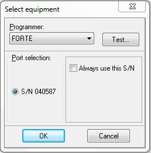
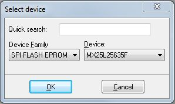
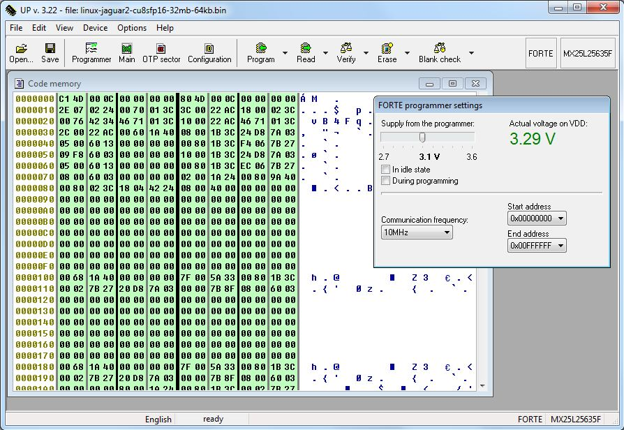
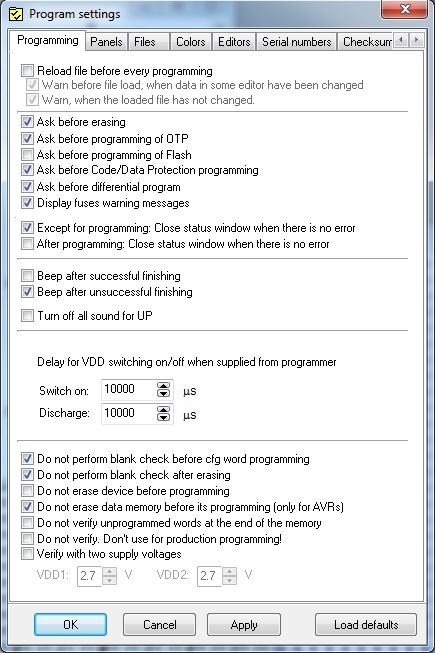
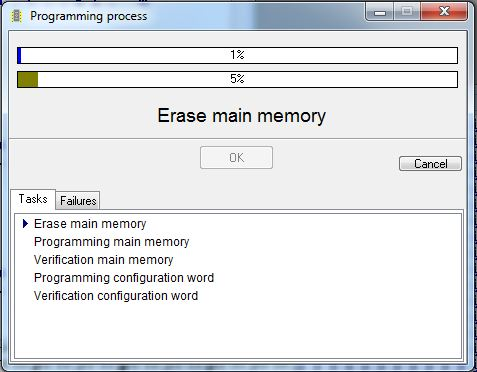
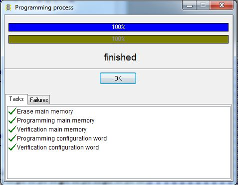

:sectnums:
:toc: left
:source-highlighter: pygments
:pygments-linenums-mode: inline
:sectnumlevels: 5
:toclevels: 5
:icons: font
:callout1: pass:[<i class="conum" data-value="1" style="font-size: 80%"></i><b>(1)</b>]
:callout2: pass:[<i class="conum" data-value="2" style="font-size: 80%"></i><b>(2)</b>]
:callout3: pass:[<i class="conum" data-value="3" style="font-size: 80%"></i><b>(3)</b>]
:callout4: pass:[<i class="conum" data-value="4" style="font-size: 80%"></i><b>(4)</b>]
:callout5: pass:[<i class="conum" data-value="5" style="font-size: 80%"></i><b>(5)</b>]
:callout6: pass:[<i class="conum" data-value="6" style="font-size: 80%"></i><b>(6)</b>]
:callout7: pass:[<i class="conum" data-value="7" style="font-size: 80%"></i><b>(7)</b>]
:callout8: pass:[<i class="conum" data-value="8" style="font-size: 80%"></i><b>(8)</b>]
:callout9: pass:[<i class="conum" data-value="9" style="font-size: 80%"></i><b>(9)</b>]
:svg_or_png: png
:toc: macro

= SW Introduction to WebStaX under Linux

== Disclaimer
Microchip is aware that some terminology used in this technical document is
antiquated and inappropriate. As a result of the complex nature of software
where seemingly simple changes have unpredictable, and often far-reaching
negative results on the software's functionality (requiring extensive retesting
and revalidation) we are unable to make the desired changes in all legacy
systems without compromising our product or our clients' products.

== Introduction

This document will provide an introduction to the WebStaX Application software
(SW) from a SW developer perspective. The intention of this document is to
briefly cover what new SW developers need to know, if they are to create a
product based on the WebStaX source package. This will include general
architecture description, integration options, development environment,
customization, installation, and more. The purpose of this is to get the new
user started, and not to provide a complete reference.

Starting from the 4.00.01 release, the WebStaX SW stack is running on top of
Linux instead of eCos. This document will only cover the newer generation of
WebStaX SW which is running on Linux.

toc::[]

=== Audience

The intended audience for this document is SW developers who need to build
and/or change the WebStaX source code.

=== Prerequisites

This document assumes the reader possesses the following skills/resources:

. Fluent in C/C++ and to some extent Makefiles. HTML/CSS/JS is required to
change the web interface.
. Root access to a recent Linux development environment, and fairly experienced
in working with a Linux shell.
.. Building new images from the sources (including boot-loader, BSP and
application) requires a 64-bit Linux machine with at least 8GB of RAM, 50GB of
disk space and 4-8 CPU cores. This document uses Ubuntu 16.04LTS as reference.
Ubuntu 14.04LTS is also compatible.
.. Access to a TFTP and/or HTTP server that can be used for SW upgrades.
.. RS232 terminal to access the target (needed to debug without IP
connectivity).
. MSCC APPL source package (version 4.00.01 or newer) and the corresponding
binary BSP and toolchain. To change the BSP the BSP source package is also
needed.
. An MSCC reference board supported by the 4.x release (new users are advised to
start with a supported reference board and then move to custom boards when the
basic environment is configured correctly).

<<<
== Component overview

The WebStaX SW stack consists of a number of different components. All
components are needed to build a working WebStaX product. This section will give
an overview of the different components and explain what role they fulfill.
Projects may need to change/replace one or more of the components to support new
board types, customizations and different integration models.

=== BSP

The BSP provides almost all third-party components that are needed. This
includes both development tools needed to build the executable and third-party
components needed on target. Example of host tools are: cross-compiler, cmake,
linker, automake/autoconf etc. Example of target components are Linux kernel,
libc, net-snmp, dropbear, busybox etc.

MSCC provides a BSP that is designed and optimized for MSCC reference boards and
the WebStaX application software. The BSP is distributed in both source and
binary form. The sources are needed for customers who want/need to change the
BSP, while the binary BSP can be used if no changes are required. Building the
BSP from sources can take a fair amount of time (especially if running in
a virtual machine or on old hardware), and MSCC therefore recommends to start
out with the binary BSP and use that until modifications are needed.

NOTE: The binary BSP is compiled for the internal CPU (little endian MIPSr2). If
an alternative CPU is being used, then the BSP needs to be compiled for that
CPU.

=== API

The API is a library which is used to access the switching/phy hardware. The API
is included as part of the application SW. Customers who are building a
product based on one of the WebStaX variants will automatically be using the API
included in the WebStaX source package.

=== Application

The WebStaX product family includes three different application packages:
`WebStaX`, `SMBStaX` and `IStaX`. The three packages have different feature sets
and different licensing terms. This document will not be focusing a lot on the
individual packages, but assume that one of the three packages is being used.
When referring to "MSCC-Application", "application" or "switch application" then
it is one of these three packages. All examples in this document will be using
the `SMBStaX` package, but the procedures covered in this document are the same
for all packages.

NOTE: Customers may choose not to use the application provided by MSCC, but
instead use an existing application or write their application from scratch.
Such a project will only be using the API, and will need the dedicated API
release. This option is out of scope for this document.

=== Boot-loader

The boot-loader provides the first SW that is running at the target when it is
powered on. The boot-loader is responsible for configuring the CPU, memory
controller, loading the Linux kernel into memory and other.

The boot-loader provided by MSCC is based on RedBoot, with a number of patches
applied on top. The boot-loader is being distributed both as binary and source,
and the binary is built for specific reference boards.

Even though the boot-loader is generic, some custom boards may need to update
it. These updates need to be made in the RedBoot sources, and new binaries need
to be created from the sources.

NOTE: Customers may choose to use alternative boot-loaders, but they will need
to add support for the `MFI` image format used by the switch application.

=== Flash images

A flash image is a binary image that may be burned to the `NOR` flash using a
programmer. The flash images include partition table for the `NOR` flash,
boot-loader, bring-up image (Linux kernel, stage1 file system, stage2 minimal).
A given flash image may only be used on the specific board it is designed for.

Most flash images are _boot-strap images_ which means that they include a
minimal image that provides just enough functionality to perform a SW upgrade
over the network.

NOTE: Most reference boards use both the `NOR` and `NAND` flash to store the
kernel and root-file system. The `NAND` flash can not be burned using a
programmer, and the `NOR` flash is not big enough to include the full
application, which is why a boot-strap image is needed. The boot-strap image is
small enough to fit into the `NOR` flash and provide enough functionality to
perform a SW upgrade over the network to a _full_ application (`WebStaX`,
`SMBStaX` or `IStaX`). When doing a SW upgrade the installation process will
split the image and will utilize both the `NOR` and `NAND` flash.

<<<
== Integration options

The WebStaX product family is very flexible, and it offers a number of different
integration options. This section will describe the most common options that
should be considered for new projects.

=== MSCC-Application or API-Only

The API is bundled and is part of the switch application packages, but it also
exists as a stand-alone package. Customers can therefore choose to use one of
the application packages that already include the API, or they can choose to go
with the stand-alone API package.

Following is some of the characteristics of a projects based on one of the
MSCC-Application variants vs. API-Only projects:

MSCC-Application::
* Provides a complete turnkey-like application with CLI/web/SNMP
  management interfaces.
* Complete high-level JSON-RPC interface.
* Implements many L2/L3 protocols (the set of protocols depend on the variant).
* Proprietary license.
API-Only::
* Driver-like functionality
** Does not implement any protocols and does not perform any _network I/O_.
* C-library which must be instantiated by an application.
* Permissive license (MIT).

This document will only focus on projects that use one of the application
variants.

=== Internal CPU or External CPU

The MSCC switch chips include an internal MIPS CPU, which can be used to run the
switch application, but it is also possible to do a board design that uses an
external CPU instead.

Customers have to choose whether they want to use the internal MIPS CPU, or if
they prefer an external CPU. Arguments for choosing an external CPU is typically
that more CPU resources are needed, or that an alternative CPU architecture is
required. The downside of choosing an external CPU is the cost.

Customers that choose to do a project with an external CPU must also provide the
BSP for the given project. The MSCC source BSP can be adjusted to support most
CPU architectures, or an alternative BSP can be designed from scratch.

==== Frame flow with an external CPU

Projects using an external CPU need to decide how to implement the frame-flow,
between the switch-core and the host CPU. There are two options: either use PCI-
Express or dedicate (and configure) one of the switch ports as the CPU port.
This is called a `NPI` (Node Processor Interface) port. This section documents
some of the pros and cons; the details depend on the switch chip and can be
found in the data sheets.

===== CPU frames over PCI-E

Frames can be extracted and injected by reading/writing registers exposed in the
switch core. This register access is typically done over PCI-E but can in theory
also be done using other physical interfaces.

This approach will require a kernel driver (or user-space application using the
`tun` / `tap` facilities) to implement a `NIC` interface that will read/write
from/to the CPU queue registers. The `NIC` driver must expose the frames as is,
including the internal frame header. The `MUX` driver will connect to this `NIC`
interface and decode the `ifh` header. An interrupt will indicate when there are
frames to be read.

The advantages of this approach is that it is simple, it does not require any
dedicated hardware, and it does not consume one of the switch ports. The
downside is that the frame-flow may affect the CPU performance as the CPU is
being used to read/write the frames.

===== Dedicated `NPI` port

The switch core can be configured to dedicate one of the switch ports as `NPI`
port. This means that the frame flow between the CPU and switch-core is a normal
ethernet connection.

NOTE: Some chips are in some configurations using the `FCS` to carry certain
information. This may be an issue if using a dedicated `NPI` port to implement
the frame flow between switch core and host CPU.

This approach will require that the host CPU has a free `MAC` interface that
can be used to connect to the `NPI` port of the switch-core. The `MAC` interface
must be supported by a Linux `NIC` driver.

The advantages of this approach is that the performance depends on the host
`MAC` interface (and the associated driver) which may be better than running
over PCI-E. The downside is that this solution consumes a switch port from the
switch core that cannot be used for anything else, and it requires a free `MAC`
on the host CPU.

=== MSCC-BSP or custom BSP

A BSP which provides a tool-chain, host tools, and various target
libraries/applications is required to build the MSCC switch application. MSCC
encourages customers to use the MSCC-BSP as it is designed for and tested with
the MSCC Ethernet products. But customers are welcome to use an alternative BSP
or create one from scratch. Typical arguments for using alternative BSPs are
strong preference to other embedded distributions like Yocto, T2-SDK, Gentoo,
etc, or having an existing BSP with support for an external CPU which
is intended for the project.

MSCC is in general not supporting customers in integrating the MSCC application
into custom BSP's. Customers that choose this path must therefore be able to
do this on their own. Customers that choose to design their own BSP need to
look at the MSCC BSP to get the list of packages and patches used by the MSCC
switch application.

<<<
== Brief system architecture

This section will provide a brief overview of the system architecture. The
section will focus on how the MSCC switch application has been integrated with
the Linux system, and on how third-party components may interact. The image
below illustrates the overall system architecture.

[[img-frame-flow]]
.Overall system architecture
image::UG1068-SW-Introduction-to-WebStaX-on-Linux/FrameFlow.{svg_or_png}[]

The green box labeled WebStaX is the MSCC switch application, it can be any of
the supported variants (`WebStaX`, `SMBStaX` or `IStaX`). The switch application
is running as a long-lived normal user-space process (as root), and it is
interacting with the switch registers through the `uio` driver. The WebStaX
application includes an instance of the API, and the application must be the
exclusive owner of the API and switch registers.

NOTE: This means that no other process is allowed to instantiate the API and
alter the switch registers in HW, this must go through the API instance already
created by the application.

The `uio` kernel space driver is a simple kernel module which does two things;
1) exposes the entire register region of the switch hardware, and 2) exposes
all interrupts from the switch hw. The `uio` kernel module is provided by the
Linux kernel (part of the BSP) and allows user-space applications, like WebStaX,
to gain access to HW registers and interrupts from user-space. This is achieved
by a `mmap` of the register region from the user-space application.

=== Frame flow

Besides from configuring the switch registers in HW, the application also
implements a number of protocols (which may influence the switch
configurations). To implement these protocols the application needs to inject
frames into the switch core, and it needs to extract frames that have been
redirected to the CPU (either because it was send to the MAC address of the CPU,
or because an ACL rule has captured the frame). To implement this frame-flow
the Linux kernel in the BSP provides a FDMA driver which can inject/extract
to/from the CPU queue in the switching hardware.

NOTE: The FDMA driver included in the MSCC BSP only supports the internal CPU.
Projects that uses an external CPU need to provide a NIC driver that will
connect the CPU queue in the switching hardware with a Linux network interface.

Frames that are injected/extracted to/from the CPU queue are prefixed with an
extra header that carries various side-band information related to the frame
(front port, classified VLAN, ACL rule number, time stamp etc.). The content of
the header is chip dependent and the content is specified in the data sheet of
the switching chip. This information is needed by the application to implement
most of the L2 protocols, but it also causes a problem when the frame is being
processed through the Linux IP stack. To solve this, received frames are being
exposed both on a Linux network interface called `ifh` (short for _interface
frame header_) and to the `MUX-Filter` (see figure <>).

The `MUX-Filter` will _see_ all frames being received by the CPU queue in the
switching hardware. The driver will decode the frame header to see which
classified VLAN a
given frame belongs to, and if such an interface exists, then the switch
dependent frame header is popped and the frame is being processed by the Linux
IP stack. The `MUX-Filter` is configured by the user-space application using the
`netlink` protocol, and this configuration channel allows the application to
dynamically create and delete IP interfaces that correspond to a VLAN domain.
These kinds of interfaces are being referred to as `VLAN interfaces`.

A system without any configuration will not have any IP interface, but only the
`ifh` interface that exposes the raw frames. When a `VLAN interface` is created,
a corresponding Linux network interface is created by the `MUX-Driver`.

This design allows the user-space applications to implement various L2 protocols
and have access to all the side-band data collected by the switch-core, and it
also allows existing Linux applications to do various socket operations (IP, UDP
and TCP) without changing these applications.

=== System services

The WebStaX application will listen on a number of TCP/UDP ports, and it will
spawn a number of third-party services. The list of TCP/UDP ports and
third-party services depends on the variant (`WebStaX`. `SMBStaX` or `IStaX`).
An example of listening ports is TCP port 23, which the application listens on
in order to implement telnet. Examples of third-party services are `hiawatha`,
which is being used as web-server and `net-snmp` as `SNMP` main agent.

External services needed by the WebStaX application are automatically started by
the application itself. The application also offers configuration hooks that can
stop a given service if the user does not wish to use it.

More advanced configuration of various system services is covered in <<AN1163>>.

=== Boot sequence

The boot-sequence of a WebStaX system differs a bit from what is seem in most
_general purpose_ Linux systems. The are two main reasons for these
differences: a) The system starts by booting from `NOR` and when the kernel is
up, it mounts the stage 2 flash as its root file system; b) The system uses a
custom `init` process called `ServiceD`.

The stage 2 rootfs is normally placed in `NAND`, but can optionally be
placed in `NOR` flash. The latter option imposes a limitation on the
total image size at (currently) 13.5 Mb for a system with 32 Mb `NOR`
flash.

The following illustrates the boot-process of a WebStaX system with
both `NOR` and `NAND`:

[[img-boot-process-nand]]
.Boot proces, NOR+NAND
image::UG1068-SW-Introduction-to-WebStaX-on-Linux/Bootprocess.{svg_or_png}[]

The following illustrates the boot-process of a WebStaX system with `NOR` only:

[[img-boot-process-nor-only]]
.Boot process, NOR only
image::UG1068-SW-Introduction-to-WebStaX-on-Linux/Bootprocess-NOR.{svg_or_png}[]

==== Image split, `NOR`+`NAND`

The image format used in WebStaX is called `mfi` and is designed to allow using
both the `NOR` and `NAND` flash to store firmware images. `Redboot` does not
have the required drivers to read from the `NAND` flash, meaning that the Linux
kernel must be stored in `NOR` flash. When the kernel is booted, it will run the
`stage2` loader (also from `NOR`) which will mount the `NAND` flash, do a
`pivot_root` and use the `NAND` flash as the root file system from this point
on.

This design is a bit different from what is seen in many embedded systems where
the entire root file system is placed in the `initrd` section loaded by the
boot-loader. The reason for this design is that the `NAND` flash is
significantly cheaper than the `NOR` flash, and splitting the image into both
`NOR` and `NAND` will lower the BOM cost.

This means that the actual boot process starts already when the image is being
installed, because the installation process must split the image file and burn
the `kernel` + `initrd` section to the `NOR` flash, and also burn the remaining
part to `NAND` flash. The SW upgrade facilities, which are part of the MSCC
application, will take care of that automatically. This is illustrated at the
left side in <> image.

When the system is powered on, the boot-loader will initialize the hardware and
load the `kernel` + `initrd` into memory, and start the Linux kernel. When the
Linux kernel is up and running, it will look for an executable called
`stage2-loader` (part of the `stage1` part of the BSP) in the `initrd` area, and
invoke that process as `PID` 1. The `stage2-loader` loader will mount the `NAND`
flash, and look for the corresponding `stage2` section of the current firmware
image in the `NAND`. After finding it, it will iterate through its contents, and
mount each root file system element on top of each other by using the
`OverlayFS` facilities in the Linux kernel. Once this process is completed, the
final root-file system is ready, and the `stage2-loader` will use the
`pivot_root` to replace the existing root with the newly prepared root file
system.

==== Image split, `NOR`-only

When the `NOR`-only architecture is used, the MFI image is stored in entirety in
the `NOR`, and _not_ split during flashing. The `stage2` loader will detect the
absence of `NAND` and will concatenate the root file system elements as normal,
but overlaying them with a small read-write filesystem which is used instead of
the `NAND` filesystem.

Together, they form a similar unified filesystem as for `NAND`, just with the
two following differences:

* Rootfs data is located in `NOR`. This impacts how large the firmware image can
  be, as it is limited to half the `NOR` size, minus overhead at about 5 Mb. For
  32 Mb, this gives 13.5 Mb maximum firmware image size.

* The read-write storage capacity is limited to what is stored in a small `NOR`
  read-write filesystem. This implies bulk data storage is not available. The
  read-write storage is only used for system dynamic data storage, such as
  configuration and device certificates.

==== `ServiceD` as `init process`

At this point the final root file system is ready, and the system can start to
initialize all the services that need to be running. The `ServiceD` application
is used to perform this task. The `ServiceD` process will read its
configuration files (see `ServiceD Conf WebStaX` and `ServiceD Conf Customer
process` in <>) and spawn (and monitor) the configured
services. In a vanilla WebStaX system there will only exist one service called
`switch_app`, which represents the WebStaX application. When the application is
started it will automatic start the set of services it depends on.

For more details on the `mfi` format and `ServiceD` read the <<AN1163>>
document.

=== Boot sequence, MMC

On systems with MMC storage installed, the bootsequence can be run directly from MMC.
This is possible by the .ext4 file generated during build.
The 4 GB MMC storage is partitioned into several partitions, each holding specific
binaries for the boot process.
A typical partition can look like illustrated in  <<emmc-laoyut>>

[[emmc-layout]]
.EMMC layout and boot sequence
image::UG1068-SW-Introduction-to-WebStaX-on-Linux/emmc-layout.{svg_or_png}[]

The first 0xFFFFF bytes contains GPT header (1 MB bytes) and is normally not referred
to as a 'partition'. Note the first 512 bytes is unused, and thus not part of GPT header.
Partition 1+2 (128 MB each) contains the fip with bootloaders (including uboot).
The latter partition is used if the primarily fip is not found/usable. Partition 3+4 (2 MB each)
contains the environment for u-boot (primarily and backup). Partition 5+6 (1 GB each) contains
linux kernel, mmc-rootfs, stage2 loader, application fs and application itself (all within .ext4 file).
Partition 7 (approx 1.75 GB) can be used by application or bootloader.
Note that partition 5+6 is named 'boot', even though the first partition used is partition 1/2,
which then executes code in partition 5/6.

The boot process starts with BL1 (hardware bootloader) looking into GPT header and searches for
partition called 'fip'. Partition 1/2 is read and several stages of bootloaders are executed.
Partition 5/6 is loaded into ram, Linux kernel is prepared for loading and started. Linux kernel
trigs /sbin/init application. During build of root fs, this application is replaced by
own "stage 2 loader" which is executed instead of Linux' own /sbin/init.

Stage 2 loader is a seperate application that replaces current root fs ("first root fs") with
another one. When application is loaded, a mount to current partition is done. The application
then executes a pivot_root and re-mounts a new file system to be used when switch-app
is running ("second root fs"). In other words, the root fs distributed with stage 2 loader, has a limited
lifetime. Note that when starting up system in secure more (secure boot), stage 2
loader has extended functionality; this is explained in section <<Notes on secure boot>>

==== Notes on secure boot

It is possible to build rootfs and entire chain of bootloaders secure, thus enabling
"secure boot". Description on basic verified boot in Linux can be found at
https://bitbucket.microchip.com/projects/UNGE/repos/sw-doc-bsp/browse/modules/ROOT/pages/supported-hw/lan969x-verified-boot.adoc[Github page for MSCC sw-doc-bsp]

If using secure boot for switch application, the following is done during build/start:

 * At build time, 2 different files are generated: (A) a fit image which contains mmc-rootfs. This is
 started by bootloader and contains the stage2 loader). (B) a application-fs (which is the filesystem
 used during the application' lifetime). The application-fs is a ext4 image. Both (A) (Image.itb/mmc-rootfs)
 and (B) (application-fs) are generated every time the application is built.
 * File (A) (Image.itb/mmc-rootfs) is signed with hash keys provided by BRSDK.
 This prolongs the chain-of-trust  from BSP into scope of application. The .fit file built
 is generated via linux tool mkimage with a additional -k param for providing the keys to use. The keys
 are fetched from BRSDK build with application, thus joining the BRSDK and mmc-rootfs.
 Additionally, static fields for are added to temporarily .its file, which is used for
 constructing device tree definition. The resulting mmc-rootfs is called Image.itb.
 * The application-fs is generated as ext4 file with Linux tool mke2fs. The file is formatted
 (=hashed) via tool "veritysetup format".  This gives possibility to verify if the
 generated fs at build time is actually the fs that is used during boot of system. During this
 process, a hash and a root hash are generated. These hash'es must be available for later
 verification of the data stored in the partition. The hash and root hash'es are stored within first
 root fs (mmc-rootfs) as files app.hash and app.roothash, respectively. The application fs itself
 is stored as app.ext4
 * All 4 files (Image.itb, app.hash, app.roothash and app.ext4) are all stored within a seperate
 "outer" filesystem (=the resulting .ext4 file)
 * When bootloader starts, it is instructed to use Image.itb within .ext4 file. This is only possible,
 if chain-of-trust is valid, thus the core principle of secure boot. If Image.itb is valid, Linux
 kernel is stared, thus starting /sbin/init (which is replaced by "stage 2 loader" during build of fs).
 * When stage 2 loader is executed, it attempts to mount partition app.ext4 and uses
 app.hash and app.roothash to validate the mounted partition. This is done via tool "veritysetup open",
 which will create a virtual device on mmc-rootfs and attempt to mount this device.
 In case any of these steps fails, either the hash, roothash or the partition itself has been changed
 or replaced since the application was built, boot is not possible/allowed, and system
 will reboot*.
 * If stage 2 loader is successfully able to do a final mount of the application fs (app.ext4),
 a pivot_root is executed, thus setting a new root-fs to the (verified) application fs.
 * Once stage 2 loader is done, responsibility is given to either Linux kernel param "init_next"
 or to /sbin/init within application fs.

*) In case of invalid application fs (or incorrect hash/roothash), the system will reboot and simply
try to start in the same fashion again. Future versions of application will attempt to start system
on boot 1 (backup) partition instead of attempting reboot on the same partition/fs.

NOTE: Notice that the application contains a seperate module called stage2 loader, which
is trigged within application fs. Though the naming is identical, it is two different application,
serving two different purposes. The stage2 loader used in mmc-rootfs is located in ./build/initramfs,
while stage2 loader in application is located in ./vtss_appl/stage2_loader.

<<<
== Installing SW on a target

This section describes how to install SW into a target, whether that is a
'fresh' installation, i.e. install on a target with an empty NOR device, or a SW
upgrade of an existing installation. The two processes are different, hence they
are covered separately.

=== Installing SW from scratch - How to flash a board

If the device has no SW installed in it already, e.g. empty `NOR` or if a SW
upgrade is not possible (e.g. upgrade from an eCos version to this Linux
release), then the device needs to be flashed with a flash image. Flash images
is part of the normal WebStaX release, and can be used with the reference
boards. To build custom flash images see section: <<Custom flash images>>.

The clean installation is a two step process; first the `NOR` memory of the
device needs to be flashed with a proper binary image (the _flash image_) that
will bring the device into a _bring-up_ state with basic network connectivity
and then the device needs to be bootstrapped with the final _full_ application
(`WebStaX`, `SMBStaX` or `IStaX`).

==== Flashing the NOR with a flash image

In order to flash the `NOR` memory of the device, a flash memory programmer is
required. In order to generate the following guidelines and examples, the
http://www.asix.net/prg_forte.htm[*FORTE*] memory programmer from
http://www.asix.net/[*ASIX*] was used. Other memory programmers will work as
well, but covering their installation methods is out of the scope of this
document.

Things you will need:

* A board as a target
* A flash memory programmer (http://www.asix.net/prg_forte.htm[*FORTE*] is
  recommended, http://www.asix.net/prg_presto.htm[*PRESTO*] is slower but works
  too)
* A PC running Windows
* Universal Programmer tool (downloaded from
  http://www.asix.net/dwnld_up.htm[*ASIX.net*]) installed
* Binary flash image for the specific board

Once all the hardware is in place and all the drivers and software are
installed, go ahead and start the ASIX UP program. You will then be prompted
with the following screen that allows you to select and connect to your
programmer. Please select the programmer you are using and the proper port. If
you check "Always use this S/N", then you will no longer see this initial
screen, but you can always select programmers from within UP (`Options > Select
Programmer`, or press `Shift + F4` on the keyboard).

[[img-up-start]]
.Start-up screen of ASIX UP

Next, you have to select the NOR device you are about to program. If it is the
first time you start UP you will also see the following screen where you can
select the device you want to program. Otherwise, you will be redirected to the
main screen of the software. You can always select another device through
`Device > Select` device (or press `F4` on the keyboard).

[[img-up-device]]
.Flash device selection screen of ASIX UP

The Device Family should be _SPI FLASH EPROM_, and the Device ID depends on the
respective NOR flash the target is equipped with. Below you can see a table
indicating a few of the NOR flash devices that can be found on the MSCC
reference boards.

NOTE: The table is only listing a few of the most commonly NOR flashes that are
used in the MSCC reference boards. Make sure to check the NOR Part No. on your
device before performing the flash procedure that is outlined in this section.

[cols="4*", options="header"]
.Flash memory table
|===
|MSCC reference board (family name)
|NOR Flash Part No.
|Device name in ASIX UP
|Binary image name

|Caracal-1
|25P28V6P
|M25P128
|linux-caracal1-16mb-256kb.bin

|Serval-2
|MX25L25635F
|MX25L25635F
|linux-serval2-32mb-64kb.bin

|Jaguar-2
|MX25L25635F
|MX25L25635F
|linux-jaguar2-cu8sfp16-32mb-64kb.bin

|Serval-T
|MX25L25635FMI
|MX25L25635F
|linux-servalt-32mb-64kb.bin
|===

NOTE: As seen from the table above, the Device name in ASIX UP is not always the
same or even similar to the Device Part No., and in that case the Device name
can usually be derived by the data-sheet of the `NOR` device. This will be
necessary for applications where customers create their own board.

For MSCC reference boards though, the above table also provides the mapping to
the appropriate binary flash image. The APPL-4.X package (`WebStaX`, `SMBStaX`
or `IStaX`) contains the directory *flash-images* where binary flash images can
be found for all MSCC reference boards. The right-most column of the above table
indicates the right image for each reference board.

With that in mind, open the right binary through `File > Open` (or press `Ctrl
+O` on the keyboard). You are now in the main screen of the program and you
should see something similar to the following:

[[img-up-main]]
.Main screen of ASIX UP

The version of UP along with the loaded binary image can be seen on the top-left
corner, while the memory programmer (in this case FORTE) along with the selected
device can be seen on the top-right corner. One thing to notice here is the
voltage of the flash device, and the expected value for MSCC ref. boards is
something in the range of 3.1V - 3.3V.

The first time you use the software, you can also set your preferred program
setting under `Options > Program settings` (`Shift + F10`). Those will be kept
across. We suggest to check the `"Do not perform blank check after erasing"`
option if you want to speed-up the process. The next figure shows a possible
configuration:

[[img-up-settings]]
.Program settings screen of ASIX UP

You are ready to flash your device now, so click on `Device > Program > Program
all except OTP sector / Program all` (depending on the NOR, you might be
presented with more than one option). The process should start (you might get a
confirmation pop-up first) and you will see some progress bars.

[[img-up-flashing]]
.Programming process screen of ASIX UP

When the process is finished, you should get the following screen and no errors
or warnings.

[[img-up-success]]
.Programming process screen of ASIX UP - successful programming

The device is now flashed with a bring-up image, but before it can be put to use
one final step is required. The MAC address of the board has been reset, and the
board will pick-up a random MAC address the next time it powers up. You need to
change that by making a RS232 connection to the device and issuing the following
commands on ICLI (Industrial Command Line Interface): `platform debug allow` and
`debug board mac <mac-address>`. Then reboot the device and the flashing process
is complete.

NOTE: The MAC address given is the device `BASE` address. You implicitly should
reserve the next _N_ addresses for the device as well. _N_ depends on the number
of physical ports on the device in question.

Let's take a Serval-1 reference board. Here's the output from the device's first
boot after the flash process:

[source,console]
----
+M25PXX : Init device with JEDEC ID 0xC22018.
Serval Reference board detected (VSC7418 Rev. B).

RedBoot(tm) bootstrap and debug environment [ROMRAM]
Non-certified release, version 1_19-5f9ed7e - built 13:31:17, Jun 17 2016

Copyright (C) 2000, 2001, 2002, 2003, 2004, 2005, 2006, 2007, 2008, 2009
Free Software Foundation, Inc.
RedBoot is free software, covered by the eCos license, derived from the
GNU General Public License. You are welcome to change it and/or distribute
copies of it under certain conditions. Under the license terms, RedBoot's
source code and full license terms must have been made available to you.
Redboot comes with ABSOLUTELY NO WARRANTY.

Platform: VCore-III (MIPS32 24KEc) SERVAL
RAM: 0x80000000-0x88000000 [0x800292c0-0x87fdfffc available]
FLASH: 0x40000000-0x40ffffff, 256 x 0x10000 blocks
== Executing boot script in 3.000 seconds - enter ^C to abort
RedBoot> diag -p
RedBoot> fis load -x linux
MD5 signature validated
Stage1: 0x80100000, length 4311824 bytes
Initrd: 0x80600000, length 188416 bytes
Kernel command line: init=/usr/bin/stage2-loader loglevel=4
RedBoot> exec
Now booting linux kernel:
 Base address 0x80080000 Entry 0x80100000
 Cmdline : init=/usr/bin/stage2-loader loglevel=4
 Active fis: linux
[    0.884288] vcfw_uio vcfw_uio: UIO driver loading
[    0.889189] vcfw_uio vcfw_uio: Invalid memory resource
[    0.894392] iounmap: bad address   (null)
00:00:01 Stage 1 booted
00:00:01 Using device: /dev/mtd7
00:00:10 Mounted /dev/mtd7
00:00:10 Loading stage2 from NOR flash partition 'linux'
00:00:12 Overall: 11669 ms, ubifs = 9590 ms, rootfs 2016 ms of which xz = 0 ms of which untar = 0 ms
Starting application...
Using existing mount point for /switch/
W conf 00:00:16 65/conf_board_start#385: Warning: MAC address not set, using random: 02-00-c1-75-c2-83
Press ENTER to get started
----

NOTE: The device has selected a random MAC address after the flash process. We
now use the debug command for setting the board's MAC address and then reboot.

[source, console]
----
# platform debug allow

WARNING: The use of 'debug' commands may negatively impact system behavior.
Do not enable unless instructed to. (Use 'platform debug deny' to disable
debug commands.)

NOTE: 'debug' command syntax, semantics and behavior are subject to change
without notice.

# debug board mac 00-01-C1-00-C9-90
# reload cold
% Cold reload in progress, please stand by.
Rebooting system...
# Umount done.[  166.748728] VcoreIII I2C: Disabling with active transfer pending

[  166.784052] reboot: Restarting system
----

==== Bootstrapping

After the `NOR` has been flashed with the steps outlined in the previous
section, the flash is partitioned, the boot-loader, Linux kernel and initramfs
are installed and for MSCC reference boards and bring-up application is present
which allows for basic network connectivity. Note that at this stage the NAND
flash still needs to be formatted and partitioned before it is put into use. The
bootstrap option that is part of the bring-up application will seamlessly take
care of that, plus perform a SW upgrade to the selected APPL-4.X package
(`WebStaX`, `SMBStaX` or `IStaX`).

In order to demonstrate how the bootstrapping process works, we take the example
of a Serval-1 reference board that has been flashed using the method explained
in <<Flashing the NOR with a flash image>>.

Things needed to perform the bootstrap:

* The bootstrap option is only available through the ICLI management interface,
therefore a terminal connection to the device is required.
*  [[Install_reqs]] Basic network connectivity from/to the device
is also needed since we are going to be downloading one of the APPL-4.X packages
into the device.
* An APPL-4.X SW image (`WebStaX`, `SMBStaX` or `IStaX`).
Customers can build this image themselves through the build system and by
following the process explained in section
<<Setting up development environment>>. For reference boards however, the
released package already contains images for all MSCC reference boards. These
can be found in `/bin/` of the respective release package. For this example we
will be using a SMBStaX image taken from `SMBStaX-4.5.0/bin/smb_serval.mfi`.
* An HTTP or TFTP server for distributing the above image.

Having all that in place, we simply log in to the device through ICLI and issue
the `debug firmware bootstrap <url>` command.

NOTE: You may need to set-up IP configuration properly on device to upgrade
bootstrap firmware.

[source, console]
----
Press ENTER to get started
# platform debug allow

WARNING: The use of 'debug' commands may negatively impact system behavior.
Do not enable unless instructed to. (Use 'platform debug deny' to disable
debug commands.)

NOTE: 'debug' command syntax, semantics and behavior are subject to change
without notice.

# debug firmware bootstrap http://10.10.130.147:8080/smb_serval.mfi
Fetching...
looking up 10.10.130.147
connecting non-blocking to 10.10.130.147:8080
connection: Success
requesting http://10.10.130.147:8080/smb_serval.mfi
Bootstrap ubi starts...
ubiformat: mtd7 (nand), size 134217728 bytes (128.0 MiB), 1024 eraseblocks of 131072 bytes (128.0 KiB),
min. I/O size 2048 bytes
libscan: scanning eraseblock 1023 -- 100 % complete
ubiformat: 1024 eraseblocks have valid erase counter, mean value is 3
ubiformat: formatting eraseblock 1023 -- 100 % complete
Bootstrap ubi done ok.
Writing primary image
Erasing flash ... done
Programming flash ... done
  Done
Writing backup image
Erasing flash ... done
Programming flash ... done
  Done
Rebooting ...
[ 7757.970262] VcoreIII I2C: Disabling with active transfer pending
[ 7758.003073] reboot: Restarting system
...
// Skipping standard boot output
...
Press ENTER to get started

Username: admin
Password:
# show version

MAC Address      : 00-01-c1-00-c9-90
Previous Restart : Cold

System Contact   :
System Name      :
System Location  :
System Time      : 1970-01-01T00:17:19+00:00
System Uptime    : 00:17:19

Bootloader
----------
Image            : RedBoot (bootloader)
Version          : version 1_19-5f9ed7e
Date             : 13:31:17, Jun 17 2016

Active Image
------------
Image            : linux (primary)
Version          : Version 4.00.01
Date             : 2016-07-06T11:23:33+02:00
Upload filename  : smb_serval.mfi

Backup Image
------------
Image            : linux.bk (backup)
Version          : Version 4.00.01
Date             : 2016-07-06T11:23:33+02:00
Upload filename  : smb_serval.mfi

------------------
SID : 1
------------------
Chipset ID       : VSC7418
Board Type       : Serval PCB106
Port Count       : 11
Product          : Vitesse SMBStaX Switch
Software Version : SMBStaX (standalone) Version 4.00.01 Build 272
Build Date       : 2016-07-06T11:23:33+02:00
Code Revision    : 82e4c3f

----

NOTE: The bootstrap process has now formatted and partitioned the NAND flash,
plus installed the selected Application image to both NOR and NAND. The same
image is both the active and the backup image of the device.

=== Upgrading SW from within an existing installation

Performing a SW upgrade from within APPL-4.X is similar to the bootstrap
process, with the difference that it is supported by all management interfaces.
I.e. ICLI, Web, JSON-RPC and SNMP. For simplicity reasons, this document will
only focus on the ICLI interface. The rest of the  prerequisites listed in the
bootstrap section (<<Install_reqs,Basic Upgrade Requirements>>) remain the same.

After having all the above in place, simply log in to the device and issue the
`firmware upgrade <url>` command as also seen in the example below:

[source, console]
----
Press ENTER to get started

Username: admin
Password:
# firmware upgrade http://10.10.130.147:8080/smb_serval.mfi
Fetching...
looking up 10.10.130.147
connecting non-blocking to 10.10.130.147:8080
connection: Success
requesting http://10.10.130.147:8080/smb_serval.mfi
Got 8936650 bytes
Starting flash update - do not power off device!
Erasing flash...done
Programming flash...done
Swapping images...done
Restarting, please wait...Umount failed: D[  450.658665] VcoreIII I2C: Disabling with active transfer pending
evice or resource busy, retry with force
Umount failed again: Device or resource busy!!!
[  450.695431] reboot: Restarting system
...
//Skipping standard boot output
...
Press ENTER to get started

Username: admin
Password:
# show version

MAC Address      : 00-01-c1-00-c9-90
Previous Restart : Cold

System Contact   :
System Name      :
System Location  :
System Time      : 1970-01-01T00:01:43+00:00
System Uptime    : 00:01:43

Bootloader
----------
Image            : RedBoot (bootloader)
Version          : version 1_19-5f9ed7e
Date             : 13:31:17, Jun 17 2016

Active Image
------------
Image            : linux (primary)
Version          : dev-build by vkosteas@soft-dev10 2016-08-19T14:19:11+02:00 Config:smb_serval SDK:v02.32-smb
Date             : 2016-08-19T14:19:11+02:00
Upload filename  : smb_serval.mfi

Backup Image
------------
Image            : linux.bk (backup)
Version          : Version 4.00.01
Date             : 2016-07-06T11:23:33+02:00
Upload filename  : smb_serval.mfi

------------------
SID : 1
------------------
Chipset ID       : VSC7418
Board Type       : Serval PCB106
Port Count       : 11
Product          : Vitesse SMBStaX Switch
Software Version : SMBStaXdev-build by vkosteas@soft-dev10 2016-08-19T14:19:11+02:00 Config:smb_serval SDK:v02.32-smb
Build Date       : 2016-08-19T14:19:11+02:00
Code Revision    : a506391+
----

As seen from the example above, after the upgrade is complete the uploaded image
has taken its place as active image (in this case a development build was used
for the test), while the previously active image is now the new backup image.

[IMPORTANT]
====
The upgrade process outlined above can not be used in order to upgrade an
existing customer or MSCC reference board from an eCos installation to a Linux
installation. A binary flash image (MSCC provided or customer provided) needs to
be flashed in the device first, according to the process explained in
<<Installing SW from scratch - How to flash a board>>.
====

<<<
== Setting up development environment

Working with the source code raises some requirements to the development
environment. This section will provide instructions on how to set-up a
development machine based on x86_64 Ubuntu 16.04LTS installation. Other (recent)
Linux distributions can be used, but that is not supported by MSCC. Setting up
the development environment requires `root` access through the `sudo` command.

First step is to install a bunch of required packages using the package system
provided by Ubuntu:

[source,console,linenums]
----
$ sudo apt-get install bc build-essential bzip2 coreutils cpio findutils gawk git grep gzip libc6-i386 libcrypt-openssl-rsa-perl libncurses5-dev patch perl python ruby sed squashfs-tools tcl tar wget libyaml-tiny-perl libcgi-fast-perl ruby-parslet libstdc++6
----

Next step is to download and install the binary BSP and the binary toolchain.
This example will be using version `2021.06` of the BSP and version `2021.02-090`
of the toolchain. Future versions of WebStaX may depend on newer BSP and
toolchain versions. Section <<Customizing the BSP>> shows the steps to determine
which BSP version a given WebStaX release expects to use, while the toolchain
version is derived from a file embedded in the BSP, as shown below.

[source,console,linenums]
----
$ cd

# Download and install the BSP
$ wget -q http://mscc-ent-open-source.s3-eu-west-1.amazonaws.com/public_root/bsp/mscc-brsdk-mipsel-2021.06.tar.gz
$ sudo mkdir -p /opt/mscc
$ sudo tar xf mscc-brsdk-mipsel-2021.06.tar.gz -C /opt/mscc

# Get the toolchain version
$ cat /opt/mscc/mscc-brsdk-mipsel-2021.06/sdk-setup.mk | grep "MSCC_TOOLCHAIN_FILE "
MSCC_TOOLCHAIN_FILE ?= 2021.02-090

# Download and install the Toolchain
$ wget -q http://mscc-ent-open-source.s3-eu-west-1.amazonaws.com/public_root/toolchain/mscc-toolchain-bin-2021.02-090.tar.gz
$ sudo mkdir -p /opt/mscc
$ sudo tar xf mscc-toolchain-bin-2021.02-090.tar.gz -C /opt/mscc

# Test the toolchain
$ /opt/mscc/mscc-toolchain-bin-2021.02-090/mipsel-mips32r2-linux-gnu/usr/bin/mipsel-linux-gcc --version
mipsel-linux-gcc.br_real (Buildroot 2018.05) 6.4.0
Copyright (C) 2017 Free Software Foundation, Inc.
This is free software; see the source for copying conditions.  There is NO
warranty; not even for MERCHANTABILITY or FITNESS FOR A PARTICULAR PURPOSE.
----

[[extract-src]]
The final step is to extract the WebStaX sources and build them using the newly
installed tool-chain. The WebStaX sources (`WebStaX`, `SMBStaX` or `IStaX`) are
proprietary SW and distribution may differ from customer to customer. Contact
your Microchip support to get instructions on how to get access to the sources.

The outcome of a compilation is a so-called MFI file, which is the binary image
format used by WebStaX-based SW.

=== Unpacking the source code

To get started you unpack the source in a folder of your own choice, and go to
the build folder.

[source,console,linenums]
----
$ cd
$ mkdir istax                                # Create a folder
$ tar -C istax -xf IStaX.tgz                 # Extract the sources
$ cd istax/build                             # Enter the building catalog
----

Now you are ready to select what to build.

=== The Build System

There are four packages of targets available to the build system: `Bringup`,
`WebStaX`, `SMBStaX` and `IStaX`.

Starting with version 4.3.0, an application compiled once may be used to create
MFI files for multiple targets.

The build configuration for each of these packages is found in the corresponding
package configuration file:

[cols="1,5"*]
|===
|Bringup:
|`build/configs/bringup_multi.mk`
|WebStaX:
|`build/configs/web_multi.mk`
|SMBStaX:
|`build/configs/smb_multi.mk`
|IStaX:
|`build/configs/istax_multi.mk`
|===

You simply select which package to build by creating a symbolic link to the
package configuration file and start the build process.

==== Building a subtarget

You can select a subset of targets to build instead of building the whole range
in the package. You can get help on how to do this by just typing `make`.

[source,console,linenums]
----
$ pwd                          # Check that you are in the build folder
$ make                         # List all the available targets for all packages
$ make istax                   # List the available istax package targets only
$ make serval_tep              # List the available serval_tep targets only
$ make istax_serval_tep        # List the istax_serval_tep target only
----

NOTE: As long as you haven't selected any configuration (by creating the
symbolic link) `make` will show this help information.

If you just want to build the istax_serval_tep.mfi target you can use the
`make istax_serval_tep` command to see the instruction on how to set this up.

[source,console,linenums]
----
$ tools/set_build_config.rb -c configs/istax_multi.mk -s istax_serval_tep.mfi
Create link to configs/istax_multi.mk
Create subtargets in .subtargets.mk
----

This operation creates a symbolic link to the package configuration file and a
subtarget configuration file that contains the subtarget you selected. Now, you
can start the build process.

[source,console,linenums]
----
$ make -j8                                     # Build the target
...
$ ls obj/*.mfi                                 # Check the result
obj/istax_serval_tep.mfi
----

==== Building a set of subtargets

If you want to select more targets you can simply edit the `.subtargets.mk` file
to include these.

[source,console,linenums]
----
# List the currently selected subtargets
$ cat .subtargets.mk
# BUILD_SUBTARGETS   += istax_caracal1.mfi
# BUILD_SUBTARGETS   += istax_caracal2.mfi
# BUILD_SUBTARGETS   += istax_caracal_lite.mfi
# BUILD_SUBTARGETS   += istax_jr2_24.mfi
# BUILD_SUBTARGETS   += istax_jr2_48.mfi
# BUILD_SUBTARGETS   += istax_lynx2.mfi
# BUILD_SUBTARGETS   += istax_ocelot_10.mfi
# BUILD_SUBTARGETS   += istax_ocelot_8.mfi
# BUILD_SUBTARGETS   += istax_serval.mfi
# BUILD_SUBTARGETS   += istax_serval2.mfi
# BUILD_SUBTARGETS   += istax_serval2_lite.mfi
# BUILD_SUBTARGETS   += istax_serval_lite.mfi
# BUILD_SUBTARGETS   += istax_serval_t.mfi
# BUILD_SUBTARGETS   += istax_serval_te.mfi
# BUILD_SUBTARGETS   += istax_serval_te10.mfi
BUILD_SUBTARGETS   += istax_serval_tep.mfi
# BUILD_SUBTARGETS   += istax_serval_tp.mfi
# BUILD_SUBTARGETS   += istax_sparxIV_34.mfi
# BUILD_SUBTARGETS   += istax_sparxIV_44.mfi
# BUILD_SUBTARGETS   += istax_sparxIV_52_48.mfi
# BUILD_SUBTARGETS   += istax_sparxIV_80_24.mfi
# BUILD_SUBTARGETS   += istax_sparxIV_90_48.mfi
----

Just remove the comment (#) in the beginning of the line to include the
subtarget.

==== Building all subtargets

To build all targets for the IStaX package you simply just remove the
`.subtargets.mk` file

[source,console,linenums]
----
$ pwd               # Check that you are in the build folder
$ rm .subtargets.mk # Remove the subtargets selection file
$ make -j8          # Build the sources
...
# Verify that the full range of 'mfi' files were produced
$ ls obj/*.mfi
obj/istax_caracal1.mfi       obj/istax_jr2_24.mfi
obj/istax_serval2.mfi        obj/istax_serval_t.mfi
obj/istax_sparxIV_34.mfi     obj/istax_sparxIV_80_24.mfi
obj/istax_jr2_48.mfi         obj/istax_ocelot_8.mfi
obj/istax_serval_te.mfi      obj/istax_serval_tp.mfi
obj/istax_sparxIV_90_48.mfi  obj/istax_caracal_lite.mfi
obj/istax_serval.mfi         obj/istax_serval_lite.mfi
obj/istax_ocelot_10.mfi      obj/istax_sparxIV_44.mfi
obj/istax_serval_tep.mfi     obj/istax_lynx2.mfi
obj/istax_caracal2.mfi       obj/istax_serval_te10.mfi
obj/istax_serval2_lite.mfi
----

==== Starting from scratch again

To start the build process from the very beginning again you simply do this:

[source,console,linenums]
----
$ pwd           # Check that you are in the build folder
$ make mrproper # Remove the build artifacts and configuration
----

Now you are ready to start selecting the configuration and building new targets.

==== Creating a custom configuration

It is possible to create custom made configurations that build just a single
target. You do this by creating your own `.mk` file in the `configs` folder.

In the configuration you need to refer to the package in order to configure
correct hardware and software support.

You can find more details in the <<Customizing the Application>> section.

<<<
== Customizing SW

This section will document how to build the various SW components from sources,
and how to change the corresponding sources. The section is intended as a
_getting started_ guide, and it will focus on documenting work-flow of MSCC
developed components (third-party components like Buildroot and RedBoot is
documented by the upstream projects).

=== Customizing the Toolchain

The toolchain contains cross-compilers that are utilized to compile on one
architecture and get an output that can run on a different architecture.
The toolchain is distributed both in binary and source format. To customize the
toolchain, the sources are needed and must be downloaded.

Determining the toolchain the application uses is a two-step process: First find
the BSP version (see <<Customizing the BSP>>) and then lookup the toolchain
version in the BSP's `sdk-setup.mk` file, like this:

[source,console,linenums]
----
$ cat sdk-setup.mk | grep MSCC_TOOLCHAIN_FILE
MSCC_TOOLCHAIN_FILE ?= 2021.02-090
----

This tells us the toolchain version is `2021.02-090`. Get and install toolchain
sources:
[source,console,linenums]
----
$ cd <workspace-to-install-sources>
$ wget -q http://mscc-ent-open-source.s3-eu-west-1.amazonaws.com/public_root/toolchain/mscc-toolchain-source-2021.02-090.tar.gz
$ tar -xf mscc-toolchain-source-2021.02-090.tar.gz
----

Before starting to customize the toolchain, make sure it compiles without any
modifications. The build process is automated by the `./build.rb` script.

Here is how to build all toolchains:
[source,console,linenums]
----
$ cd mscc-toolchain-source-2021.02-090
$ ./build.rb all
----

NOTE: Lots of warnings are printed on the screen when compiling the toolchain.
These are warnings in third-party code and can be ignored.

NOTE: For more options in the `./build.rb` script, use `./build.rb --help`.

If the build completes successfully, it stores the resulting binary toolchain
in `output/artifact` folder.

[source,console,linenums]
----
$ ls mscc-toolchain-source-2021.02-090/output/artifact
files.md5
mscc-toolchain-bin-2021.02-090.tar.gz
mscc-toolchain-logs-2021.02-090.tar.gz
----

Now the toolchain is ready to be installed in `/opt/mscc` and used by BSP. To
do that, update the entries `MSCC_TOOLCHAIN_FILE` and `MSCC_TOOLCHAIN_DIR`
inside the BSP's `sdk-setup.mk` file.

==== Changing config

The easiest way to alter the toolchain is to use `make` command. Run `make
BR2_EXTERNAL=./external O=output/build_xxx_toolchain menuconfig` and use the
curses menus to navigate to the desired option, select or deselect it, save the
configuration and exit.

For example:
[source,console,linenums]
----
$ make BR2_EXTERNAL=./external/ O=./output/build_mips_glib_toolchain/ menuconfig
----

NOTE: The toolchain package only contains the toolchain, so in case you need to
add or remove non-toolchain related packages, refer to <<Customizing the BSP>>.

After this, rebuild the toolchain and pack everything to be able to use them:

[source,console,linenums]
----
$ ./build.rb build --configs mips_glib_toolchain
$ ./build.rb pack
$ ./build.rb relocate
----

Now, the new toolchain is ready to be install into `/opt/mscc` and be used by
the BSP.

=== Customizing the BSP

The toolchain is used to cross-compile the majority of all the third-party
components used in the application, and the BSP contains these third-party
components. Some projects may want to add other third-party components and use
those in their customizations of the software. The easiest way to do that is to
customize the BSP provided by MSCC. The BSP is distributed both in binary and
source format. To customize the BSP, the BSP sources are needed and must be
downloaded.

First step is figure out which version of the BSP matches the application
release. To do that, go to the folder with the application sources (this example
will use the `SMBStaX` variant in version 4.x). The BSP version is specified in
`build/make/paths-brsdk.mk` in a variable called `MSCC_SDK_VERSION`. Here is how
to find the associated BSP version:

[source,console,linenums]
----
$ cd ~/webstax2
$ cat build/make/paths-brsdk.mk  | grep "MSCC_SDK_VERSION "
MSCC_SDK_VERSION       ?= 2021.06
----

This tells us that BSP version `2021.06` belongs to the given SW release.
Get and install the BSP sources:

[source,console,linenums]
----
$ cd
$ wget -q http://mscc-ent-open-source.s3-eu-west-1.amazonaws.com/public_root/bsp/mscc-brsdk-source-2021.06.tar.gz
$ tar -xf mscc-brsdk-source-2021.06.tar.gz
----

See <<Setting up development environment>> for instructions on how to download
and install the toolchain.

Before starting to customize the BSP, it is a good idea to check that it
compiles without any modifications. Building all stages of the BSP requires a
number of steps (and time). The building process is automated by
the `./build.rb` script.

Here is how to build the BSP for a MIPS target (expect this to take from 20
minutes and up to several hours depending CPU/RAM/Disk resources):

[source,console,linenums]
----
$ cd mscc-brsdk-source-2021.06
$ ./build.rb all
----

NOTE: Lots of warnings are printed on the screen when compiling the BSP. These
are warnings in third-party code, and can be ignored.

NOTE: For more options in the `./build.rb` script, please use
`./build.rb --help`.

If the build completes successfully, then it will store the resulting binary BSP
`output/artifact` folder. Let's see if it exists:

[source,console,linenums]
----
$ ls mscc-brsdk-source-2021.06/output/artifact
dependencies.txt
files.md5
mscc-brsdk-aarch64-2021.06.tar.gz
mscc-brsdk-arm-2021.06.tar.gz
mscc-brsdk-logs-2021.06.tar.gz
mscc-brsdk-mipsel-2021.06.tar.gz
mscc-brsdk-source-2021.06.tar.gz
----

As we can see above, the build script has packed the binary BSP in
`mscc-brsdk-mipsel-2021.06.tar.gz`.

The BSP is now ready to be installed in `/opt/mscc/` and used by the
application.

==== BSP Stages

Before starting to alter the BSP, some background knowledge on the use of
variants will be needed. The `./build.rb` will build `bootloaders`, `xstax`
and `standalone` images.

The `bootloaders` contains bootloaders images. These images are chip dependent.
The `xstax` images contains Linux kernels and filesystems used by WebStax.
The `standalone` contains Linux kernels and filesystem that are used with `switchdev`.
Each architecture has it own variants, so these images are not chip specific but
architecture specific.

There is one special image called `xstax_loader` which is used to build
`stage2-loader` which is used to load the `MFI` image and change root to the
`NAND` flash.

This means that in order to add new packages to the image, then changes in
`xstax` are required. To add support for new boards/CPUs or to alter the
bootloader configuration, then changes in `bootloaders` are required.

==== Adding a package

_This step will assume that the BSP which belongs to the application has been
built already, if not then go to section <<Customizing the BSP>> and follow the
steps there._

The easiest way to alter the packages included in the various BSP
stages/variants, is to use the `make`. To do this, run
`make BR2_EXTERNAL=./external O=output/build_xxx_defconfig menuconfig`
where `xxx` represents the variant.

As an example, lets add the `iproute2` package to the `mipsel_xstax` variant:

[source,console,linenums]
----
$ make BR2_EXTERNAL=./external O=output/build_mipsel_xstax menuconfig
----

Use the `curses` menu to navigate to: `Target packages` then `Networking
applications`, and now select the `iproute2` package. Exit the configuration
tool (remember to save at the end), and build the specific variant to see that it
works like expected (call `make` with the `O=xxx` options):

NOTE: The configuration changes are only stored in the
`output/build_mipsel_xstax` folder which will disappear when doing a clean
build. To persist the changes, save the changes to
`external/configs/mipsel_xstax_defconfig`.

[source,console,linenums]
----
$ make BR2_EXTERNAL=./external O=output/build_mipsel_xstax menuconfig
----

These changes have to be copied manually into
`external/configs/mipsel_xstax_defconfig`.

[source,console,linenums]
----
$ ./build.rb build --configs mipsel_xstax
----

This will re-build the `output/build_mipsel_xstax` variant, and include
`iproute2` and all dependencies of `iproute2`.

TIP: The BSP is using `buildroot`, to learn more about build root read the
upstream documentation at https://buildroot.org/.

The `iproute2` tool has now been cross-compiled for the MIPS CPU, and it is
installed in the `output/build_mipsel_xstax` folder. To use this along with the
build system used by the application, it needs to be packed into a BSP package.
To do that, we will use the `build.rb` script. This avoids a complete rebuild
(actually nothing will be built; it will just make a BSP package, which will
only take a few minutes):

[source,console,linenums]
----
$ ./build.rb pack
$ ./build.rb relocate
----

The new build including the `iproute2` package is now available in
`mscc-brsdk-mipsel-2021.06.tar.gz` in the artifact folder.

==== Using the new BSP

To use the newly packaged BSP, it needs to be installed, and the application
needs to link with the new BSP.

Installing the new BSP is simply a matter of extracting it into `/opt/mscc`:

[source,console,linenums]
----
$ cd artifact/mscc-brsdk-source-2021.06
$ sudo tar -xf mscc-brsdk-mipsel-2021.06.tar.gz -C /opt/mscc/
----

To use the new BSP, either set the environment variable `MSCC_SDK_VERSION` or
update the default setting in `build/make/paths-brsdk.mk`. In this example we
will use the environment variable:

[source,console,linenums]
----
$ cd ~/webstax2/build
$ rm -rf obj config.mk # always do a clean build when changing BSP
$ tools/set_build_config.rb -c configs/smb_multi.mk -s smb_caracal1.mfi
$ MSCC_SDK_VERSION=2021.06 make
Using toolchain: /opt/mscc/mscc-brsdk-mipsel-2021.06 - mips - smb
...
----

NOTE: The first line in the output of the make script, is printing what
BSP it is pointing to. Use this to double-check that it has picked up the newly
built BSP.

The resulting `mfi` files will include the `iproute2` command in the `debug
system shell`. Try to install the image on a target device, and see if the `ip`
command works as expected:

[source,console]
----
Press ENTER to get started

Username: admin
Password:
# platform debug allow
# debug system shell
/ # ip --help
/ # ip --help
Usage: ip [ OPTIONS ] OBJECT { COMMAND | help }
       ip [ -force ] -batch filename
where  OBJECT := { link | address | addrlabel | route | rule | neighbor | ntable |
                   tunnel | tuntap | maddress | mroute | mrule | monitor | xfrm |
                   netns | l2tp | fou | tcp_metrics | token | netconf }
       OPTIONS := { -V[ersion] | -s[tatistics] | -d[etails] | -r[esolve] |
                    -h[uman-readable] | -iec |
                    -f[amily] { inet | inet6 | ipx | dnet | mpls | bridge | link } |
                    -4 | -6 | -I | -D | -B | -0 |
                    -l[oops] { maximum-addr-flush-attempts } | -br[ief] |
                    -o[neline] | -t[imestamp] | -ts[hort] | -b[atch] [filename] |
                    -rc[vbuf] [size] | -n[etns] name | -a[ll] | -c[olor]}
----

=== Customizing the Linux Kernel

_This step will assume that the BSP which belongs to the application has been
installed already, if not then go to section <<Customizing the BSP>> and follow the
steps there._

The Linux Kernel is part of the images in `xstax` of the BSP, so its
customization will also take place in `xstax` using the kernel `menuconfig`.

[source,console]
----
$ cd mscc-brsdk-source-2021.06
$ make BR2_EXTERNAL=./external/ O=./output/build_mipsel_xstax linux-menuconfig
----

Using the `curses` menu, we can now make target specific customizations to the
kernel. Before going any further, some brief background on where the above
configuration is stored:

NOTE: Just like with the customization example that was presented in
<<Adding a package>>, the saved configuration from `menuconfig` is stored in a
temporary `.config` file inside the current build directory; this will be erased the
next time a clean make is performed. The configuration is stored in the kernel
sources files `arch/mips/configs/microchip_xstax_defconfig`.

Next, we rebuild the kernel and replace with the newly built kernel image as
following:

[source,console]
----
$ make BR2_EXTERNAL=./external O=./output/build_mipsel_xstax linux-reconfigure
$ sudo cp -f ./output/build_mipsel_xstax/images/mscc-linux-kernel.bin /opt/mscc/mscc-brsdk-mipsel-2021.06/mipsel-mips32r2-linux-gnu/smb/.
----

=== Customizing Bootloaders

RedBoot is currently the only boot-loader supported by MSCC on MIPS based
platforms.  All reference boards come with a pre-installed boot-loader, and all
releases include a binary boot-loader image for each of the supported reference
boards.  This is normally sufficient when just using the reference boards (or
custom boards that are compatible with the reference boards).

But some projects need to patch the boot-loader (often because they want to
change the output printed, due to changes to the hardware that need to be
handled by RedBoot or in order to implement features that can only be done in
the boot-loader). In such cases it is necessary to build the boot-loader from
sources, patch in the required changes and do a new boot-loader release for the
given project.

On ARM based platforms the U-Boot bootloader is used instead of RedBoot.

==== Building and installing RedBoot

===== Installing required tools

RedBoot is a part of eCos, and it is therefore also using the tool-chain from
eCos (not the same tool-chain as the one provided by the BSP). First step in
building RedBoot from source is therefore to make sure that the required tools
are installed:

[source,console,linenums]
----
$ ls /opt/ecos
$ ls /opt/vtss-cross-ecos-mips32-24kec-v2
----

If the `/opt/ecos` does not exists then follow the steps below to install it:

[source,console,linenums]
----
$ wget -q http://mscc-ent-open-source.s3-eu-west-1.amazonaws.com/public_root/ecos-toolchain/ecos.tar.bz2
$ sudo tar -xf ecos.tar.bz2 -C /opt
----

If the `/opt/vtss-cross-ecos-mips32-24kec-v2` does not exists then follow the
steps below to install it:

[source,console,linenums]
----
$ wget -q http://mscc-ent-open-source.s3-eu-west-1.amazonaws.com/public_root/ecos-toolchain/vtss-cross-ecos-mips32-24kec-v2.tar.bz2
$ sudo tar -xf vtss-cross-ecos-mips32-24kec-v2.tar.bz2 -C /opt
----

Check that the required tools are installed and working correctly by invoking
one of the tools provided:

[source,console,linenums]
----
$ /opt/ecos/ecos-2.0/tools/bin/ecosconfig --version
ecosconfig 2.0 (May  9 2003 09:45:47)
Copyright (c) 2002 Red Hat, Inc.
$ /opt/vtss-cross-ecos-mips32-24kec-v2/bin/mipsel-vtss-elf-gcc --version
mipsel-vtss-elf-gcc (crosstool-NG 1.20.0 - vtss-eCos-toolchain-v2) 4.9.1
Copyright (C) 2014 Free Software Foundation, Inc.
This is free software; see the source for copying conditions.  There is NO
warranty; not even for MERCHANTABILITY or FITNESS FOR A PARTICULAR PURPOSE.
----

===== Building RedBoot from sources

Next step is to find the RedBoot sources. They are distributed as a
`mscc-redboot-xxxxxxx.tar.gz` (where `xxxxxxx` is the version number) file along
with the normal application releases. This example will be using version
`5f9ed7e`. Start by extracting the respective tar-ball:

[source,console,linenums]
----
$ tar xf mscc-redboot-5f9ed7e.tar.gz
----

[IMPORTANT]
====
The RedBoot build script assumes that the sources reside in a git repository,
which therefore must be initialized:

[source,console,linenums]
----
$ cd mscc-redboot-5f9ed7e
$ git init
Initialized empty Git repository in ~/mscc-redboot-5f9ed7e/.git/
$ git add .
$ git commit -m "Initial import of version 5f9ed7e"
[master (root-commit) 291b5ac] Initial import of version 5f9ed7e
----
====

After this, RedBoot is ready to build. Use the `mscc-build.rb` to build the
corresponding configuration for your device (expect this to take from a few
minutes and up to one hour):

[source,console,linenums]
----
$ ./mscc-build.rb --verbose --parallel --machines ocelot
----

The `--machines <family_name>` parameter of the script allows for selecting the
right chip family among the available options. Options valid for MSCC
Application 4.00.01 are: `luton26`, `jaguar2`, `servalt` and
`ocelot`.

NOTE: For more options in the `mscc-build.rb` script, please use
`./mscc-build.rb --help`.

When the build has completed, then the newly built images are available in the
`images` folder (in the above case, only `ocelot` image is present):

[source,console,linenums]
----
$ ls -la images/
total 984
drwxr-xr-x  2 anielsen epdeng2   4096 Aug 19 10:10 .
drwxr-xr-x 12 anielsen epdeng2   4096 Aug 19 10:10 ..
-rw-r--r--  1 anielsen epdeng2 151128 Aug 19 10:10 redboot-ocelot.img
----

===== Changing the RedBoot sources

RedBoot is now ready for customization. The main sources are found in
`packages/redboot/current/src/`, and a good starting point is to read:
`packages/redboot/current/src/main.c`.

===== Installing a new bootloader

To try out the new boot-loader, install it on a target device using the `debug
firmware bootloader <url>` command:

----
# platform debug allow
# debug firmware bootloader http://some.ip.address/redboot-machine.img
----

==== Building and installing U-Boot

The U-Boot bootloader source code is included in the BSP and it uses the same
toolchain as the rest of the platform.

U-Boot is built during the ordinary build step to build the BSP for the ARM64
base target, such as sparxV:

[source,console,linenums]
----
$ ./build.rb build --configs arm64_bootloaders_defconfig
----

===== Installing U-Boot

Locate the U-Boot binary (e.g
arm64-armv8_a-linux-gnu/bootloaders/release/u-boot-fireant_pcb134.bin).

. Connect your programmer device to the J3 programmer connector and power on the
PCB.

. In the programmer GUI select a mx66l1g45g device.

. Set the end address to be 0xFFFFF if your programmer allows this.

. Program the u-boot bin file.

. Attach a USB cable to the USB connector on the board.

. Start a terminal program and select the USB port of your PC connected to the
board.

. Select the options communication parameters 115200 n 8 1

. Turn off the board, remove the programmer cable from the J3 connector, turn on
the board.

. Check that you get the U-Boot prompt in the terminal.

[source,console,linenums]
----
U-Boot 2019.10 (May 18 2020 - 13:50:20 +0200)fireant

CPU:   ARM A53
Model: FireAnt PCB134/NAND Reference Board
DRAM:  2 GiB
Loading Environment from SPI Flash... SF: Detected mx66l1g45g with page size 256 Bytes, erase size 4 KiB, total 128 MiB
OK
In:    serial@600100000
Out:   serial@600100000
Err:   serial@600100000
Net:
Warning: switch@0 (eth0) using random MAC address - 36:fc:19:95:6f:4b
eth0: switch@0

=>
----

===== Upgrading U-Boot

If you make changes to the U-Boot source and build a new U-Boot image, then you
can update the installed U-Boot using U-Boot itself.

If your U-Boot image has been built and is available via TFTP as the image file
u-boot.bin, you can update using the following commands in the U-Boot shell:

First transfer the image file:

[source,console,linenums]
----
=> dhcp u-boot.bin
----

And then use the ubupdate command in the default U-Boot environment.

[source,console,linenums]
----
=> run ubupdate
----

If this went well you can now retart the new U-Boot version by doing:

[source,console,linenums]
----
=> reset
----

==== Customizing U-Boot

Find the config file for the uboot version to be customized,
e.g. arm64_bootloaders_defconfig located in
external/configs/arm64_bootloaders_defconfig.

In the config file, the parameter BR2_MSCC_MUBOOT_VERSION will show
which source code to look for, e.g 2b7cfab32843e317f17cd80ecabbb4e8c45d0e8f.

The tar file can then be found by:
[source,console,linenums]
----
$ find . | grep 2b7cfab32843e317f17cd80ecabbb4e8c45d0e8f | grep tar.gz
./dl/mscc-muboot/mscc-muboot-2b7cfab32843e317f17cd80ecabbb4e8c45d0e8f-br1.tar.gz
----

Then unpack the tar file in a folder (e.g. mscc-muboot-2b7cfab32843e317f17cd80ecabbb4e8c45d0e8f)
[source,console,linenums]
----
$ cd uboot
$ ls configs | grep pcb135
mscc_fireant_pcb135_16bit_emmc_defconfig
mscc_fireant_pcb135_defconfig
mscc_fireant_pcb135_emmc_defconfig
$ make mscc_fireant_pcb135_emmc_defconfig
#
# configuration written to .config
#
----

Now, setup your environment for cross compilation, assuming you are using
the toolchain mscc-toolchain-bin-2021.02.7-097.

[source,console,linenums]
----
$ export ARCH=arm64
$ export CROSS_COMPILE=/opt/mscc/mscc-toolchain-bin-2021.02.7-097/arm64-armv8_a-linux-gnu/bin/aarch64-linux-
$ make
----

=== Customizing the Application

The majority of the WebStaX functionality is implemented in the
application, and customizing the application is therefore an important section
of this document. This section will document different strategies on how the
application can be customized. Many projects may benefit from combining the
different customization facilities.

==== External process

The easiest way to customize the application is to add an external process that
will communicate with the existing switch application as it is. How to add new
processes (internal developed or third-party) is covered in <<AN1163>>.
<<AN1163>> also covers how to configure an existing application without having
to rebuild it.

==== Build configurations

A build configuration provides a high-level configuration of the build system
with information such as chip type and CPU-architecture.
The build system and its configuration files are described in
<<The Build System>>

In the following, the home directory is assumed to be the extraction directory
of the application source files and it is assumed that the folder vtss_api/bin
contains a precompiled API.

To do a full recompile of one of the existing configurations including a
recompile of the API, the precompiled API vtss_api/bin needs to be removed.

===== Customizing build configurations

Customers implementing their own boards must create a configuration used to
control the following:

1. The selected Switch API chipset.

2. The choice of MEBA implementation.
+
MEBA is the target board application interface (See mesa-doc.html for more information
on MEBA).

3. Linux target OS platform name.

4. The choice of kernel-mode board driver.
+
This is a kernel-mode board driver that sets up I2C muxing, SFP to port number
mapping and exposes board-specific SPI devices.

5. The application package (`WebStaX`, `SMBStaX` or `IStaX`) and possible
customizations to these pre-defined profiles.

====== Defining target configurations

Customizing a profile will require defining a custom
target by means of the `DefineNamedTarget` macro.

Example:

[source,make,linenum]
----
$(eval $(call DefineNamedTarget,acme, acme, acme, vsc7558, sparx5,
              acme, sparx5_pcb134:sparx5_pcb134_emmc:sparx5_pcb135:sparx5_pcb135_emmc))
----

This defines the named target board profile `acme`, consisting of the
following properties. You can see the list of target profiles in the file
`./build/make/templates/targets.in`, along with possible values of the different
entities. That file is also where you place the call (as shown in the example
above) to the DefineNamedTarget macro.

NOTE: In the file `./build/make/templates/targets.in` each configuration shall be on one line.
Do not break up long lines.

In the example, the seven parameter values are:

[cols="1,2,2,5",options=header]
|===
|Parameter
|Name
|Value
|Description

|1.
|Profile Name
|`acme`
|This selects name for this profile.  It must be unique when looking at the
table of profiles in the targets.in file.

|2.
|Target name
|`acme`
|This defines the name of the resulting target file (for MIPS platforms, the .mfi file,
for ARM platforms, the .itb, .ext4, .ubifs files).

|3.
|MEBA Config name
|`acme`
|A file called `./build/make/meba/meba_<profile_name>.dtso` defines the MEBA
layer configuration. This is a device tree overlay that also allows you to define
other properties of the linux kernel.

|4.
|Profile API target
|`vsc7558`
|This is a named target configuration from the MESA Switch API.

|5.
|Linux kernel target name
|`sparx5`
|This selects the Linux kernel used in the image.

|6.
|MEBA target name
|`acme`
|The MEBA library is taken from the API, but may also be customized (see later).
The reference drivers are in the MEBA `./vtss_api/meba/src/` directory.

|7.
|Device Tree
|`sparx5_pcb134:
sparx5_pcb134_emmc:
sparx5_pcb135:
sparx5_pcb135_emmc`
|This is the name of the device tree describing kernel configuration. Changes to
a device tree can be implemented by adding them to the meba profile dtso file
`./build/make/meba/meba_<profile_name>.dtso`.
|===

The MEBA layer dtso configuration file typically defines the board name, but
may be used to change other Linux kernel settings. In the running system,
the device tree can be read at `/sys/firmware/devicetree`.

An example of the `acme` MEBA layer configuration file could be:

.build/make/meba/meba_acme.dtso
[source,json,linenum]
----
/dts-v1/;
/plugin/;

/ {
        fragment@0 {
		target-path = "/";
		__overlay__ {
			meba {
				board = "ACME";
				type = "ACME";
				board_port_cnt = "";
				target = "";
			};
		};
	};
};
----

Once you have a target configuration, you can add this to the list of
configurations that will be built by the `DefineTargetByPackage` macro. This
takes just two parameters.

1. Package
+
This will select build configuration using the name package name.
2. Profile
+
The name of the target profile (the first parameter name in a
`DefineNamedTarget` call.)

You may have one or more calls to `DefineNamedTarget`. Each call will just add
to the list of configurations that will be built.

====== Customizing MEBA layer

As the MEBA layer is the glue layer between the application and your target
board, this is most likely to need customization.

When you are creating a new target configuration, you are providing the MEBA
interface name. If you just change the name, the build system will search for a
pre-compiled MEBA layer with that name. While it is possible to add a new binary
MEBA layer, you will typically be better off by providing the layer as source
code, which will get compiled and combined into your build image on the fly.

To do this you need to remove the precompiled
API, i.e. the folder vtss_api/bin must be deleted. When doing a clean build,
the build system will then compile both the application and the API.

The meba layer is located in `vtss_api/meba/src` where there is a folder for
each supported architecture. You are adviced to copy one of the reference
meba designs into you own meba folder, that will make it easier to port
you changes to futere releases.

When you have added a folder to the meba layer, you need to add the new folder
to the file `vtss_api/meba/CMakeLists.txt`

Example:
[source,makem,linenum]
----
MEBA_LIB(LIB_NAME acme MEBA_SRC_FOLDER acme
         STATIC_DEPENDENCIES    mepa_sparx5)
----

Here, the `acme` MEBA layer will be created from two source files in
`vtss_api/meba/src/acme`, and it
will be available for creating custom target configurations with the
`DefineNamedTarget` macro.

====== Step by step example of adding acme to smb_arm64_multi

The following example assumes an ESTAX-REL-2022.x SMBStaX package.

As the meba is added to the api, first remove the precompiled api.
[source,makem,linenum]
----
rm -rf vtss_api/bin
----

Add the acme target to "build/configs/smb_arm64_multi.mk":
[source,makem,linenum]
----
     sparx_5_128        \
     sparx_5_160        \
     sparx_5_200        \
+    acme               \
----

Then define the acme configuration in "build/make/templates/targets.in":
[source,makem,linenum]
----
 $(eval $(call DefineNamedTarget,sparx_5i_200_ls1046,   sparx_5i_200_ls1046,   sparx_5_null,     vsc7558TSN, ls1046,      sparx5,     ls1046_pcb134))
 $(eval $(call DefineNamedTarget,lan966x_ls1046,        lan966x_ls1046,        lan966x_8,        lan966x,    ls1046,      lan966x,    mchp-ls1046a-lan966x_vtss))
 $(eval $(call DefineNamedTarget,lan966x,               lan966x,               lan966x_8,        lan966x,    lan966x,     lan966x,    lan966x-appl-pcb8290:lan966x-appl-pcb8291))
+$(eval $(call DefineNamedTarget,acme, acme, acme, vsc7558, sparx5,              acme, sparx5_pcb134:sparx5_pcb134_emmc:sparx5_pcb135:sparx5_pcb135_emmc))
----

Add the board definition file "build/make/meba/meba_acme.dtso":
[source,dtso,linenum]
----
/dts-v1/;
/plugin/;

/ {
        fragment@0 {
		target-path = "/";
		__overlay__ {
			meba {
				board = "ACME";
				type = "ACME";
				board_port_cnt = "";
				target = "";
			};
		};
	};
};
----

Add a board specific meba implementation, for this example we just copy the
sparx5 meba:
[source,makem,linenum]
----
cp -r vtss_api/meba/src/sparx5 vtss_api/meba/src/acme
----

Add the acme meba implementation to the file `vtss_api/meba/CMakeLists.txt`.
[source,makem,linenum]
----
 MEBA_LIB(LIB_NAME lan966x MEBA_SRC_FOLDER lan966x
          STATIC_DEPENDENCIES    mepa_lan966x)
 
+MEBA_LIB(LIB_NAME acme MEBA_SRC_FOLDER acme
+         STATIC_DEPENDENCIES    mepa_sparx5)
----

Setup build to build just acme:
[source,makem,linenum]
----
cd build
tools/set_build_config.rb -c configs/smb_arm64_multi.mk -s smb_acme
make -j 8
----

====== Controlling application modules

The functionality of the switch application is defined by two factors

1. The application main profile.
+
This will be `WebStaX`, `SMBStaX` or `IStaX`. Each profile is licensed
separately, so not all may be available to you.

2. Specifically added or omitted modules.
+
Modules added may be one defined by you, or a module normally used in another
profile.

The profile is normally selected in the second last line in the configuration
file. You should be able to locate the profile name (all caps), and you can
change this according to your desire and what profiles you have licensed.

The specific adding and omission of individual modules are controlled by two
`make` variables:

* Custom/AddModules
* Custom/OmitModules

You can add a line setting each of these variables (between the first and the
last line) as desired. Individual module names are separated by space. You can
check the result by executing `make show_modules`.

Note that not all modules may be able to be removed individually, but may tie to
other modules. Also be sure to re-compile after changing module configuration
(`make clean`)

====== Customizing preprocessor variables

You can add custom preprocessor variables by using the `Custom/Defines` make
variable. This can enable certain features in default modules (refer to other
configuration files) or behavior of modules in your own modules. You set CPP
preprocessor options and all application code will have these compiler options
added.

Example:

[source,make,linenum]
----
Custom/Defines := -DMY_OPTION=1
----

Already defined customizations are:
[cols="1,5",options=header]
|===
|Name
|Description

|CUSTOMIZED_SYS_ADMIN_NAME
|The default user name for the administration user is "admin". If you prefer another
name for the admin user, this allows you to define it. E.g.

Custom/Defines += -DCUSTOMIZED_SYS_ADMIN_NAME

Defines the admin username to be the empty string

Custom/Defines += -DCUSTOMIZED_SYS_ADMIN_NAME=xyz

Defines the admin username to be xyz

|CUSTOMIZED_SYS_ADMIN_PASSWORD
|The default password for the admin account is the empty string. If you prefer another
default admin password, this allows you to define it. E.g.

Custom/Defines += -DCUSTOMIZED_SYS_ADMIN_PASSWORD=hello

Defines the default admin password to be "hello"

|CUSTOMIZED_SYSTEM_DESCRIPTION
|Allows you to define the system description announced through lldp
|===

====== Customizing single image configuration makefile

Below is the example configuration file `istax_serval_tep.mk`:

[source,make,linenum]
----
include $(BUILD)/make/templates/linuxSwitch.in
$(eval $(call DefineTargetByPackage,istax,serval_tep))
$(eval $(call linuxSwitch/ServalT,ISTAX,STANDALONE,SERVAL_TEP,brsdk,mips))
$(eval $(call linuxSwitch/Build))
----

The above file does not contain a `DefineNamedTarget` macro - at least it seems.
It uses the `serval_tep` name, but that is a profile name that comes with the
default set of profiles, which can be found in
`./build/make/templates/targets.in`. So, to customize this build file you would
add your own target profile (as described earlier), and then use that in the
`DefineTargetByName` macro.

For example:

[source,make,linenum]
----
include $(BUILD)/make/templates/linuxSwitch.in
$(eval $(call DefineNamedTarget,my_acme,acme,acme,vsc7435_aqr,servalt,servalt,acme))
$(eval $(call DefineTargetByPackage,istax,my_acme))
$(eval $(call linuxSwitch/ServalT,ISTAX,STANDALONE,SERVAL_TEP,brsdk,mips))
$(eval $(call linuxSwitch/Build))
----

The above example creates a configuration file to build `istax_acme.mfi` (line
3), using the original configuration of istax_serval_tep (line 2), but renaming
the board name by using the previously defined
`./build/make/meba/meba_acme.json` file. Also, it will use the `acme` MEBA
kernel module driver (directory name `acme`).

====== Customizing multi image configuration file

Let us look at an example file:

[source,make,linenum]
----
include $(BUILD)/make/templates/linuxSwitch.in
Custom/MebaSrc_acme := $(TOPABS)/vtss_appl/yourmeba/meba_acme.c
$(eval $(call DefineNamedTarget,my_acme,acme,acme,vsc7714,ocelot,acme,nulldrv))
$(eval $(call DefineTargetByPackage,smb,acme))
$(eval $(call linuxSwitch/Multi,SMBSTAX,brsdk,mips))
$(eval $(call linuxSwitch/Build))
----

While the example above uses the general layout of the "multi" image
configurations, only one image is produced (only one `DefineTargetByName` call).

The above example defines a new MEBA layer `acme` (line 2), which is used in the
target configuration of the same name (line 3), and again used to compile an
SMBStaX image (line 5) called `smb_acme.mfi` (line 4).

====== Support for individual unique passwords

It is possible to assign a unique passord to individual devices during
production. During normal operation, it is possible to change the
password of the admin user, but a reload defaults will then reset the
admin password to the device specific unique password. Normal firmware
upgrade will also not affect the unique password assigned to the
device.

On devices booting using RedBoot, the unique password can be
programmed into the RedBoot environment. However, if the entire flash
is programmed with a flash programmer, then the RedBoot environment
will also be overwritten and the device specific password will be
lost.  The device specific unique password can be programmed using the
CLI debug commands:

[source,linenum]
----
debug board tag password <unique password>
debug board tag save
----

On devices booting using UBoot, the unique password can be programmed
into the UBoot environment. However, if the entire flash is programmed
with a flash programmer, then the UBoot environment will also be
overwritten and the device specific password will be lost. The unique
password can be programmed in the UBoot environment using the UBoot
commands:

[source,linenum]
----
set password <unique password>
save
----

On devices supporting OTP memory, the unique password can be
programmed into the OTP section. Not even if the entire flash is
programmed with a flash programmer, will the unique password be
overwritten.  The unique password can be programmed into the OTP
section using the commands:

[source,linenum]
----
debug system shell
otp -d /sys/bus/nvmem/devices/lan9662-otp0/nvmem tag set password ascii <unique password>
exit
----

==== PoE Customization

The software supports the PoE controllers PD69200, PD69210 and PD69220.

==== Adding a custom module to the Application

This section provides a detailed description of how to add a new software module
to the Application. An example hello_world module will be created along with a
trace message indicating proper execution of the module. Finally, the module
will be added to all management interfaces.

For the rest of the section, it is assumed that the home directory is the
extraction point of the application sources, see
<<extract-src, Extract APPL sources>>.

===== Creating a makefile

Each application module has each own makefile, located in `build/make/`.
Therefore, we create a new file `build/make/module_hello_world.in` with the
below content:

.build/make/module_hello_world.in
[source,make,linenum]
----
MODULE_ID_hello_world := 160 # MODULE_ID_CUST_0
DIR_hello_world := $(DIR_APPL)/hello_world
OBJECTS_hello_world := hello_world.o
$(OBJECTS_hello_world): %.o: $(DIR_hello_world)/%.cxx
    $(call compile_cxx,$(MODULE_ID_hello_world), $@, $<)

INCLUDES += -I$(DIR_hello_world)
----

IMPORTANT: The first character of the `$(call compile_c, $@, $<)` line must be
tab and not spaces, per makefile rules.

IMPORTANT: The module ids MODULE_ID_CUST_0 (160), MODULE_ID_CUST_1 (161)
MODULE_ID_CUST_2 (162), MODULE_ID_CUST_3 (163) and MODULE_ID_CUST_4 (164)
are allocated for customizations and will never be used by Microchip

===== Creating a source directory

Switch application modules are placed in different directories inside
`/vtss_appl/`. To add the new module's sources simply create a new directory
called `hello_world` and start adding source and header files into it:

[source,console,linenum]
----
$ cd vtss_appl/
$ mkdir hello_world
$ vim hello_world/hello_world_api.h
...
$ vim hello_world/hello_world.cxx
...
----

The external header `hello_world_api.h` is necessary since it contains the
declaration of the module's `init` function:

[source,c++,linenums]
.vtss_appl/hello_world/hello_world_api.h
----
#ifndef _HELLO_WORLD_API_H_
#define _HELLO_WORLD_API_H_

/* Initialize module */
mesa_rc hello_world_init(vtss_init_data_t *data);

#endif /* _HELLO_WORLD_API_H_ */
----

And the `hello_world` program which is using the standard initialization
function template, with a single `printf` statement:

[source,c++,linenums]
.vtss_appl/hello_world/hello_world.cxx
----
#include "main.h"

/* Initialize module */
mesa_rc hello_world_init(vtss_init_data_t *data)
{
  vtss_isid_t isid = data->isid;
  mesa_rc rc = VTSS_RC_OK;

  switch (data->cmd) {
    case INIT_CMD_INIT:
      printf("%s\n", "Hello World!");
      break;
    case INIT_CMD_START:
      break;
    case INIT_CMD_CONF_DEF:
      break;
    case INIT_CMD_ICFG_LOADING_PRE:
      break;
    case INIT_CMD_ICFG_LOADING_POST:
      break;
    default:
      break;
  }
  return rc;
}
----

===== Adding the module to the build
With the makefile and the module's sources present, we now add the new module to
the build by appending it to the build configuration as described in
<<Build configurations>>:

[source,make,linenums]
----
Custom/AddModules := tod post adt_7476_api hello_world
----

And next we call the module's `init` function through the application's main
(`/vtss_appl/main/main.cxx`):

[source,c++,linenums]
.vtss_appl/main/main.cxx
----
#ifdef VTSS_SW_OPTION_HELLO_WORLD
#include "hello_world_api.h"
#endif
----

NOTE: The `init` call must be placed inside the `initfun` struct.

[source,c++,linenums]
.vtss_appl/main/main.cxx
----
static struct {
    mesa_rc           (*func)(vtss_init_data_t *data);
    const char        *name;
    vtss_tick_count_t max_callback_ticks;
    init_cmd_t        max_callback_cmd;
} initfun[] = {
#ifdef VTSS_SW_OPTION_HELLO_WORLD
    INITFUN(hello_world_init)
#endif
}
----

Assign the module a unique module ID, that has to be added in 2 places:

[source,c,linenum]
.vtss_appl/include/vtss/appl/module_id.h
----
/** Module IDs
 * !!!!! IMPORTANT !!!!!
 * ---------------------
 * When adding new module IDs, these MUST be added at the end of the current
 * list. Also module IDs MUST NEVER be deleted from the list.
 * This is necessary to ensure that the Msg protocol can rely on consistent
 * module IDs between different SW versions.
 */
enum {
    /* Switch API */
    VTSS_MODULE_ID_API_IO               =   0,  /* API I/O Layer */
    VTSS_MODULE_ID_API_CI               =   1,  /* API Chip Interface Layer */
    VTSS_MODULE_ID_API_AI               =   2,  /* API Application Interface Layer */
    VTSS_MODULE_ID_SPROUT               =   3,  /* SPROUT (3) */
    VTSS_MODULE_ID_MAIN                 =   4,
    ...
-    VTSS_MODULE_ID_CUST_0               = 160, // Customer Module ID #0. Not used by MCHP-distributed code.
+    VTSS_MODULE_ID_HELLO_WORLD          = 160, // Customer Module ID #0. Not used by MCHP-distributed code.

    /*
     * INSERT NEW MODULE IDS HERE. AND ONLY HERE!!!
     *
     * REMEMBER to add a new entry in the module id database on our twiki
     * before adding the entry here!!!
     *
     * Assign the module ID number from the database to the enum value here
     * like shown in VTSS_MODULE_ID_DHCP_SERVER above.
     * This will allow for 'holes' in the enum ranges on different products/branches.
     *
     * REMEMBER ALSO TO ADD ENTRY IN \vtss_appl\util\vtss_module_id.c\vtss_module_names[] !!!
     * REMEMBER ALSO TO ADD ENTRY IN \vtss_appl\util\vtss_module_id.c vtss_priv_lvl_groups_filter[] !!!
     */

    /* Last entry, default */
    VTSS_MODULE_ID_NONE
};
----

[source,c,linenums]
.vtss_appl/util/vtss_module_id.cxx
----
#include "vtss_module_id.h"

/* These module name will shown as privilege group name.
   Please don't use space in module name, use under line instead of it.
   The module name can be used as a command keyword. */
const char * const vtss_module_names[VTSS_MODULE_ID_NONE + 1] =
{
    [VTSS_MODULE_ID_API_IO]           /*   0 */ = "obsolete_api_io",
    [VTSS_MODULE_ID_API_CI]           /*   1 */ = "api_cil",
    [VTSS_MODULE_ID_API_AI]           /*   2 */ = "api_ail",
    [VTSS_MODULE_ID_SPROUT]           /*   3 */ = "sprout",
    [VTSS_MODULE_ID_MAIN]             /*   4 */ = "main",
    ...
-    [VTSS_MODULE_ID_CUST_0]                /* 160 */ = "CUST_0",
+    [VTSS_MODULE_ID_HELLO_WORLD]           /* 160 */ = "Hello_World",

    /* Add new module name above it. And please don't use space
       in module name, use underscore instead. */
    [VTSS_MODULE_ID_NONE]                       = "none"
};

...

const int vtss_priv_lvl_groups_filter[VTSS_MODULE_ID_NONE+1] =
{
    /*[VTSS_MODULE_ID_API_IO]                  0 */ 1,
    /*[VTSS_MODULE_ID_API_CI]                  1 */ 1,
    /*[VTSS_MODULE_ID_API_AI]                  2 */ 1,
    ...
-    /*[VTSS_MODULE_ID_CUST_0]                160 */ 1,
+    /*[VTSS_MODULE_ID_HELLO_WORLD]           160 */ 1,
    ...
    /* Hint:
     * For a new module, if the module needs an independent privilege level group
     * then the filter value should be equal 0. If this module is included by other
     * privilege level group then the filter value should be equal 1.
     * Set filter value '0' means a privilege level group mapping to a single module
     * Set filter value '1' means this module will be filtered in privilege groups
     **/

    // LAST ELEMENT ////////////////////////////////////////////////////////////
    /*[VTSS_MODULE_ID_NONE] */                 0
};
    
----

Perform a **make** and test that the new module is included in the build:

[source,console,linenums]
----
$ touch vtss_appl/hello_world/hello_world.cxx
$ make -C build
Using brsdk: /opt/mscc/mscc-brsdk-mipsel-2021.06 - mips - smb
Using toolchain: /opt/mscc/mscc-toolchain-bin-2021.02-090
...
[CXX] ../../vtss_appl/hello_world/hello_world.cxx
...
----

And then upgrade the device with the newly built .mfi image. Check that the
new module is added successfully by observing the `Hello World!` message:

[source,console,linenums]
----
00:00:01 Stage 1 booted
00:00:01 Using device: /dev/mtd7
00:00:09 Mounted /dev/mtd7
00:00:09 Loading stage2 from RAM
00:00:10 Stage2 ends at 0x76c4ece6, offset 00874ce6
00:00:10 Overall: 9553 ms, ubifs = 8029 ms, rootfs 1454 ms of which xz = 0 ms of which untar = 0 ms
Starting application...
Using existing mount point for /switch/
Hello World!

Press ENTER to get started
----

===== Adding management interfaces
The MSCC application stack includes four different management interfaces
(`ICLI`, `SNMP`, `JSON-RPC` and `Web`). When adding new modules, it is often
necessary to add new commands (or objects) in the management interfaces. Most
modules provided by MSCC are fully supported on all management interfaces, but
projects that are adding new modules only need to implement the interfaces they
need. This section covers basic examples of how to add a new management
interface to a module, e.g. for a new
<<Adding a custom module to the Application, custom module>>. We will be
improving on top of the existing `hello_world` custom module.

====== `ICLI`

`ICLI` is the command line interfaces that users are presented with when logging
into using `rs232`, `telnet` or `ssh`. This section will show how to create
a simple `ICLI` command.

`ICLI` commands are traditionally implemented inside the module directory, and
called `<module_name>.icli`.

A very simple `ICLI` file could look something like this:

[source,linenums]
.vtss_appl/hello_world/hello_world.icli
----
CMD_BEGIN
COMMAND = hello world
PRIVILEGE = ICLI_PRIVILEGE_15
CMD_MODE = ICLI_CMD_MODE_EXEC

CODE_BEGIN
{
    (void)icli_session_self_printf("Hello world\n");
}
CODE_END
CMD_END
----

To include the `ICLI` file in the build job use the `add_icli` function as shown
below ({callout1}):

[source,make,linenum]
.make/module_hello_world.in
----
DIR_hello_world := $(DIR_APPL)/hello_world
OBJECTS_hello_world := hello_world.o
$(eval $(call add_icli,$(MODULE_ID_hello_world),$(DIR_hello_world)/hello_world.icli)) # <1>
$(OBJECTS_hello_world): %.o: $(DIR_hello_world)/%.cxx
        $(call compile_cxx, $@, $<)

INCLUDES += -I$(DIR_hello_world)
----

Register the ICLI command for the module:
[source,c++,linenums]
.vtss_appl/hello_world/hello_world.cxx
----
#include "main.h"
extern "C" int hello_world_icli_cmd_register();
..
..
  switch (data->cmd) {
    case INIT_CMD_INIT:
      T_W("hello world! (init)\n");
      hello_world_icli_cmd_register();
----

====== `Web`

The Web GUI is comprised of the following two elements:

* Static elements - HTML pages, style sheets, and graphic files.
* Dynamic elements - Dynamic data retrieved by the static HTML pages
  representing state of configuration data. These are implemented in so-called
  page handlers that can be found in the following module directory for each
  module: `vtss_appl/<module>/<module>_web.c`. When creating a custom module,
  the respective `module_web.c` handler needs to be implemented, along with the
  html pages for the new module. HTML pages are usually located in
  `vtss_appl/<module>/html/*.htm`. When a new page is created, it has to be
  added in the web GUI by listing the page in `vtss_appl/web/menu_default.c`.

Simply modifying the style sheet and the graphic resource files directly can, to
a large extent, change the graphic look of the Web GUI. Style sheets are located
in `vtss_appl/web/html/lib/*.css`. Graphics files are located in
`vtss_appl/web/html/images/`. Both GIF and PNG formats are used. If changing
graphic files, their sizes should be retained.

Finally, the web logo can be also customized by changing the icons
`vtss_appl/web/html/logo.gif` and `vtss_appl/web/html/favicon.ico`.

====== `SNMP` and `JSON-RPC`

This section will provide a simple example on how to expose objects in a private
`MIB` and on the `JSON-RPC` interface.

NOTE: The expose framework is not suitable for implementing public `MIBs`.
Public `MIBs` are implemented using the `mib2c` tool provided by the `net-snmp`
project. Using `mib2c` is out-of-scope for this document.

NOTE: The `Expose` framework will derive the `MIB` or JSON specification from
the implementation, and not the implementation from the specification. This may
be different from other frameworks.

The `Expose` framework is used to expose existing `C/C++` structures/methods on
a `JSON-RCP` or `SNMP` interface. We therefore need some structures and methods
to work with before the framework can be used. The following header file for the
hello world example defines a simple structure with an associated get method
(the three `init` functions will be explained later):

[source,c++,linenums]
.vtss_appl/hello_world/hello_world.hxx
----
#ifndef __VTSS_HELLO_WORLDH__
#define __VTSS_HELLO_WORLDH__

#include <main.h>

typedef struct {
    int status;
} hello_world_status_t;

mesa_rc hello_world_status_get(hello_world_status_t *st);

extern "C" void vtss_appl_hello_json_init();
extern "C" void hello_mib_init();
mesa_rc hello_world_init(vtss_init_data_t *data);

#endif
----

When the type definitions are in place, an abstract serialize function needs to
be defined. The serialize function is used for both the `JSON` and `SNMP`
interface. The serialize function should be placed in a
`<module_name>_serializer.hxx` file, and it will look something like this:

[source,c++,linenums]
.vtss_appl/hello_world/hello_world_serializer.hxx
----
#ifndef __VTSS_HELLO_WORLD_SERIALIZER_HXX__
#define __VTSS_HELLO_WORLD_SERIALIZER_HXX__

#include "vtss_appl_serialize.hxx"
#include "hello_world.hxx"

namespace vtss {
namespace appl {
namespace hello_world {
namespace interfaces {
// Defines how the hello_world_status_t is being exposed
struct StatusLeaf {
    // List of parameters for the access methods
    typedef vtss::expose::ParamList<
            vtss::expose::ParamVal<hello_world_status_t *>> P;

    // Serializing the individual arguments
    VTSS_EXPOSE_SERIALIZE_ARG_1(hello_world_status_t &s) {
        // Expose the struct as an "object" when using JSON.
        typename HANDLER::Map_t m =
                h.as_map(vtss::tag::Typename("hello_world_status_t"));

        // Expose the individual fields in the structure
        m.add_leaf(s.status, vtss::tag::Name("status"),
                   vtss::expose::snmp::Status::Current,
                   vtss::expose::snmp::OidElementValue(1),
                   vtss::tag::Description("description"));
    }

    // List all the access methods - only get is needed for read-only objects
    VTSS_EXPOSE_GET_PTR(hello_world_status_get);
};
}  // namespace interfaces
}  // namespace hello_world
}  // namespace appl
}  // namespace vtss

#endif // __VTSS_HELLO_WORLD_SERIALIZER_HXX__
----

When the serialize classes are in place, then the object can be exposed on the
`JSON` and/or `SNMP` interfaces. Here is how to create a `JSON` module and
expose the `hello_world_status_get` method:

[source,c++,linenums]
.vtss_appl/hello_world/hello_world_json.cxx
----
#include "hello_world_serializer.hxx"
#include "vtss/basics/expose/json.hxx"

using namespace vtss;
using namespace vtss::json;
using namespace vtss::expose::json;
using namespace vtss::appl::hello_world::interfaces;

// Register the methods in the json engine
namespace vtss { void json_node_add(Node *node); }

// Create a name space in the json-spec
static NamespaceNode ns_hello_world("helloWorld");

// Wrapper function to do the registration
extern "C" void vtss_appl_hello_json_init() {
    json_node_add(&ns_hello_world);
}

// Add the structure as a read-only object on the json interface.
// The resulting json method will be called "helloWorld.status.get"
static StructReadOnly<StatusLeaf> l(&ns_hello_world, "status");
----

The same serialize function can now be used to expose the `hello_world_status_t`
structure as objects in the SNMP tree. Following is an example showing how to
add a new MIB, and expose the structure as read-only objects in the MIB:

[source,c++,linenums]
.vtss_appl/hello_world/hello_world_mib.cxx
----
#include "hello_world_serializer.hxx"

VTSS_MIB_MODULE("helloMib", "HELLO", hello_mib_init, 1000, root, h) {
    h.add_history_element("000000000000Z", "Initial version");
    h.description("Example mib produced by VTSS-Expose");
}

#define NS(VAR, P, ID, NAME) static NamespaceNode VAR(&P, OidElement(ID, NAME))

using namespace vtss;
using namespace expose::snmp;

namespace vtss {
namespace appl {
namespace hello_world {
namespace interfaces {
NS(objects, root, 1, "helloMibObjects");;
NS(hello_status, objects, 2, "helloStatus");;

static StructRO2<StatusLeaf> l(
        &hello_status,
        vtss::expose::snmp::OidElement(1, "helloStatusGlobals")
);

}  // namespace interfaces
}  // namespace hello_world
}  // namespace appl
}  // namespace vtss
----

The generated MIB file can be downloaded from a running target using the
URL http://admin:@a.b.c.d/VTSS-HELLO-MIB.mib, where `a.b.c.d` is the IP address
of the target.

[source,console]
----
wget http://admin:@a.b.c.d/VTSS-HELLO-MIB.mib
----

The final step is to actually implement the `hello_world_status_get` method,
register the `hello_world` module in the `SNMP` and `JSON` trees and to update
the make file.

[source,c++,linenums]
.vtss_appl/hello_world/hello_world.cxx
----
#include <hello_world.hxx>

mesa_rc hello_world_status_get(hello_world_status_t *st) {
    st->status = 123;
    return VTSS_RC_OK;
}

mesa_rc hello_world_init(vtss_init_data_t *data) {
    ...
    switch (data->cmd) {
    ...
    case INIT_CMD_INIT:
        ...
        vtss_appl_hello_json_init();  // register the JSON commands
        hello_mib_init();  // register the MIB objects
        break;
    ...
    }

    ...

    return VTSS_RC_OK;
}
----

[source,make,linenum]
.make/module_hello_world.in
----
DIR_hello_world := $(DIR_APPL)/hello_world

OBJECTS_hello_world :=  \
    hello_world.o \
    $(if $(MODULE_PRIVATE_MIB),hello_world_mib.o) \
    $(if $(MODULE_JSON_RPC),hello_world_json.o)

$(eval $(call add_icli,$(DIR_hello_world)/hello_world.icli))

$(OBJECTS_hello_world): %.o: $(DIR_hello_world)/%.cxx
        $(call compile_cxx, $@, $<)

INCLUDES += -I$(DIR_hello_world)
----

===== Trace system

The trace system allows for modules to printout helpful messages to the console
such as errors, warnings or simply debug messages. The trace system is a
framework already included in the MSCC application, however new modules have to
register to it before they can start using it. The trace system is also
configurable per module, with the option to specify which levels of tracing will
be active (i.e. shown in the console) at any given time. The trace system
features the following trace levels (listed in descending priority):

* Error
* Warning
* Info
* Debug
* Noise
* Racket

The levels are quite intuitive and a module can use any of them after having
registered itself to the trace system. The first step in doing that is to assign
the module a unique module ID that has to be added as follows:

[source,c,linenums]
.vtss_appl/util/vtss_module_id.cxx
----
/* In most cases, a privilege level group consists of a single module
   (e.g. LACP, RSTP or QoS), but a few of them contains more than one.
   For example, the "security" privilege group consists of authentication,
   system access management, port security, TTPS, SSH, ARP inspection and
   IP source guard modules.
   The privilege level groups shares the same array of "vtss_module_names[]".
   And use "vtss_priv_lvl_groups_filter[]" to filter the privilege level group which
   we don't need them.
   For a new module, if the module needs an independent privilege level group
   then the filter value should be equal 0. If this module is included by other
   privilege level group then the filter value should be equal 1.
   Set filter value '0' means a privilege level group mapping to a single module
   Set filter value '1' means this module will be filetered in privilege groups */
const int vtss_priv_lvl_groups_filter[VTSS_MODULE_ID_NONE+1] =
{
    /*[VTSS_MODULE_ID_API_IO]             0 */ 1,
    /*[VTSS_MODULE_ID_API_CI]             1 */ 1,
    /*[VTSS_MODULE_ID_API_AI]             2 */ 1,
    /*[VTSS_MODULE_ID_SPROUT]             3 */ 1,
    /*[VTSS_MODULE_ID_MAIN]               4 */ 1,
    ...
    /*[VTSS_MODULE_ID_HELLO_WORLD]      148 */ 1,

    /* Hint:
     * For a new module, if the module needs an independent privilege level group
     * then the filter value should be equal 0. If this module is included by other
     * privilege level group then the filter value should be equal 1.
     * Set filter value '0' means a privilege level group mapping to a single module
     * Set filter value '1' means this module will be filetered in privilege groups
     **/

    // LAST ELEMENT ////////////////////////////////////////////////////////////
    /*[VTSS_MODULE_ID_NONE] */                 0
};
----

Next, create a new file called `hello_world_trace.h` with the following content:

[source,c,linenums]
.vtss_appl/hello_world/hello_world_trace.h
----
#ifndef _HELLO_WORLD_TRACE_H_
#define _HELLO_WORLD_H_

#define VTSS_TRACE_MODULE_ID VTSS_MODULE_ID_HELLO_WORLD
#define VTSS_TRACE_GRP_DEFAULT 0 # <1>

#endif /* _HELLO_WORLD_TRACE_H_ */
----

On top of the per module trace level, each module can have its own trace group
for better trace granularity. The above header defines the needed trace groups,
in this case only one group called `default` as seen in {callout1}.

Finally, we update the `hello_world.cxx` program to include the new header,
declare the new `default` trace group {callout2} and register the module to
the trace system {callout1}, {callout3}:

[source,c++,linenums]
.vtss_appl/hello_world/hello_world.cxx
----
#include "hello_world_trace.h"
#include "vtss_trace_api.h"

static vtss_trace_reg_t trace_reg = # <1>
{
    /*.module_id = */VTSS_TRACE_MODULE_ID,
    /*.name      = */"hello_world",
    /*.descr     = */"example"
};

static vtss_trace_grp_t trace_grps[] = # <2>
{
    /*[VTSS_TRACE_HELLO_WORLD_GRP_DEFAULT] = */{
        /*.name      = */"default",
        /*.descr     = */"Default",
        /*.lvl       = */VTSS_TRACE_LVL_WARNING
    }
};

VTSS_TRACE_INIT(&trace_reg, trace_grps); <3>

/* Initialize module */
mesa_rc hello_world_init(vtss_init_data_t *data)
{
  vtss_isid_t isid = data->isid;
  mesa_rc rc = VTSS_RC_OK;

  switch (data->cmd) {
    case INIT_CMD_INIT:
      printf("%s\n", "Hello World!");
      T_W("hello world! (init)\n"); # <4>
      break;
    case INIT_CMD_START:
      T_W("hello world! (start)\n"); # <5>
      break;
    case INIT_CMD_CONF_DEF:
      break;
    case INIT_CMD_ICFG_LOADING_PRE:
      break;
    case INIT_CMD_ICFG_LOADING_POST:
      break;
    default:
      break;
  }
  return rc;
}
----

Finally, we use the trace system to add a couple of warning messages {callout4},
{callout5} and build the new application. Upgrade the device with the new image
and check that two warning messages are emitted during boot as expected:

[source,console]
----
00:00:01 Stage 1 booted
00:00:01 Using device: /dev/mtd7
00:00:09 Mounted /dev/mtd7
00:00:09 Loading stage2 from RAM
00:00:10 Stage2 ends at 0x76fc6ce6, offset 00874ce6
00:00:10 Overall: 9476 ms, ubifs = 7952 ms, rootfs 1453 ms of which xz = 0 ms of which untar = 0 ms
Starting application...
Using existing mount point for /switch/
Hello World!
W hello_world 00:00:32 66/hello_world_init#37: Warning: hello world! (init)

W hello_world 00:00:34 69/hello_world_init#40: Warning: hello world! (start)

Press ENTER to get started
----

===== Locking

The `critd` module that is always included in any MSCC application helps in
protecting critical sections by the use of mutexes and semaphores. Have a look
at `vtss_appl/misc/critd_api.h` for more information on the module's interfaces.
In this section, we will show how to use the interfaces provided by `critd` in
order to secure critical sections inside the new `hello_world` module. We also
demonstrate the use of scope locking that eases the lock/unlock process. See the
new `hello_world.cxx` program below:

[source,c++,linemnums]
.vtss_appl/hello_world/hello_world.cxx
----
#include "hello_world_trace.h"
#include "vtss_trace_api.h"
#include "critd_api.h" # <4>

#define VTSS_ALLOC_MODULE_ID VTSS_MODULE_ID_HELLO_WORLD

static critd_t hello_world_crit; # <1>

static vtss_trace_reg_t trace_reg =
{
    /*.module_id = */VTSS_TRACE_MODULE_ID,
    /*.name      = */"hello_world",
    /*.descr     = */"example"
};

static vtss_trace_grp_t trace_grps[] =
{
    [VTSS_TRACE_HELLO_WORLD_GRP_DEFAULT] = {
        /*.name      = */"default",
        /*.descr     = */"Default",
        /*.lvl       = */VTSS_TRACE_LVL_WARNING
    }
};

struct Lock { # <5>
    Lock(int line) { # <6>
      critd_enter(&hello_world_crit, __FILE__, line);
     }
    ~Lock() { # <7>
      critd_exit(&hello_world_crit, __FILE__, 0);
     }
};

#define HELLO_WORLD_CRIT_ASSERT_LOCKED() critd_assert_locked(&hello_world_crit, __FILE__, __LINE__)
#define CRIT_SCOPE() Lock __lock_guard__(__LINE__)

/* Initialize module */
mesa_rc hello_world_init(vtss_init_data_t *data)
{
  vtss_isid_t isid = data->isid;
  mesa_rc rc = VTSS_RC_OK;

  switch (data->cmd) {
    case INIT_CMD_INIT:
      critd_init(&hello_world_crit, "hello_world.crit", VTSS_MODULE_ID_HELLO_WORLD, CRITD_TYPE_MUTEX); # <2>

      printf("%s\n", "Hello World!");
      T_W("hello world! (init)");
      break;
    case INIT_CMD_START:
      T_W("hello world! (start)");
      break;
    case INIT_CMD_CONF_DEF:
      break;
    case INIT_CMD_ICFG_LOADING_PRE:
      { CRIT_SCOPE(); } # <8>
      break;
    case INIT_CMD_ICFG_LOADING_POST:
      break;
    default:
      break;
  }
  return rc;
}
----

We create a mutex called `hello_world_crit` {callout1} which we initialize using
the `critd_init()` function as seen in {callout2}, {callout3}. Note that we also
include the `critd_api.h` {callout4}.

The mutex is now ready to use, and the `critd_api.h` provides us with the
`critd_enter()` and `critd_exit()` interfaces for locking and unlocking the
mutex. However, this can be simplified even more with scope locking. In
{callout5}, we use a C++ structure's contructor {callout6} and destructor
{callout7} to do the locking and unlocking for us. Then we simply lock a section
by instantiating a variable of this structure {callout8}. One of the benefits of
this method is that unlocking of the mutex will happen automatically when the
instantiated variable goes out of scope.

Finally, make a build using the new `hello_world.cxx` and load it into the
device. Check that you see the following output, thus verifying that the scope
locking works as expected.

[source,console]
----
00:00:01 Stage 1 booted
00:00:01 Using device: /dev/mtd7
00:00:09 Mounted /dev/mtd7
00:00:09 Loading stage2 from RAM
00:00:10 Stage2 ends at 0x772bfce6, offset 00875ce6
00:00:10 Overall: 9795 ms, ubifs = 8333 ms, rootfs 1391 ms of which xz = 0 ms of which untar = 0 ms
Starting application...
Using existing mount point for /switch/
Hello World!
W hello_world 00:00:32 66/hello_world_init#64: Warning: hello world! (init)
W hello_world 00:00:34 69/hello_world_init#67: Warning: hello world! (start)

Press ENTER to get started
----

===== Frame flow

Most applications that implement L2/L3 protocols will need to set-up some basic
frame flow for receiving/transmitting packets as part of their implementation.
This section briefly illustrates the key interfaces for setting up frame flow
within a custom module.

====== Frame reception

The `packet` module is responsible for distributing received frames to the other
application modules, therefore a custom module needs to register itself to the
`packet` module in order to receive frames. All the needed interfaces for the
`packet` module are declared in the library `packet_api.h` which is found in
`vtss_appl/packet/packet_api.h`. Let's see an example registration using the
existing `hello_world` program:

[source,c++,linenums]
.vtss_appl/hello_world/hello_world.cxx
----
//...
#include "packet_api.h" # <1>

//...

vtss_mac_addr_t dmac = {0xff, 0xff, 0xff, 0xff, 0xff, 0xff};

static BOOL hello_world_packet_rx(void *contxt, const uchar *const frm, const mesa_packet_rx_info_t *const rx_info) # <2>
{
    // Example of packet processing
    if (!memcmp(&frm[0], dmac, 6)) {
        T_D("hello world just received a frame!\n");
        // Further processing...
        return VTSS_RC_OK;
    }

    // Don't do anything, packet is discarded
    return VTSS_RC_OK;
}

static void hello_world_packet_register(void) # <3>
{
    packet_rx_filter_t rx_filter; # <4>
    void               *rx_filter_id;
    mesa_rc            rc;

    packet_rx_filter_init(&rx_filter); # <5>
    rx_filter.modid = VTSS_MODULE_ID_HELLO_WORLD;
    rx_filter.cb    = hello_world_packet_rx;

    memcpy(rx_filter.dmac, dmac, sizeof(rx_filter.dmac));
    rx_filter.match  = PACKET_RX_FILTER_MATCH_DMAC;
    rx_filter.prio   = PACKET_RX_FILTER_PRIO_NORMAL;

    if ((rc = packet_rx_filter_register(&rx_filter, &rx_filter_id)) != VTSS_RC_OK) { # <6>
      T_E("Failed to register packet rx!\n");
    }
}

/* Initialize module */
mesa_rc hello_world_init(vtss_init_data_t *data)
{
  vtss_isid_t isid = data->isid;
  mesa_rc rc = VTSS_RC_OK;

  switch (data->cmd) {
    case INIT_CMD_INIT:
      critd_init(&hello_world_crit, "hello_world.crit", VTSS_MODULE_ID_HELLO_WORLD, CRITD_TYPE_MUTEX);

      printf("%s\n", "Hello World!");
      T_W("hello world! (init)\n");
      break;
    case INIT_CMD_START:
      T_W("hello world! (start)\n");
      hello_world_packet_register(); # <7>
      break;
    case INIT_CMD_CONF_DEF:
      break;
    case INIT_CMD_ICFG_LOADING_PRE:
      { CRIT_SCOPE(); }
      break;
    case INIT_CMD_ICFG_LOADING_POST:
      break;
    default:
      break;
  }
  return rc;
}
----

First we need to include the `packet_api.h` header as seen in {callout1}. Then
we need to create a callback function inside our module, which the packet module
will call when it needs to provide a frame. This function is seen in {callout2}
and is responsible for processing the frame inside the custom module. You can
see a very basic example code inside the `hello_world_packet_rx()` function.
Then we create the `hello_world_packet_register()` function, see {callout3},
that will do the registration with the packet module. This function starts by
declaring a `rx_filter` {callout4} which then initializes using the
`packet_api.h` function, `packet_rx_filter_init()`, see {callout5}. Then, we
have to configure the packet filter according to the needs, in this case we
demonstrate a simple filter that matches on destination MAC address of the
received frame. The last step after configuring the filter is to call the
`packet_rx_filter_register()` interface ({callout6}) that will register the
filter with the `packet` module. The registration must be made during the
`INIT_CMD_START` stage as seen in {callout7}.

====== Frame transmission

The `l2proto` module is responsible for transmitting frames created by the
application modules, therefore a custom module needs to utilize interfaces that
the `l2proto` module provides. All the needed interfaces are declared in the
library `l2proto_api.h` which is found in `vtss_appl/l2proto/l2proto_api.h`.
Let's see an example frame transmission function using the existing
`hello_world` program:

[source,c++,linenums]
.vtss_appl/hello_world/hello_world.cxx
----
//...
#include "l2proto_api.h" # <1>

//...

mesa_mac_addr_t dmac = {0xff, 0xff, 0xff, 0xff, 0xff, 0xff};

static void hello_world_tx(uint l2port, void *buffer, size_t size) # <2>
{
    vtss_common_bufref_t bufref;
    uchar *buf;

    // Use the existing buffer, or edit it accordingly
    // ...
    /* fill destination MAC */
    memcpy(buffer, dmac, 6);

    buf = (uchar *)vtss_os_alloc_xmit(l2port, size, &bufref); # <3>
    if(buf) {
        memcpy(buf, buffer, size);
        (void)vtss_os_xmit(l2port, buf, size, bufref); # <4>
    }
}
----

We start by including the `l2proto_api.h` header as seen in {callout1}.
Then we create a very basic transmit function, `hello_world_tx()`, see
{callout2}. This function assumes that we have already created a frame we would
like to transmit, that is the argument `buffer`, and we also know the transmit
port `l2port` and the frame size `size`. The `buffer` can be already created in
another function, but it can always be manipulated as seen inside this sample
function, where we appoint a destination MAC address to the frame. The actual
frame transmission is a two step process; first we allocate a transmit buffer
using the `vtss_os_alloc_xmit()` interface as seen in {callout3}, and then
(after we fill that buffer with the actual frame we have prepared) call the
`vtss_os_xmit()` interface {callout4} that will now transmit the frame.

=== Custom flash images

WebStaX releases include a set of flash images that matches the different
reference boards. If a project has changed the flash components, or wishes to
use other components in the flash-images, then it is necessary to build custom
flash images. This section provides instructions on how to do that.

A prerequisite to this is to have a working boot-loader, application SW and
knowledge about the HW flash system.

This project uses an internally developed `flash_builder` project to build these
flash images. The scripts are located alongside the application in
`build/flash_builder`.

The script reads a template that specifies the flash layout and points to the
files that provide the content for each partition.

The upstream `flash_builder` project includes support for all the different
reference boards supported by MSCC. Most customer projects do not need to
build all these flash images, and the easiest approach is therefore to pick the
configuration that is _closest_ to the given project and use that as a
reference. This example will be using a `Jaguar2` board as reference:

[source,console,linenums]
----
$ cd build/flash_builder
$ cp templates/linux-jaguar2-cu48-32mb-64kb.txt templates/custom.txt
----

Next step is to customize the template so it matches the requirements of the
project. Here is what the example template looks like:

[source,linenums]
----
# Flash template: linux-jaguar2-cu48-32mb-64kb
# The first section describes the flash geometry: capacity, blocksize
---
- capacity: 32M
  blocksize: 64K
#
# Subsequent sections describe individual flash sections:
#  - name: The FIS name. 1 to 15 characters
#  - size: Flash section size. Units 'M' or 'K'
#  - flash: Hex address of section
#  - entry: Hex address of execution entrypoint (optional)
#  - memory: Hex address of memory load address (optional)
#  - datafile: File name to load data from (optional)
#
- name: 'RedBoot'
  size: 256K
  flash: 0x40000000
  datafile: artifacts/redboot-jaguar2.img
- name: 'conf'
  size: 64K
  flash: 0x40040000
- name: 'linux'
  size: 16128K
  flash: 0x40050000
  memory: 0x80100000
  entry: 0x80100000
  datafile: artifacts/bringup_jr2_48.mfi
- name: 'linux.bk'
  size: 16128K
  flash: 0x41010000
  memory: 0x80100000
  entry: 0x80100000
  datafile: artifacts/bringup_jr2_48.mfi
- name: 'FIS directory'
  size: 64K
  flash: 0x41fd0000
- name: 'RedBoot config'
  size: 4K
  flash: 0x41fe0000
  datafile: files/fconfig-linux.bin
- name: 'Redundant FIS'
  size: 64K
  flash: 0x41ff0000
----

If changes to the `capacity` and `blocksize` are needed, we suggest to start by
picking a template that matches the new `capacity` and `blocksize`. The
`templates` directory contains several useful templates. Then you can change the
sizes of the flash sections and optionally update the `datafile` pointers (do
not change the last three partitions as these are needed by RedBoot).
If no template exists that fits your needs, the `capacity` and `blocksize` have
to be updated manually to match the `NOR` flash mounted on the target device.

[IMPORTANT]
====
The last three sections of the template depend directly on the `capacity` and
`blocksize` values. If these values are changed on an existing template, then
the `size` and `flash` values of the last three sections have to be altered as
well. Unless you know the needed values, we suggest to use one of the existing
templates in order to avoid such changes.
====

When the template is updated, make sure that all `datafile` artifacts exist;
the `linux` and `linux.bk` is built from the WebStaX sources (see
<<The Build System>>), and the `RedBoot` image is built from the
RedBoot sources (see <<Building RedBoot from sources>>).
Move those files into directory called 'artifacts'.

[IMPORTANT]
====
If the system is a system with `NOR`+`NAND`, then the linux and
linux.bk shall be built from a bringup configuration, see
<<Installing SW from scratch - How to flash a board>>
====

[source,console,linenums]
----
$ ls -la artifacts
total 4548
drwxrwxr-x 2 anielsen anielsen    4096 Aug 22 16:20 .
drwxr-xr-x 9 anielsen anielsen    4096 Aug 22 16:21 ..
-rw-rw-r-- 1 anielsen anielsen 4449541 Aug 22 16:39 bringup_jr2_48.mfi
-rw-rw-r-- 1 anielsen anielsen  195056 Aug 22 16:39 redboot-jaguar2.img
----

Final step is to build the custom flash image:

[source,console,linenums]
----
$ perl -w ./buildflash.pl --verbose templates/custom.txt
Completed custom
$ ls -lah images
total 33M
drwxrwxr-x 2 anielsen anielsen 4.0K Aug 22 16:41 .
drwxr-xr-x 9 anielsen anielsen 4.0K Aug 22 16:21 ..
-rw-rw-r-- 1 anielsen anielsen  32M Aug 22 16:40 custom.bin
----

The resulting `custom.bin` can now be programmed to the `NOR` flash using a
programmer. This is covered in section <<Flashing the NOR with a flash image>>.

=== Licenses

WebStaX releases include a set of licenses.txt files that list the licenses used
by both the BSP, the Toolchain, MESA, and the application itself.

The licenses differ from architecture to architecture, which is why there are
several files in the root of the WebStaX software source folder:
[source,console]
----
$ ls -al licenses*.txt
-rw-rw-r-- 1 rbn rbn 376444 Dec 27 13:13 licenses-arm64.txt
-rw-rw-r-- 1 rbn rbn 333986 Dec 27 13:13 licenses-mipsel.txt
----

The build system will pick the one that matches the architecture you are
building for and store it in `/etc/mscc/licenses.txt.gz` of the target's rootfs.

This file will be utilized by both CLI's `show licenses [details]` command and
by the `licenses.htm` Web page.

If you choose to update e.g. the BSP with new features or versions, also
remember to update the proper `./licenses-<ARCH>.txt` file(s).

<<<
== References

[[[AN1163]]]:: AN1163 Linux Customizations

////
== Backlog

. Customizing SW
// .. Custom board
// ... Port map

// . SW Debugging
// .. Tracing
// .. Remote GDB
// ... Building GDB
// ... Using gdbserver
=======

----
System architecture documents:
  Current listed documents:
    AN1008: Vitesse_Application_Software.doc
    AN1139: Partition Resize Description Backup
    Programmers Guide include migration from eCos to LinuX
    Training material for Linux
    AN1148: Documentation for Linux_BSP_buildroot

  My suggestion:
    Skip all these documents and write a new document called "SW Architecture
    for Linux based systems".

    The new document should cover the following:
      - Define the different deliveries (BSP, API and APP) and describe how they
        relate to each other
      - Go through the different integration options that our customers can
        choose from
      - Cover the firmware architecture (MFI)
      - Cover build environment
        - BSP
        - Application
        - API
      - Cover the boot sequence
      - Cover the frame-flow
      - Brief go through the architecture for our application
      - Cover how to change/update the BSP
      - Do an appendix on the licenses
      - Do an appendix with hints on how to migrate from eCos to Linux

    Writing such a document should take ~1 month.
----
////
