:sectnums:
//:toc: macro
:toc: left
:source-highlighter: pygments
:pygments-linenums-mode: inline
:sectnumlevels: 5
:toclevels: 5

= OSPF Software Configuration Guide

== Disclaimer
Microchip is aware that some terminology used in this technical document is
antiquated and inappropriate. As a result of the complex nature of software
where seemingly simple changes have unpredictable, and often far-reaching
negative results on the software's functionality (requiring extensive retesting
and revalidation) we are unable to make the desired changes in all legacy
systems without compromising our product or our clients' products.

== Introduction

This document gives examples on how to configure OSPF using the Command Line
Interface (CLI) and also the Web interface. The commands are available in
the APPL-4.5 SW release package and above.

* Using CLI as the management interface requires a serial console connection
between the device and the management platform. No network connection is
required to use CLI, but a terminal emulator software has to be installed.

== Audience

This document is for software and application developers who need to understand
and use the OSPF functionality in Microchip switch products.

== OSPF Introduction
Open Shortest Path First (OSPF) is a routing protocol for Internet Protocol
(IP) networks. It is an Interior Gateway Protocol (IGP) developed by the OSPF
working group of the Internet Engineering Task Force (IETF). RFC 2328 defines
OSPF Version 2 for IPv4 and RFC 5340 defines OSPF Version 3 for IPv6. Current
ENT products only support OSPF for IPv4.

OSPF is a link-state routing protocol and designed to be run internally within
a single Autonomous System. Each router maintains a link-state database
describing the Autonomous System's topology. From this database, each router
constructs a shortest path first tree (SPF tree), from which it determines the
(lowest cost) routes to different networks.

The implementation utilizes an open-source router called Free Range Router
(FRR), which is a fork of the open-source Quagga router. FRR supports a variety
of routing protocol daemons including BGP, IS-IS, LDP, OSPF, PIM, and RIP, of
which OSPFv2 and RIPv2 are the only ones currently supported in selected
Microchip products.

Compared with RIP (Routing Information Protocol), OSPF has the following
advantages.

* Shortest Path First - chooses the best routing path according to route metrics.
* Bandwidth optimization - less frequent routing updates by divided areas.
* No 15 hops limit as in RIP.
* OSPF converges faster than RIP in large networks.
* Supports routing data authentication.
* Supports variable-length subnet mask (VLSM).

Before diving into details of configuration setup, some basic concepts of OSPF
networking are needed.

=== AS and Router Types
.AS and Border Router Types
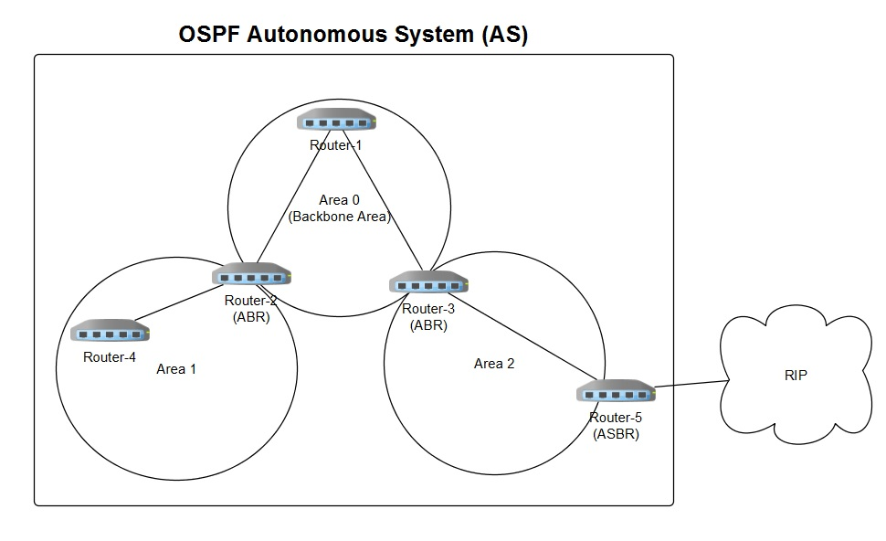

* Autonomous system (AS)
+
A group of networks under a single administrative control. An Interior Gateway
Protocol (IGP) refers to a routing protocol that handles routing within a
single autonomous system. IGPs include RIP, IGRP, EIGRP, and OSPF.

* Area border router (ABR)
+
A router that connects to multiple areas.

* Autonomous system border router (ASBR)
+
A router that connects different ASs, that is, it acts as a gateway between OSPF
and other routing protocols (IGRP, RIP, BGP and etc.)

* Designated router (DR)
+
A designated router is elected on every broadcast network. It generates
link-state packets for the network and synchronizes the link-state database with
all other routers on the network. The designated router concept also reduces
the amount of routing protocol traffic.

* Backup designated router (BDR)
+
The backup designated router also synchronizes the link-state databases with all
other routers on the network but does not generate link-state packets for the
network. When a DR fails, the BDR becomes the new DR. This transition doesn't
need to resynchronize the link-state database which can potentially take quite
some time. The backup designated router concept makes the transition smoother.

=== OSPF Areas

OSPF allows for grouping contiguous networks and hosts into so-called areas. The
topology of an area is invisible from the outside of the area. A router has a
separate link-state database for each area it is connected to. This reduces the
OSPF traffic sent on the network and also the size of the topology database a
router must maintain.

* Backbone Area
+
The OSPF backbone is the central area of an AS and all other areas must be
directly connected to the backbone area. The backbone area distributes routing
information between non-backbone areas. The backbone area needs to be
contiguous.

* Transit Area
+
When an area can carry data traffic that neither originates nor terminates
in the area itself, it's an transit area.

* Stub Area
+
OSPF allows certain areas to be configured as "stub areas". AS external routing
information is not flooded into stub areas. Instead, a default route is
advertised into the stub area through one or more of the stub area's ABRs.

* Not-So-Stubby Area (NSSA)
+
NSSA is similar to the existing OSPF stub area but has the additional capability
of importing AS external routes in a limited fashion. All routers in the NSSA
must agree on the "N" bit (NSSA capable) and  allow to carry AS external route
information.

=== Link-State Packet Types
There are four major Link-State packet types (LS Types).

.OSPF Link-State Packet Types
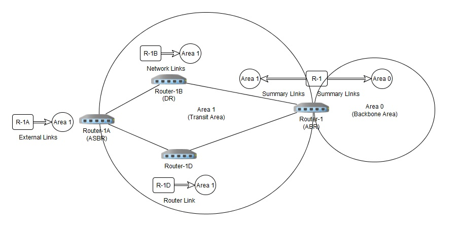

* Router LSA (Type 1)
+
Originated by a router. Describes the state and cost of the router's link
(interfaces) to the intra area.

* Network LSA (Type 2)
+
Originated by a DR. Describes all routers attached to the network segment.

* Summary LSA (Type 3 and 4)
+
Originated by an ABR. Describes networks between backbone area and inter area.

* External LSA (Type 5 and 7)
+
Originated by an ASBR. Describes networks outside of the AS.

=== DR Election
OSPF Hello packets are exchanged using IP multicast packets on each network
segment. Designated router (DR) and backup designated router (BDR) election is
done via the Hello packet. The router with the highest OSPF priority will be
elected as the DR on the segment and the one with the second-highest OSPF
priority will be elected as the BDR.

[NOTE]
Priority value 0 indicates that an interface is not to be elected as DR or BDR.
This is known as a DROTHER router.

==== Neighbor and Adjacency
OSPF neighbor is the relationship that is established among OSPF intra-area
routers that share a common network segment and area.

Adjacencies are created when neighboring routers exchange routing information
with each other. The adjacency states are listed below.

.OSPF Adjacency Example
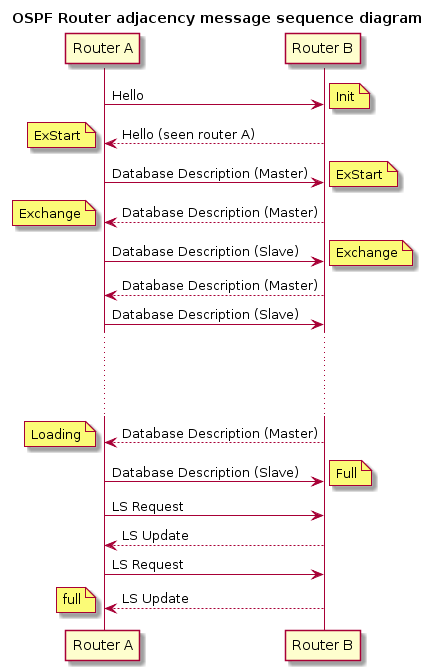

* Down: The initial state of a conversation when no information has been
exchanged.
* Attempt: Similar to the Down state, but is only used on Non-broadcast
multiple-access (NBMA) networks.
* Init: Hello packet has been received from neighbor. But bidirectional
  communication has not yet been established with the neighbor.
* 2-Way: Communication with neighbor is bidirectional.
* ExStart: Decide a master/slave relationship and an initial sequence number
  for later adjacency building process.
* Exchange: Describe the entire link state database to the neighbor.
* Loading: Request the most recent LSAs from neighbor.
* Full: The adjacency is completed.

== Simple OSPF Configuration Example
In this section we present a simple example to show how to enable OSPF on two
routers in the backbone area. This involves two actions: Enable OSPF process and
enable OSPF on the specified network.

When OSPF is disabled, no OSPF control frames will be transmitted and the
router will not react to OSPF control frames sent by others. No OSPF status
will be available when disabled.

When OSPF routing is enabled and a network is also enabled, the corresponding
interfaces will transmit OSPF control frames periodically, advertising routing
updates. The frames received from the corresponding interfaces will also be
processed.

NOTE: Before enabling OSPF, the IP routing capability must be enabled first.
This can be done by issuing the 'ip routing' CLI command in global configuration
mode.

=== Configuration Example
Suppose we have two routers, Router-1 and Router-2, both connected to Area 0
(a.k.a. 0.0.0.0). Router-1 can reach 192.168.1.0/24 and Router-2 can reach both
192.168.1.0/24 and 192.168.2.0/24.

==== Topology Setup
.Simple backbone area topology
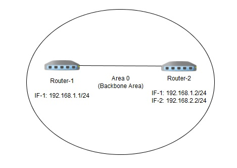

==== Via CLI
Use the 'ip routing' command in global configuration mode to enable the IP
routing capability. Use the 'no' form to disable the IP routing capability.

Syntax::
* ip routing
* no ip routing

Default::
IP routing capability is disabled. The default is therefore host mode.

Use the 'router ospf' command in global configuration mode to enable OSPF
routing. Use the 'no' form to disable OSPF routing.

Syntax::
* router ospf
* no router ospf

Default::
OSPF routing is disabled.

Use the 'network area' command in router configuration mode to set the OSPF
network area ID on a specific interface. The area ID is typically formatted
as an IP address. Use the 'no' form to remove the setting.
To enable OSPF on multiple network segments you need to issue the command
multiple times.

Syntax::
* network <ipv4_addr> <wildcard_mask> area <area_id>
* no network <ipv4_addr> <wildcard_mask> [ area <area_id> ]

Parameters::
* <ipv4_addr> <wildcard_mask>: The pair of these two parameters indicate an
address range, which allows the user to define one or multiple interfaces within
this address range and associate them with a specific OSPF area ID.
Notice that in OSPF, regular IPv4 network masks are inverted, and called
wildcard masks. This means that an IP segment of 192.168.1.0/24 will be written
as 192.168.1.0 0.0.0.255. Throughout this document, 192.168.1.0/24 means an IPv4
network with network mask 255.255.255.0 and wildcard mask 0.0.0.255.

* <area_id>: The OSPF area ID is a 32-bit number used to associate the OSPF
address range with a particular area. It can be specified as either an IPv4
address format (A.B.C.D) or as a decimal value from 0 to 4294967295.

Default::
No OSPF network is configured.

NOTE: The software prohibits the network address range overlapping to avoid
conflict.

Example::
Step 1 (both Router-1 and Router-2). Enable IP routing using OSPF and enable
OSPF on network 192.168.1.0/24 in area 0 via CLI.
[cols="1,5,5"]
|===
| Step | Command | Description

| 1
|# configure terminal
|Enter global configuration mode.

| 2
|(config)# vlan 100
|Create a VLAN, and enter VLAN configuration mode.

| 3
|(config-vlan)# interface GigabitEthernet 1/1
|Specify the interface to configure, and enter the interface configuration
mode.

| 4
|(config-if)# switchport access vlan 100
|Set the access mode of the interface to the specified VLAN.

| 5
|(config-if)# interface vlan 100
|Specify the interface to configure, and enter the VLAN interface configuration
mode.

| 6
| For Router-1: Configure IP address 192.168.1.1/24.

(config-if-vlan)# ip addr 192.168.1.1/24

For Router-2: Configure IP address 192.168.1.2/24.

(config-if-vlan)# ip addr 192.168.1.2/24

|Configure an IP address for an interface.

| 7
|(config)# ip routing
|Enable the IP routing capability.

| 8
|(config)# router ospf
|Enable the OSPF routing process and enter the OSPF router configuration mode.

| 9
|(config-router)# network 192.168.1.0 0.0.0.255 area 0

|Configure the OSPF network area. The configured network segment must not
overlap with other network segments.
|===

Step 2 (Router-2, only). Enable OSPF on network 192.168.2.0/24 in area 0 via
CLI.

[cols="1,4,6"]
|===
| Step | Command | Description

| 1
|# configure terminal
|Enter global configuration mode.

| 2
|(config)# vlan 200
|Create a VLAN, and enter VLAN configuration mode.

| 3
|(config-vlan)# interface GigabitEthernet 1/2
|Specify the port interface to configure, and enter the port interface
configuration mode.

| 4
|(config-if)# switchport access vlan 200
|Set the access mode of the port interface to the specified VLAN.

| 5
|(config-if)# interface vlan 200
|Specify the VLAN interface to configure and enter the VLAN interface
configuration mode.

| 6
|(config-if-vlan)# ip addr 192.168.2.2 255.255.255.0
|Configure an IP address for an interface.

| 7
|(config)# router ospf
|Enable the OSPF routing process and enter the OSPF router configuration mode.

| 8
|(config-router)# network 192.168.2.0 0.0.0.255 area 0

|Configure the OSPF network area. The configured network segment must not
overlap with other network segments.
|===

[TIP]
Use the 'show ip ospf' command to verify the current settings. See also
<<General/Area Status via CLI>>.

==== Via Web
.Configure VLAN via Web
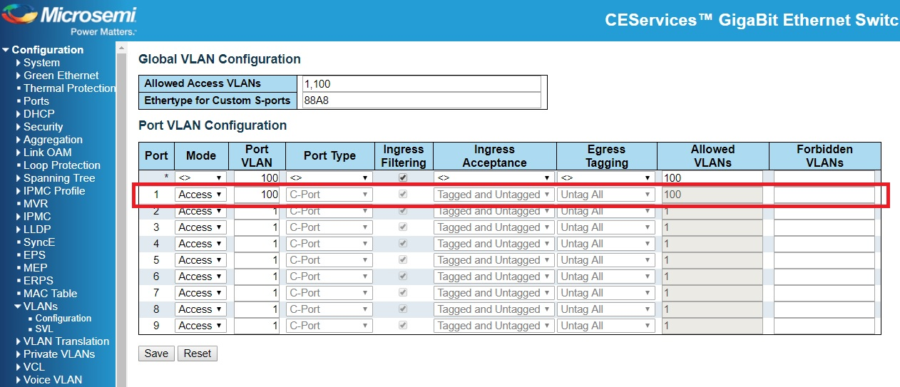

.Configure IP address and enable IP routing via Web
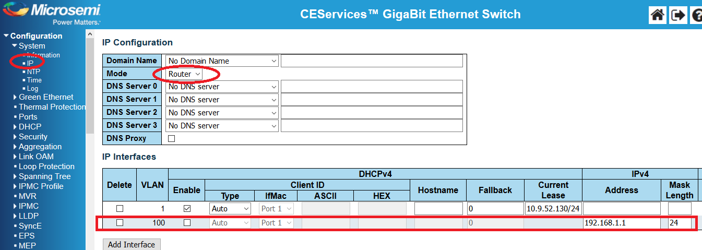

.Enable OSPF via Web
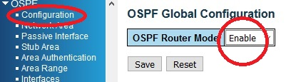

.Configure OSPF network area via Web
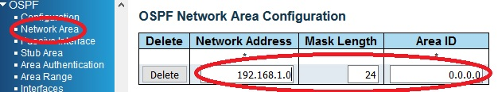

[TIP]
Use the 'OSPF Status' web page to verify the current settings. See also
<<General/Area Status via Web>>.

== OSPF Router ID
The router ID is a 32-bit number (typically formatted as an IPv4 address)
uniquely identifying the router in the Autonomous System.

When the Router ID is changed, you must restart the OSPF router process. See
<<Clear IP OSPF Process>> for a description of this.

NOTE: It is the user's responsibility to ensure that the ID is unique within the
entire OSPF domain. If the router ID is not set explicitly, then the router will
use the highest active interface IP addresses as its router ID.

=== Configuration Example
Here's an example of configuring router ID 0.0.0.1 for Router-1 and auto mode
router ID for Router-2.

==== Topology Setup
.OSPF router ID example
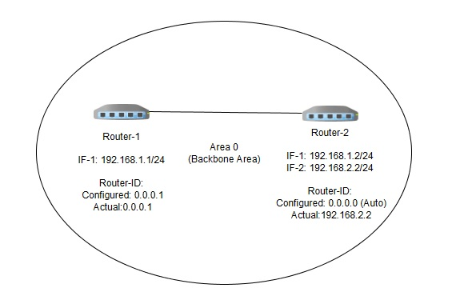

==== Via CLI
Use the 'router-id' command in OSPF router configuration mode to set the OSPF
router ID. Use the 'no' form to restore the setting to default algorithm.

Syntax::
* router-id <router_id>
* no router-id

Parameter::
* <router_id>: OSPF router-id in IPv4 address format (A.B.C.D). Notice that the
router ID should be unique in the Autonomous System and value '0.0.0.0' is
invalid since it is reserved for the default algorithm. If there is one or more
fully adjacent neighbors in the current OSPF area, the new router ID will take
effect after restarting the OSPF process (using 'clear ip ospf process'.)

Default::
No OSPF router ID is configured. The default algorithm will choose the largest
IP address assigned to the router.

.Configure OSPF Router ID
[cols="1,4,6"]
|===
| Step | Command | Description

| 1
|# configure terminal
|Enter global configuration mode.

| 2
|(config)# router ospf
|Enable OSPF and enter OSPF router configuration mode.

| 3
|Router-1: Configure Router ID 0.0.0.1 +
(config-router)# router-id 0.0.0.1 +
Router-2: Apply default algorithm (Auto) +
(config-router)# no router-id
|Configure the OSPF router ID.
|===

[TIP]
Use the 'show ip ospf' command to verify the setting. See also
<<General/Area Status via CLI>>.

==== Via Web
.Configure OSPF router ID via Web
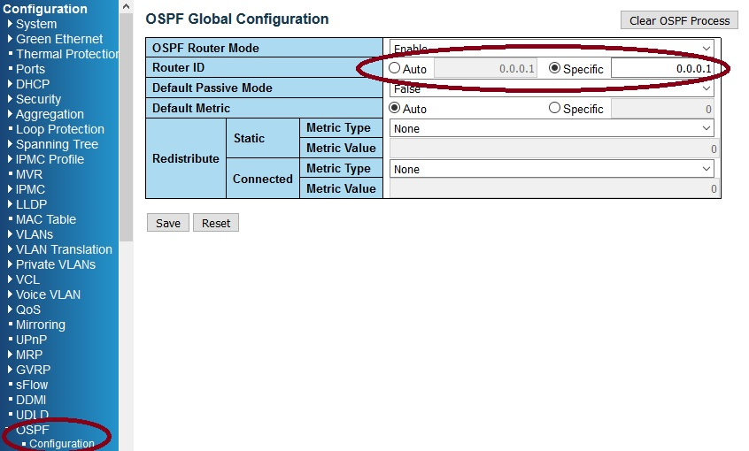

[TIP]
Use the 'OSPF Status' web page to verify the setting. See also
<<General/Area Status via Web>>.

== OSPF Interface
=== OSPF Passive Interface
When an interface is configured as a passive interface, transmission of OSPF
routing updates is suppressed. Therefore, the interface does not establish
adjacencies (no OSPF Hellos). The subnet of all interfaces (both passive and
active) is advertised by the OSPF router.

==== Configuration Example
The following example configures VLAN 22 as a passive interface.

===== Via CLI
Use the 'passive-interface vlan' command in router configuration mode to
suppress OSPF routing updates on a specific interface.

Use the 'passive-interface default' command in router configuration mode to
set all VLAN interfaces as passive by default.

Use the 'no' form to remove the setting.

Syntax::
* passive-interface { default | vlan <vid_list> }
* no passive-interface { default | vlan <vid_list> }

Parameters::
* <vid_list>: List of VLAN interface numbers. It can be a single VLAN ID or a
list of VLAN IDs, e.g. '1,3,5-8'.

Default::
No passive-interface is configured.

Example::
Configure OSPF passive interface through CLI.
[cols="1,4,6"]
|===
| Step | Command | Description

| 1
|# configure terminal
|Enter global configuration mode.

| 2
|(config)# router ospf
|Enable OSPF and enter OSPF router configuration mode.

| 3
|(config-if-vlan)# passive-interface vlan 22
|Mark VLAN 22 as a passive interface.
|===

[TIP]
Use the 'show ip ospf interface' command to verify the current settings. See
also <<Interface Status via CLI>>.

===== Via Web
.Configure OSPF passive interface via Web
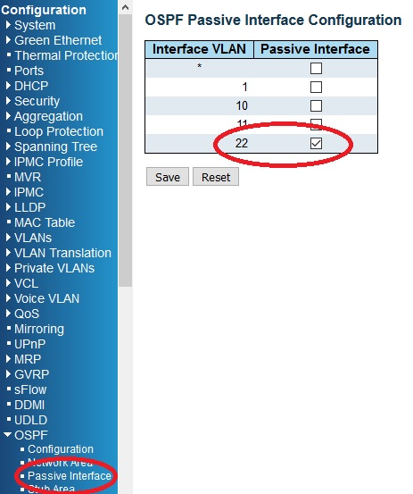

.Configure OSPF passive interface default setting via Web
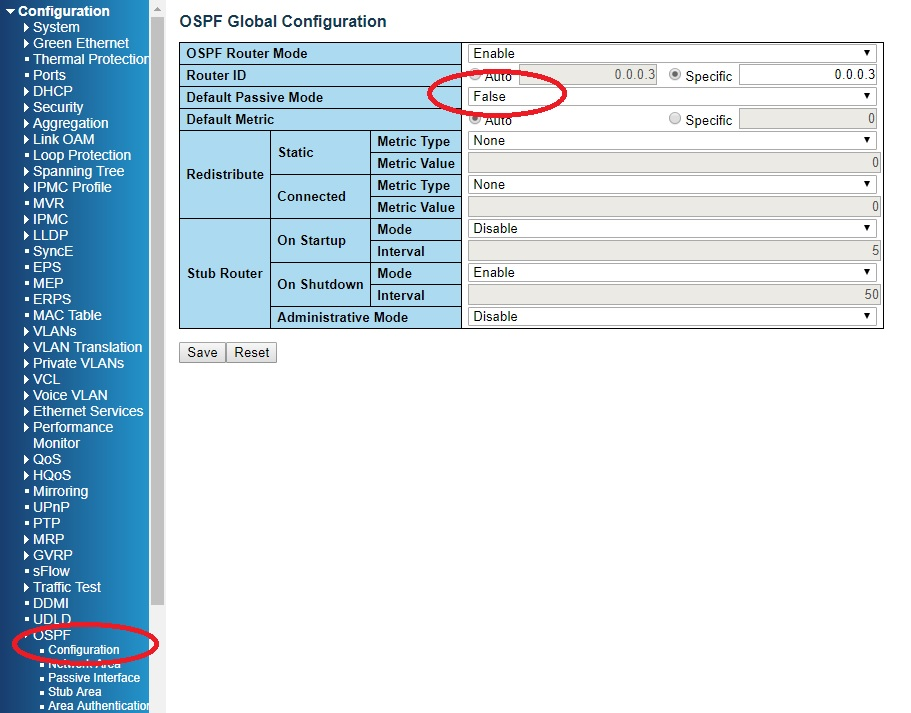

[TIP]
Use the 'OSPF Status' web page to verify the current settings. See also
<<Interface Status via Web>>.

=== Interface Parameter Tuning
This section describes additional parameters allowing for fine-tuning interfaces
to fit real network situations.

==== OSPF Interface Router Priority
The Designated Router is elected by the Hello protocol. A router's Hello packet
contains its Router Priority, which is configurable on a per-interface basis.
The router with the highest priority will be more eligible to become DR.

The router priority is an integer value from 0 to 255 with a default value of 1.

NOTE: When the router priority is set to zero, this router will be ineligible
to become the Designated Router (DR) or Backup Designated Router (BDR).

==== OSPF Interface Cost
The OSPF interface cost is a link state metric. The lower the cost, the more
likely the interface is to be used for forwarding data traffic.

The cost value is used in the router LSAs' metric field and used in the Shortest
Path First (SPF) calculation.

The interface cost is an integer value from 0 to 255 with a default value of 1.

==== OSPF Hello Interval and Dead Interval
If a router does not receive a hello packet from a neighbor within the dead
interval, it will declare the neighbor to be down. Reception of a hello packet
resets the timer.

Both the hello interval and the dead interval must be the same within the
network. They are both included in Hello packets, and if - upon reception -
the values don't match the configured values, the Hello packet is dropped, so
no neighborship will be formed.

[TIP]
It is common practice to set the dead interval to four times the hello interval.

==== OSPF Fast Hello Packets
Fast Hello packets are Hello packets transmitted at a rate faster than one per
second. The benfit of fast Hello packets is that the OSPF network will
experience faster convergence than it would without fast Hello packets. Lost
neighbors will be detected within one second.

Fast Hello packets is configured by - in CLI - using the 'minimal' keyword in
conjunction with a hello multiplier, which specifies the number of times per
second to transmit a Hello packet. The use of the 'minimal' keyword implicitly
sets the advertised dead interval to 1 second and the advertised hello interval
to 0.

When using fast Hello packets, the hello multiplier need not be identical across
the whole network. In fact, unlike the dead interval, the hello multiplier is
not advertised in Hello packets, so there is no way for the receiver of Hello
packets to check against its own multiplier.

Since the dead interval is 1, a neighbor is considered dead if a Hello packet
has not been received within the past one second.

==== OSPF Interface Retransmit Interval
The retransmit interval determines the time until retransmitting a database
description packet or a link-state request when the previous packet has not been
acknowledged. If a router sends a link-state advertisement (LSA) to its neighbor
without acknowledgement within the retransmit interval, the LSA will be sent
again.

The retransmit-interval is an integer value from 3 to 65535 with a default value
of 5 seconds.

==== Configuration Examples
This section provides a series of examples for tuning the OSPF interface
parameters.

===== Via CLI
====== OSPF Interface Router Priority
Use the 'ip ospf priority' command in VLAN interface configuration mode to set
the router priority for that VLAN interface.

Use the 'no' form to restore the setting to default.

Syntax::
* ip ospf priority <0-255>
* no ip ospf priority

Parameters::
* <0-255>: User-specified router priority for the interface.

Default::
The default router priority value is 1.

====== OSPF Interface Cost
Use the 'ip ospf cost' command in VLAN interface configuration mode to set the
cost value for that VLAN interface. The cost value is assigned to router LSA's
metric field and used in the Shortest Path First (SPF) calculation.

Use the 'no' form to remove the setting.

Syntax::
* ip ospf cost <1-65535>
* no ip ospf cost

Parameters::
* <1-65535>: Link state metric for the interface. This is used in the Shortest
Path First (SPF) algorithm.

Default::
The default is no user-specified cost value. The cost is calculated by the OSPF
process.

====== OSPF Interface Dead Interval
Use the 'ip ospf dead-interval' command in VLAN interface configuration mode to
set the dead interval value (in seconds) for the interface.

The command also allows for configuring transmission of Hello packets at rates
faster than 1 second (a.k.a. fast Hello packets) by using the
'minimal hello-multiplier <multiplier>' argument. Here, the '<multiplier>'
specifies how many Hello packets will be sent per second.

Use the 'no' form to restore the setting to default value.

Syntax::
* ip ospf dead-interval { <1-65535> |  minimal hello-multiplier <1-10> }
* no ip ospf dead-interval

Parameters::
* <1-65535>: Number of seconds to wait until the neighbor is assumed to be dead.
The timer is restarted whenever a hello packet is received from the neighbor.
* minimal hello-multiplier <multiplier>: Enables fast Hello packets at
<multiplier> packets per second.

Default::
The default dead-interval value is 40 seconds with no fast Hello packets.

Usage Guidelines::
If the input command with the optional argument 'minimal hello-multiplier'
is specified, then the dead-interval is set to 1. In this case, the
hello-interval advertised in Hello packets is set to 0 and the hello-interval in
the Hello packets received over this interface is ignored.

The value of fast hello packets need not be the same for the entire segment
since the router only requires that at least one hello packet is received within
the dead-interval.

[NOTE]
====
The configuration of dead-interval should be used with caution.

Although the benefit of smaller dead intervals is faster detection of neighbor
removals, the downside is higher CPU (and network) utilizations, which in turn
may impact routing performance and other CPU activities.
====

====== OSPF Interface Hello Interval
Use the 'ip ospf hello-interval' command in VLAN interface configuration mode to
set the hello interval value for the interface.

Use the 'no' form to restore the setting to default value.

Syntax::
* ip ospf hello-interval <1-65535>
* no ip ospf hello-interval

Parameters::
* <1-65535>: The time interval (in seconds) between hello packets.

Default::
The default hello interval is 10 seconds.

====== OSPF Interface Retransmit Interval
Use the 'ip ospf retransmit-interval' command in VLAN interface configuration
mode to set the retransmit interval value for the interface.

Use the 'no' form to restore the setting to default value.

Syntax::
* ip ospf retransmit-interval <3-65535>
* no ip ospf retransmit-interval

Parameters::
* <3-65535>: The time interval (in seconds) to wait before retransmitting a
database description packet or a link-state request when it has not been
acknowledged.

Usage Guidelines::
Be aware that the value of retransmit-interval should be greater than the
expected round-trip delay between any two routers on the attached network. The
configuration should also consider needless LSA retransmissions.

NOTE: It is recommended to use the same retransmit interval on neighboring
routers in order to avoid unnecessary LSA retransmissions.

Default::
The default retransmit-interval value is 5 seconds.

Examples::
Configure various OSPF interface parameters via CLI.
[cols="1,4,6"]
|===
| Step | Command | Description

| 1
|# configure terminal
|Enter global configuration mode.

| 2
|(config)# interface vlan 11
|Enter VLAN interface configuration mode.

| 3
|(config-if-vlan)# ip ospf priority 8
|Set the priority to be used to elect the DR for a network.

The OSPF router with the highest router priority becomes the designated router.

| 4
|(config-if-vlan)# ip ospf cost 128
|Specify the cost of sending packets from the interface.

The lower the cost, the more likely the interface is to be used to forward data
traffic.

| 5
|(config-if-vlan)# ip ospf dead-interval 10
|Set the number of seconds during which the router must receive at least one
Hello packet from a neighbor without declaring it down.

The optional argument 'minimal hello-multiplier <multiplier>' is used to
configure Hello packets to be transmitted at rates higher than once per second
(a.k.a. fast Hello packets). In this case, the deal interval implicitly becomes
one second.

| 6
|(config-if-vlan)# ip ospf hello-interval 20
|Set the interval - in seconds - between transmission of Hello packets. This
value is not used if fast Hello packets is used (see 'minimal hello-multipier').

| 7
|(config-if-vlan)# ip ospf retransmit-interval 20
|Set the interval between retransmission of an LSA in case no acknowledgment has
been received.
|===

[TIP]
Use the 'show ip ospf interface' command to verify the current settings. See
also <<Interface Status via CLI>>.

===== Via Web
.Configure OSPF interface parameters via Web
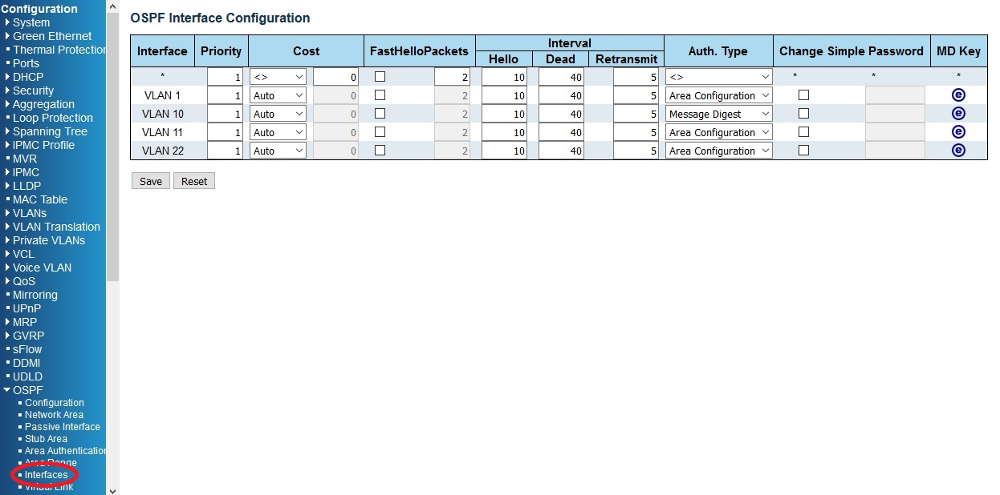

[TIP]
Use the 'OSPF Status' web page to verify the current settings. See also
<<Interface Status via Web>>.

== OSPF Virtual Links
An OSPF virtual link is established between two ABRs to overcome the fact that
all areas must be connected directly to the backbone area (Area 0).

A virtual link can be used in two cases.

=== Extend the Backbone Area
Virtual links allow the user to connect an ABR to a backbone ABR when a direct,
physical connection is not available.

The figure below shows an example of such a situation.

.OSPF Virtual Link Example Topology
image::RS1169/RS1169-UseCase-Virtual-Link_Sample.jpg[usecase virtual link sample]

Area 5 has no direct connection to the backbone area. A virtual link is a
method to set a tunnel through area 4. By using a virtual link we can extend
area 0 through area 4 to area 5. With this method, area 5 can be treated as
a direct connection and Router-41 can be treated as having a direct connection
to the backbone area.

=== Connect Discontiguous Backbone Areas
Since all areas must be connected to the backbone area, it is sometimes
beneficial to have, say, two backbone areas at two different locations so that
other areas connected at these two locations don't have to have separate virtual
links to a single backbone area. A virtual link can therefore be established to
connect the two backbone areas instead, effectively making them seem as one,
contiguous area.

The figure below shows an example of such a situation.

.OSPF Discontiguous Area Example Topology
image::RS1169/RS1169-UseCase-Virtual-Link_Discontiguous.jpg[usecase virtual link discontiguous area]

Area 4 has a virtual link between Router-4 and Router-42, effectively connecting
the two backbone areas.

=== Virtual Link Configuration Example
In this example we will configure Router-4 (with Router ID 0.0.0.4) and
Router-41 (with Router ID 0.0.0.41) to have a virtual link that connects area 5
to area 0 through area 4, taking basis in the figure from the
<<Extend the Backbone Area>> section.

==== Via CLI
Use the 'virtual link' command in router configuration mode to set a virtual
link between two related ABRs. Use the optional argument 'hello-interval' to
configure the hello interval on the virtual link. Use the optional argument
'retransmit-interval' to configure the retransmit interval on the virtual link.
Use the optional argument 'dead-interval' to configure the dead interval on
the virtual link. Use the optional argument 'authentication' to set a security
connection on virtual link.

Use the 'no' form to remove the setting.

Syntax::
* area <area_id> virtual-link <router_id> [hello-interval <1-65535>]
  [retransmit-interval <1-65535>] [dead-interval <1-65535>]
* no area <area_id> virtual-link <router_id> [hello-interval <1-65535>]
  [retransmit-interval <1-65535>] [dead-interval <1-65535>]

* area <area_id> virtual-link <router_id> {
+
authentication [ null | message-digest ] |
+
authentication-key { unencrypted <word1-8> | encrypted <word128> } |
+
message-digest-key <1-255> md5 { unencrypted <word1-16> | encrypted <word128> }
+
}
* no area <area_id> virtual-link <router_id> {
+
authentication  |
+
authentication-key |
+
message-digest-key <1-255> }
+
}

Parameters::
* <area_id>: The OSPF area ID.
* virtual-link: Configure a virtual link.
* <router_id>: Configure router-id in IPv4 address format (A.B.C.D).
* hello-interval: Configure the hello interval on the virtual link.
* retransmit-interval: Configure the retransmit interval on the virtual link.
* dead-interval: Configure the dead interval on the virtual link.
* null: Use null authentication.
* message-digest: Use MD5 authentication.
* authentication-key: Use simple password.
* message-digest-key <1-255> md5: The MD5 key ID and key.
* unencrypted: The key in plain text.
* encrypted: The encrypted key.

Default::
No OSPF virtual link is configured.

Example::
Configure OSPF virtual link via CLI.
[cols="1,4,6"]
|===
| Step | Command | Description

| 1
|# configure terminal
|Enter global configuration mode.

| 2
|(config)# router ospf
|Enable the OSPF routing process and enter the OSPF router configuration mode.

| 3
|For Router-4, use the following commands to setup.

(config-router)# router-id 0.0.0.4

(config-router)# network 1.0.3.0 0.0.0.255 area 0.0.0.0

(config-router)# network 1.0.4.0 0.0.0.255 area 0.0.0.0

(config-router)# network 1.4.15.0 0.0.0.255 area 0.0.0.4

(config-router)# area 4 virtual-link 0.0.0.41

For Router-41, repeat steps 1-2 and use the following commands to setup.

(config-router)# ospf router-id 0.0.0.41

(config-router)# network 1.4.15.0 0.0.0.255 area 0.0.0.4

(config-router)# network 1.5.16.0 0.0.0.255 area 0.0.0.5

(config-router)# area 4 virtual-link 0.0.0.4

|Configure a virtual link to another OSPF router within the area.

|===

[TIP]
Use the 'show ip ospf interface' command to verify the current settings. See
also <<Interface Status via CLI>>.

==== Via Web
.Configure OSPF virtual link via web
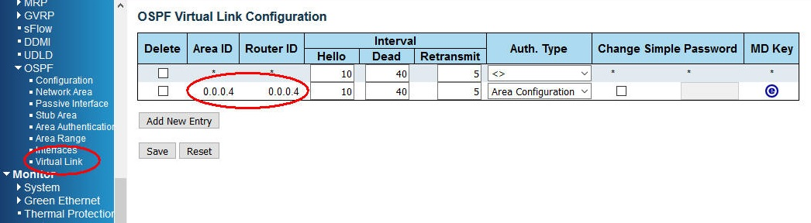

[TIP]
Use the 'OSPF Status' web page to verify the current settings. See also
<<Interface Status via Web>>.

== OSPF Authentication
The authentication type is configurable on a per-interface basis. The OSPF
router supports three authentication types.

* Type 0 - Null authentication
* Type 1 - Simple password
* Type 2 - Cryptographic authentication

Type 0 means no authentication.

Type 1 is using a plain text authentication. A password must be configured, but
the password can be eavesdropped.

Type 2 is message-digest algorithm 5 (MD5) authentication. Keying material must
also be configured. This is the most secure method.

=== Area Authentication
==== Configuration Example
This example shows how to configure authentication for an area.

===== Topology Setup
.OSPF Area authentication topology

===== Via CLI
Use the 'area authentication' command in router configuration mode to configure
authentication used in a specific area. Use the 'no' form to remove the setting.

Syntax::
* area <area_id> authentication [ message-digest ]
* no area <area_id> authentication

Parameters::
* <area_id>: 32-bit Area ID.
* message-digest: Use MD5 authentication. If not specified, the authentication
type is a simple password.

Default::
No authentication is configured.

Usage Guidelines::
This command applies the authentication type to all VLAN interfaces within an
area. It may be overridden per VLAN interface as shown in
<<Interface Authentication>>.

It is not necessary to disable authentication while switching between MD5 and
simple password authentication types.

Example::
Configure OSPF area authentication via CLI.
[cols="1,4,6"]
|===
| Step | Command | Description

| 1
|# configure terminal
|Enter global configuration mode.

| 2
|(config)# router ospf
|Enable OSPF routing and enter the OSPF router configuration mode.

| 3
|(config-router)# area 1 authentication message-digest
|Configure the authentication type within the given area.

| 4
|(config-if-vlan)# ip ospf message-digest-key 30 md5 unencrypted 1234
|The password and keying material need to be configured on the VLAN interface if
the specified authentication type requires it.

Default setting is null authentication.
|===

[NOTE]
Per-VLAN interface settings will override any per-area authentication settings.

[TIP]
Use the 'show ip ospf' command to verify the current settings. See also
<<General/Area Status via CLI>>.

===== Via Web
.Configure an OSPF area authentication via Web
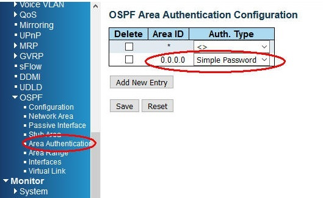

[TIP]
Use the 'OSPF Status' web page to verify the current settings. See also
<<General/Area Status via Web>>.

=== Interface Authentication
==== Configuration Example
This example shows how to set up authentication on specific interfaces.

===== Topology Setup
.OSPF Interface authentication topology

===== Via CLI
Use the 'ip ospf authentication' command in VLAN interface configuration mode
to configure the authentication. Use the 'no' form to remove the setting.

Syntax::
* ip ospf { authentication [ null | message-digest ] | authentication-key
  { unencrypted <word1-8> | encrypted <word128> } | message-digest-key <1-255>
  md5 { unencrypted <word1-16> | encrypted <word128> } }
* no ip ospf { authentication  | authentication-key |
  message-digest-key <1-255> }

Parameters::
* null: Use null authentication.
* message-digest: Use MD5 authentication.
* authentication-key: Use simple password.
* message-digest-key <1-255> md5: The MD5 key ID and key.
* unencrypted: The key is in plain text.
* encrypted: The key is encrypted.

Defaults::
No OSPF authentication is configured.

Example::
Configure OSPF interface authentication via CLI
[cols="1,4,6"]
|===
| Step | Command | Description

| 1
|# configure terminal
|Enter global configuration mode.

| 2
|(config)# interface vlan 10
|Enter VLAN interface configuration mode.

| 3
|(config-if-vlan)# ip ospf authentication
|Enable interface authentication.

| 4
|(config-if-vlan)# ip ospf authentication message-digest
|Configure the authentication type.

| 5
|(config-if-vlan)# ip ospf message-digest-key 1 md5 unencrypted 1234
|Configure the authentication password or message-digest key.

Use the argument 'unencrypted' to specify that the password is in plain text and
'encrypted' to specify that the password is in encrypted format.

Default authentication scheme is to use the area authentication settings.

|===

[NOTE]
====
* If using simple password authentication but no password is configured, all
zeros are used as the password.

* If using MD5 authentication but the message digest key is not configured,
the OSPF packets act as null authentication.
====

[TIP]
Use the 'show ip ospf interface' command to verify the current settings. See
also <<Interface Status via CLI>>.

===== Via Web
.Configure OSPF interface authentication via Web
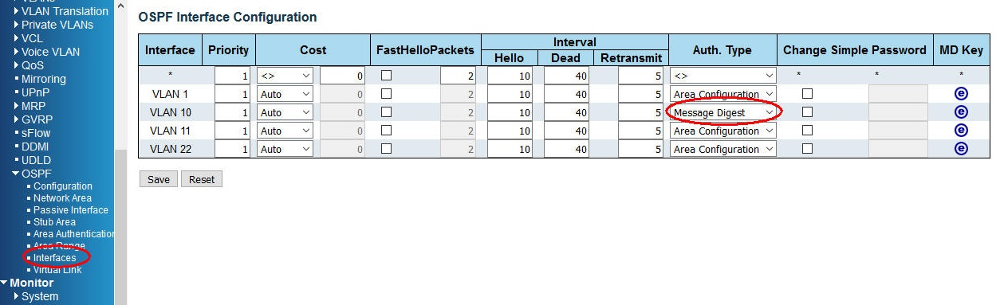

[TIP]
Use the 'OSPF Status' web page to verify the current settings. See also
<<Interface Status via Web>>.

=== Virtual Link Authentication
==== Configuration Example
The following example shows how to configure authentication on virtual links.
It is assumed that the virtual link is already configured as explained in
<<Virtual Link Configuration Example>>.

===== Topology Setup
.OSPF virtual link topology
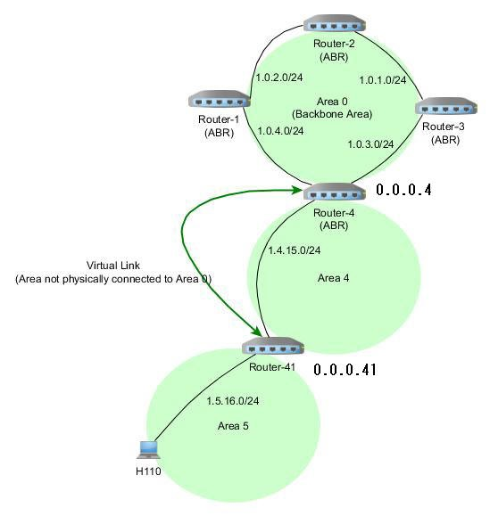

===== Via CLI
Use the optional argument 'authentication' to the 'area virtual-link' command in
router configuration mode. Use the 'no' form to remove the setting.

Syntax::
* area <area_id> virtual-link <router_id> {
+
authentication [ <null|message-digest> ] |
+
authentication-key { unencrypted <word1-8> | encrypted <word128> } |
+
message-digest-key <1-255> md5 { unencrypted <word1-16> | encrypted <word128> }
+
}
* no area <area_id> virtual-link <router_id> {
+
authentication  |
+
authentication-key |
+
message-digest-key <1-255> }
+
}

Parameters::
* <area_id>: OSPF Area ID.
* virtual-link: Configure the virtual link on this area.
* <router_id>: OSPF Router ID.
* null: Use null authentication.
* message-digest: Use MD5 authentication.
* authentication-key: Use simple password.
* message-digest-key <1-255> md5: The MD5 key ID and key.
* unencrypted: The key is in plain text.
* encrypted: The key is encrypted.

Default::
No authentication is configured on virtual links.

Example::
Configure OSPF virtual link authentication via CLI.
[cols="1,4,6"]
|===
| Step | Command | Description

| 1
|# configure terminal
|Enter global configuration mode.

| 2
|(config)# router ospf
|Enable OSPF routing and enter OSPF router configuration mode.

| 3
|For Router-4, use the following commands to setup:

(config-router)# area 4 virtual-link 0.0.0.41 authentication

(config-router)# area 4 virtual-link 0.0.0.41 authentication-key
unencrypted 1234

For Router-41, repeat steps 1-2 and use the following commands to setup:

(config-router)# area 4 virtual-link 0.0.0.4 authentication

(config-router)# area 4 virtual-link 0.0.0.4 authentication-key unencrypted 1234

|Set-up authentication on a virtual link.

|===

[TIP]
Use the 'show ip ospf interface' command to verify the current settings. See
also <<Interface Status via CLI>>.

===== Via Web
.Configure OSPF virtual link authentication via web
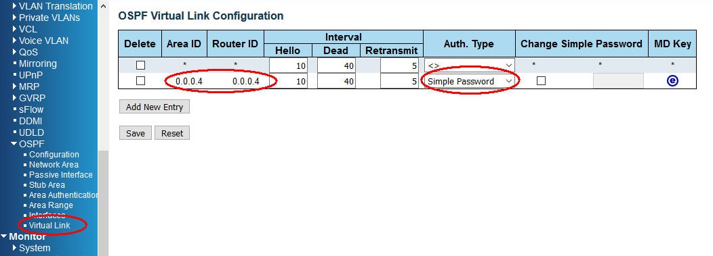

[TIP]
Use the 'OSPF Status' web page to verify the current settings. See also
<<Interface Status via Web>>.

== OSPF Stub Areas
OSPF stub areas are shielded from external routes, so AS-external LSAs (Type 5)
are not flooded into/through it. This reduces the link-state database size and
therefore the memory and CPU utilisations.

To further reduce the memory and CPU consumptions, an area can be configured as
a totally stubby area, where also summary-LSAs (Type 3) except for the default
route are blocked.

For a stub area or totally stubby area to reach any destination not reachable by
an intra-area or inter-area path, the stub area's ABR must advertise a default
route into the stub or totally stubby area via summary-LSAs.

[NOTE]
====
* All routers in a stub area must be configured as stub routers. Otherwise the
neighboring routers will refuse to accept Hello packets.
* All routers in a totally stubby area must be configured as stub routers and
only the ABR needs to be configured as a totally stubby router.
* An ASBR cannot be placed inside a stub area or a totally stubby area.
* Virtual links cannot be configured through stub areas or totally stubby areas.
====

The figure below shows an example of a stub area.

.OSPF Stub Area Example
image::RS1169/RS1169-UseCase-Stub-Area.jpg[usecase stub area]

Router-15 is an ASBR connected to external network which is `1.99.1.0/24`, so it
originates AS-external-LSAs to advertise the external network information. All
ABRs must flood these LSAs into the area they attach. Finally, all routers have
the external route. For example, the route entries in router-31 are:

----
Codes: C - connected, S - static, O - OSPF,
       * - selected route, D - DHCP installed route

O* 1.99.1.0/24 [110/20] via Router-3
O* 1.0.1.0/24 [110/100] via Router-3
O* 1.0.2.0/24 [110/100] via Router-3
O* 1.1.7.0/24 [110/100] via Router-3
O* 1.1.8.0/24 [110/100] via Router-3
O* 1.1.11.0/24 [110/100] via Router-3
O* 1.3.12.0/24 [110/100] via Router-3
----

On the other hand, once area 3 is configured as stub area, Router-3 doesn't
flood AS-external-LSAs into area 3 because it is an ABR for stub area 3.
Meanwhile, it also advertises a default route into the stub area. In this
example, the route entries in Router-31 are:

----
Codes: C - connected, S - static, O - OSPF,
       * - selected route, D - DHCP installed route

O* 0.0.0.0/0 [110/100] via Router-3
O* 1.0.1.0/24 [110/100] via Router-3
O* 1.0.2.0/24 [110/100] via Router-3
O* 1.1.7.0/24 [110/100] via Router-3
O* 1.1.8.0/24 [110/100] via Router-3
O* 1.1.11.0/24 [110/100] via Router-3
O* 1.3.12.0/24 [110/100] via Router-3
----

The figure below shows an example of a totally stubby area.

.OSPF Totally Stubby Area Example
image::RS1169/RS1169-UseCase-Totally-Stub-Area.jpg[usecase totally stubby area]

This topology is almost the same as the above except Router-2 is configured as
a totally stubby router, area 2 is a totally stubby area. Compared to the stub
area, the totally stubby area not only blocks AS-external-LSAs, but also
summary-LSAs. So the area doesn't get any routes from other areas except for the
default route from Router-2. The route entries in Router-22 are:

----
Codes: C - connected, S - static, O - OSPF,
       * - selected route, D - DHCP installed route

O* 0.0.0.0/0 [110/100] via Router-2
O* 1.2.5.0/24 [110/100] via Router-2
O* 1.2.6.0/24 [110/100] via Router-2
----

Another kind of stub area is the not-so-stubby area (NSSA), which is defined in
RFC 1587 and RFC 3101. It is illegal for a stub area to import routes external
to OSPF but an NSSA can import external routes into OSPF. To support NSSAs, all
routers in the NSSA must agree on the "N" bit (NSSA capable) and allow Type-7
LSAs to carry external route information.
NSSA area border routers translates Type-7 LSAs to Type-5 LSAs and advertise
these to other areas. The NSSA area border routers can be configured to always
or never translate Type-7 LSAs. It is also possible to select the translator
router via an election election process by marking routers as being candidates
for a translation election. The NSSA ABR who has the highest router ID will be
elected as the one translating type-7 LSAs into type-5 LSAs. Type-7 LSAs are
only advertised within an NSSA, they are not flooded into backbone area or other
area. The NSSA area border router will generate a Type-3 default route in the
NSSA.

The figure below shows an example of configuring an NSSA.

.OSPF NSSA Example Topology
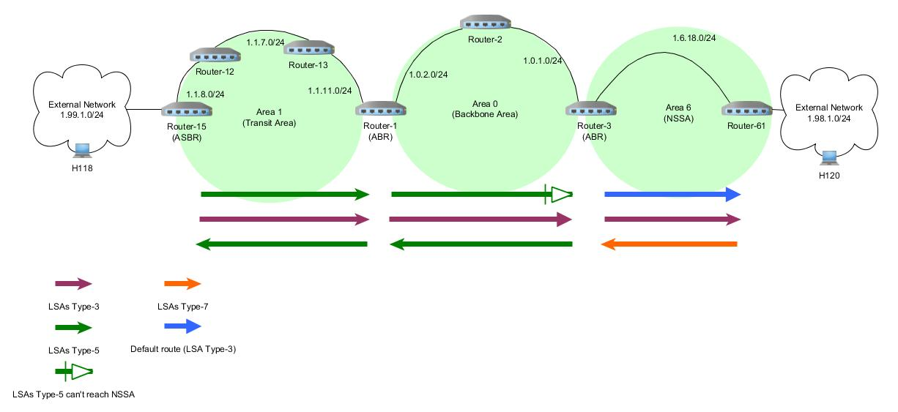

Compared to the NSSA, the totally NSSA not only blocks AS-external-LSAs (Type-5
LSAs), but also summary-LSAs. So the totally NSSA doesn't get any routes from other
areas except the default route from its ABR.

The figure below shows an example of configuring an totally NSSA.

.OSPF Totally NSSA Example Topology
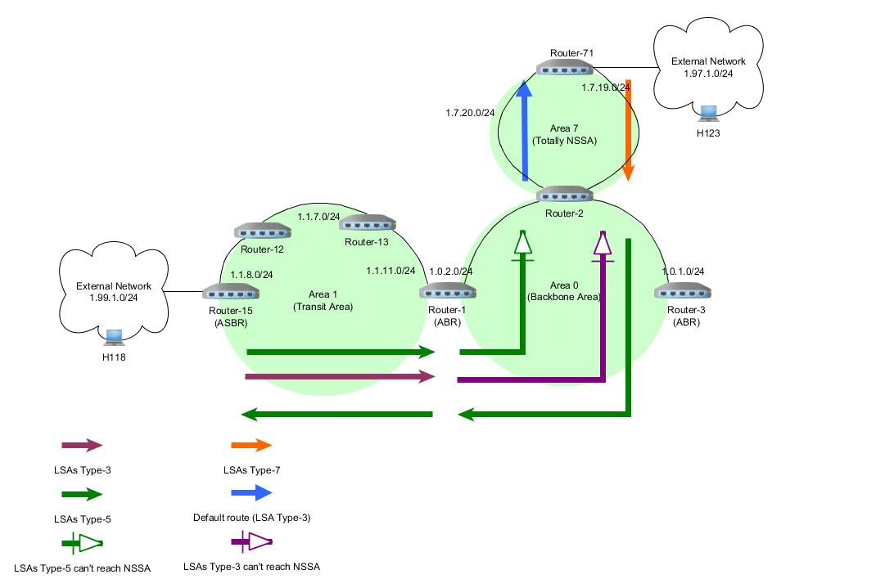

=== Stub Area Configuration Example
The following example configures area 3 as a stub area and area 2 as a totally
stubby area.

==== Topology Setup
.OSPF stub area topology
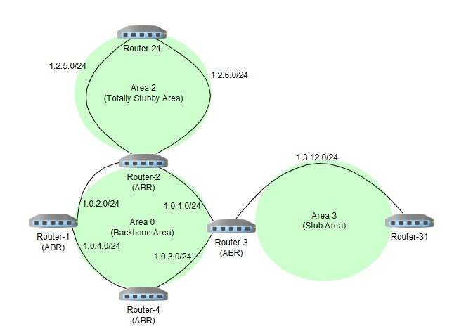

==== Via CLI
Use the 'area stub' command in OSPF router configuration mode to configure a
stub or totally stubby area.

Use the 'no' form to restore the setting.

Syntax::
* area <area_id> stub [no-summary]
* no area <area_id> stub [no-summary]

Parameters::
* <area_id>: Area ID.
* stub: Configure the area as stub area.
* no-summary: Configure the area as totally stubby area.

Default::
Area is neither a stub nor a totally stubby area.

Examples::
Configure OSPF stub area via CLI
[cols="1,4,6"]
|===
| Step | Command | Description

| 1
|# configure terminal
|Enter global configuration mode.

| 2
|(config)# router ospf
|Enable the OSPF routing process and enter the OSPF router configuration mode.

| 3
|Configure Router-2. Set area 2 as a totally stubby area. +
(config-router)# area 0.0.0.2 stub no-summary +
Configure Router-3. Set area 3 as a stub area. +
(config-router)# area 0.0.0.3 stub +
|Configure area 2 as a totally stubby area and area 3 as a stub area. +
Notice that the 'no-summary' option is required on ABR (Router-2) only.

| 4
|Configure Router-21 +
(config-router)# area 0.0.0.2 stub +
Configure Router-31 +
(config-router)# area 0.0.0.3 stub
|Configure both Router-21 and Router-31 as stub routers. Otherwise the
neighboring routers will refuse to accept OSPF hello packets.
|===

[TIP]
Use the 'show ip ospf' command to verify the current settings. See also
<<General/Area Status via CLI>>.

==== Via Web
.Configure OSPF stub area via Web
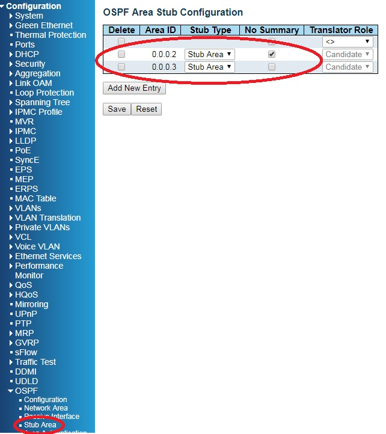

[TIP]
Use the 'OSPF Status' web page to verify the current settings. See also
<<General/Area Status via Web>>.

=== NSSA Configuration Example
The following example configures area 6 as an NSSA and area 7 as a totally NSSA.

==== Topology Setup
.OSPF NSSA topology
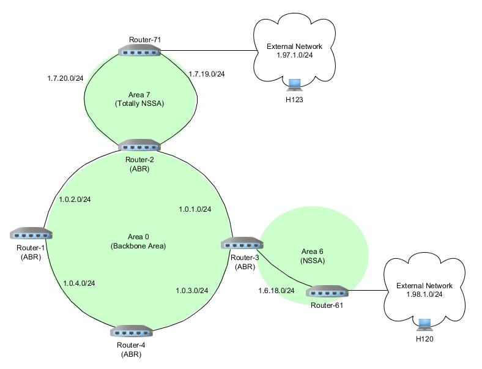

==== Via CLI
Use the 'area nssa' command in OSPF router configuration mode to configure a
NSSA or totally NSSA.

Use the 'no' form to remove the setting.

Syntax::
* area <area_id> nssa [no-summary]
* no area <area_id> nssa [no-summary]
* area <area_id> nssa translate type7 { always | never | candidate }
* no area <area_id> nssa translate type7 { always | never | candidate }

Parameters::
* <area_id>: Area ID.
* nssa: Configure the area as NSSA.
* no-summary: Configure the area as totally NSSA.
* always: Configure the NSSA-ABR always translates the Type-7 LSAs to Type-5
LSAs.
* never: Configure the NSSA-ABR never translates the the Type-7 LSAs to Type-5
LSAs.
* candidate: Configure the NSSA-ABR will participate in the translator election.

Default::
The area is neither an NSSA nor a totally NSSA. Default translator mode for NSSA
is 'candidate'.

Examples::
Configure OSPF NSSA via CLI
[cols="1,4,6"]
|===
| Step | Command | Description

| 1
|# configure terminal
|Enter global configuration mode.

| 2
|(config)# router ospf
|Enable the OSPF routing process and enter the OSPF router configuration mode.

| 3
|Configure Router-2. Set area 7 as a totally NSSA.
(config-router)# area 0.0.0.7 nssa no-summary

It is necessary to apply command 'area 0.0.0.7 nssa' on Router-71 since all
routers in NSSA must be configured as NSSA routers. Otherwise the neighboring
routers will refuse to accept OSPF hello packets.

Notice that the 'no-summary' option is required on ABR (Router-2) only.
|Configure area 7 as a totally NSSA.

| 4
|Configure Router-3. Set area 6 as an NSSA.
(config-router)# area 0.0.0.6 nssa

Apply command 'area 0.0.0.6 nssa' on Router-61 too. Same reason as the
description in step 3.
|Configure area 6 as an NSSA.
|===

[TIP]
Use the 'show ip ospf' command to verify the current settings. See also
<<General/Area Status via CLI>>.

==== Via Web
.Configure OSPF NSSA area via Web
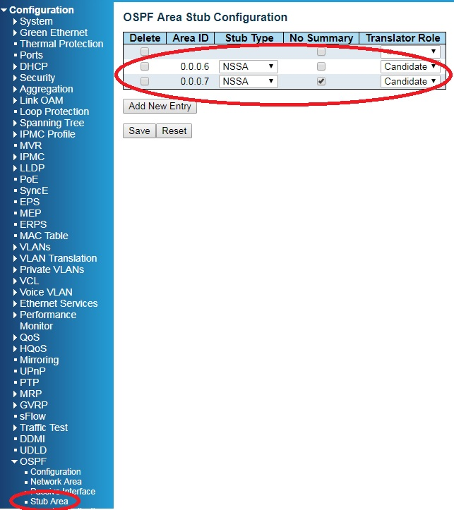

[TIP]
Use the 'OSPF Status' web page to verify the current settings. See also
<<General/Area Status via Web>>.

== OSPF Area Range

In an OSPF domain, each ABR maintains separate link-state databases and
advertises the summarized routes to other areas. The reasoning behind OSPF area
ranges is to reduce the number of routes advertised through summary-LSAs (Type
3), thereby reducing the size of LSDB in neighboring areas.

When a route matches a configured area range, only the area range is advertised.
In addition, it is possible to filter out the entire advertisement of that
range.

An area range may also come with a user-specified cost.

NOTE: The software will detect overlapping address ranges and deny applying the
configuration.

=== Configuration Example
Here's an example where Router-1 is configured to not advertise area 1's
1.1.99.0/24 and to summarize the following networks in area 1 into a single
range, namely 1.1.1.8.0/22: 1.1.1.8.0/24, 1.1.1.9.0/24, 1.1.1.10.0/24, and
1.1.1.11.0/24.

==== Topology Setup
.OSPF area range topology
image::RS1169/RS1169-UseCase-Area-Range.jpg[usecase 1]

Router-1 is the ABR between area 1 and the backbone area.

Router-14 is in the same area and contains an external route, 1.1.99.0/24, which
we want to prevent from being known in the backbone area.

==== Via CLI
Use the 'area range' command in router configuration mode to summarize or
suppress ranges.
Use the 'no' form to remove the setting.

Syntax::
* area <area_id> range <ipv4_addr> <ipv4_netmask> [advertise | not-advertise]
[cost <0-16777215>]
* no area <area_id> range <ipv4_addr> <ipv4_netmask> [advertise | not-advertise]
[cost <0-16777215>]

Parameters::
* <area_id>: Area ID.
* <ipv4_addr> <ipv4_netmask>: User-specified address range.
* advertise: Summarize intra-area paths from the address range in one
summary-LSA (Type 3) and advertise to other areas (this is default if not
directly specified).
* not-advertise: The intra-area paths from the address range are not advertised
to other areas.
* cost <cost>: User-specified cost (or metric) for this summary route.

Default::
No area range is configured. 'advertise' is default if not specified.
If 'cost' is not specified, the advertised cost for the summarized route will
become the maximum metric among the routes the command summarizes.

Usage Guidelines::
The area range command is used only with ABRs and only router-LSAs (Type 1) and
network-LSAs (Type 2) can be summarized.

AS-external-LSAs (Type 5) cannot be summarized because the scope is OSPF AS.

The AS-external-LSAs (Type 7) cannot be summarized as this feature is not
supported yet.

Example::
Configure OSPF route range via CLI.
[cols="1,4,6"]
|===
| Step | Command | Description

| 1
|# configure terminal
|Enter global configuration mode.

| 2
|(config)# router ospf
|Enable OSPF routing and enter OSPF router configuration mode.

| 3
|(config-router)# area 1 range 1.1.8.0 255.255.252.0 advertise
|Summarize intra-area paths on the ABR.

| 4
|(config-router)# area 1 range 1.1.99.0 255.255.255.0 not-advertise
|When 'not-advertise' is set, the intra-area paths from this range are not
advertised into other areas.

|===

[TIP]
Use the 'show ip ospf' command to verify the current settings. See also
<<General/Area Status via CLI>>.

==== Via Web
.Configure OSPF area range via Web
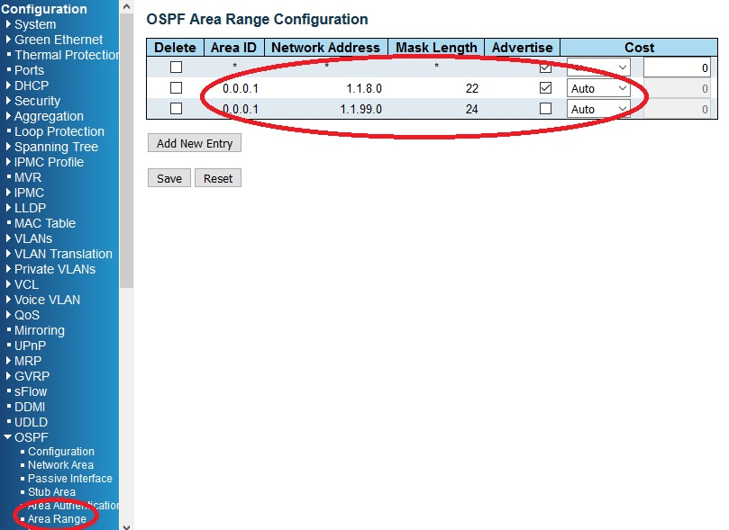

[TIP]
Use the 'OSPF Status' web page to verify the current settings. See also
<<General/Area Status via Web>>.

== OSPF Administrative Distance
The administrative distance (AD) is used to rank multiple routes for the same
destination which are available via different routing protocols. The lower
administrative distance value takes the higher preference. By default, the
administrative distance value for OSPF and RIP is set to 110 and 120,
respectively, which means that OSPF routes have precedence over RIP routes to
the same destination.

=== Configuration Example
The following example shows how to configure the OSPF administrative distance
value to 100.

==== Via CLI
Use the 'distance' command in router configuration mode to configure the OSPF
administrative distance.

Use the 'no' form to restore to the default setting.

Syntax::
* distance <1-255>
* no distance

Parameters::
* <1-255>: User-specified administrative metric value for the OSPF routing
protocol.

Default::
The default administrative distance value is 110.

Examples::
Configure OSPF administrative distance via CLI
[cols="1,4,6"]
|===
| Step | Command | Description

| 1
|# configure terminal
|Enter global configuration mode.

| 2
|(config)# router ospf
|Enable the OSPF routing process and enter the OSPF router configuration mode.

| 3
|(config-router)# distance 100
|Configure OSPF administrative distance value to 100.
|===

==== Via Web
.Configure OSPF administrative distance via Web
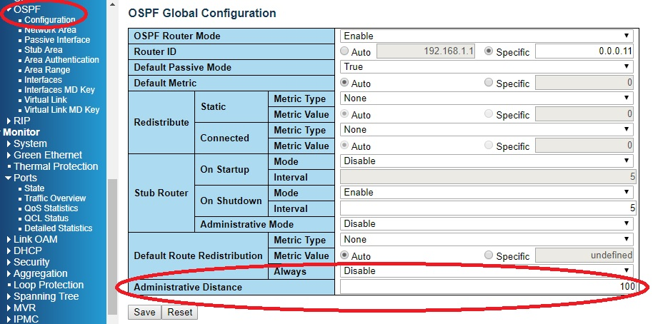

== OSPF Route Redistribution
OSPF route redistribution is a means to advertise routes coming from other
domains (e.g. RIP and BGP) to an OSPF domain. Use of this feature effectively
makes the router an ASBR.

In the current implementation, the following "other domains" are supported:

* *Static routes*
* *Interfaces that don't have OSPF enabled*
* *RIP*

Redistributed routes are transmitted into the OSPF domain with Type 5 External
LSAs provided the area accepts external routes.

Routes from other domains also have a cost or metric attached. Whether or not
using these costs depend on the configured metric type:

* *Type 1 external metrics:* Metrics are expressed in the same units as OSPF
interface cost. Therefore, they can be added to OSPF costs to find an overall
cost.
* *Type 2 external metrics:* Only the external costs are considered by the SPF
algorithm.

.OSPF route redistribution topology
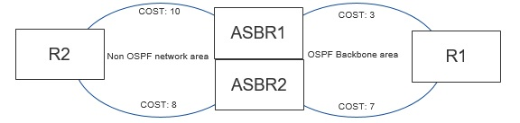

Consider the following example with two routes from R1 (in internal OSPF domain)
to R2 (external AS):

* *R1->ASBR1 (cost 3 in OSPF domain) and ASBR1->R2 (cost 10 in external routing
domain)*
* *R1->ASBR2 (cost 7 in OSPF domain) and ASBR2->R2 (cost 8 in external routing
domain)*

When Type 1 external metric is used, R1 chooses ASBR1 to transmit packets to R2,
because the total cost from R1 to R2 through ASBR1 is 13 (3 + 10), which is
lower than 15 (7 + 8) through ASBR2.

On the other hand, when Type 2 is used, R1 chooses ASBR2 instead. The reason is
that the cost through ASBR2 to R2 is 8, which is better than 10 through ASBR1.

When equal-cost Type 2 routes exist, the internal cost to the advertising
routers is used to break the tie.

Both Type 1 and Type 2 external metrics can be used in the AS at the same time.
In that case, Type 1 external metrics always take precedence.

The default value is Type 2 external metrics.

The metric, configurable by the user, is the cost to send a packet from the ASBR
to the destination. The default value is either the value of the default metric
if configured or calculated automatically by the routing protocols.

=== Configuration Example
The following example shows how to configure an OSPF router to redistribute
route information into the OSPF domain with Type 1 external metric.

==== Via CLI
===== Route redistribution
Use the 'redistribute metric' command in OSPF router configuration mode to
enable route redistribution to the OSPF domain. The redistributed routes are
transmitted with the AS-external-LSAs (Type 5 LSAs).

Use the 'no' form to remove the setting.

Syntax::
* redistribute {static | connected | rip} [metric <0-16777214>]
 [metric-type {1 | 2}]
* no redistribute {static | connected | rip}

Parameters::
* {static | connected | rip}: The OSPF redistributed route protocol type.
The 'static' argument is used to redistribute static routes (those configured
with the 'ip route' command). +
The 'connected' argument is used to redistribute the local interfaces that are
not OSPF enabled. +
The 'rip' argument is used to redistribute routes coming from RIP.
* metric <0-16777214>: The metric value for redistributed routes.
* metric-type {1 | 2}: External link type associated with the route that is
advertised into the OSPF routing domain.

Default::
No route redistribution is configured.
'metric-type 2' is the default if 'metric-type' is omitted from the command.

===== Default metric
Use the 'default-metric' command in router configuration mode to set the default
metric value for the OSPF routing protocol.

Use the 'no' form to remove the setting.

Syntax::
* default-metric <0-16777214>
* no default-metric

Parameters::
* <0-16777214>: User-specified default metric value for the OSPF routing
protocol.

Example::
Configure OSPF route redistribution for connnected interfaces via CLI.
Assume there are two IP interfaces on the device. One is on VLAN 10, ip address
10.0.0.1/24 and the other is on VLAN 11, ip address 11.0.0.1/24 and only
network address range 10.0.0.0/24 (VLAN 10) participates in the OSPF domain,
i.e. VLAN 11 doesn't.

For the connected interface VLAN 11, the following configuration can
redistribute the external type 1 route information into OSPF domain.

[cols="1,4,6"]
|===
| Step | Command | Description

| 1
|# configure terminal
|Enter global configuration mode.

| 2
|(config)# vlan 10,11
|Create VLAN 10 and 11.

| 3
|(config)# interface vlan 10
|Enter VLAN 10 interface configuration mode.

| 4
|(config-if-vlan)# ip address 10.0.0.1 255.255.255.0
|Set IP address on VLAN 10.

| 5
|(config-if-vlan)# interface vlan 11
|Enter VLAN 11 interface configuration mode.

| 6
|(config-if-vlan)# ip address 11.0.0.1 255.255.255.0
|Set IP address on VLAN 11.

| 7
|(config-if-vlan)# interface GigabitEthernet 1/10
|Enter GigabitEthernet 1/10 interface configuration mode.

| 8
|(config-if)# switchport access vlan 10
|Join VLAN 10.

| 9
|(config-if-vlan)# interface GigabitEthernet 1/11
|Enter GigabitEthernet 1/11 interface configuration mode

| 10
|(config-if)# switchport access vlan 11
|Join VLAN 11.

| 11
|(config-if)# router ospf
|Enable the OSPF routing process and enter OSPF router configuration mode.

| 12
|(config-router)# network 10.0.0.0 0.0.0.255 area 0.0.0.0
|Add network.

| 13
|(config-router)# redistribute connected metric-type 1
|Redistribute route information into OSPF domain with Type 1 external metric.
|===

[TIP]
Use the 'show ip ospf' command to verify the current settings. See also
<<General/Area Status via CLI>>.

==== Via Web
.Configure OSPF route redistribution via Web
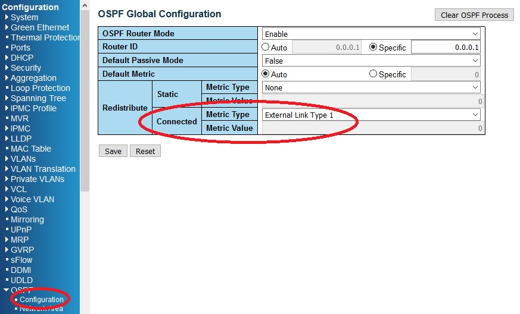

[TIP]
Use the 'OSPF Status' web page to verify the current settings. See also
<<General/Area Status via Web>>.

== OSPF Stub Router
OSPF stub router is defined in RFC 3137. A stub router is a router that
advertises that it is unavailable for forwarding transit traffic. In some cases,
it may be advantageous to inform routers in a network not to use a specific
router as a transit point, but still route to it. The possible situations
include:

* The router is in a critical condition. Maybe it has a high CPU load or doesn't
have enough memory space.
* Graceful introduction and removal of the router to/from the network.
* Other (administrative or traffic engineering) reasons.

[NOTE]
====
The router is not being removed from the network. Stub router advertisement is
to prevent other routers from using it as a transit routing. +
The current implementation is to set the cost of non-stub links as LSInfinity
(16-bit value 0xFFFF) in the router-LSA.
====
The figure below shows an example of OSPF stub router.

.OSPF stub router topology
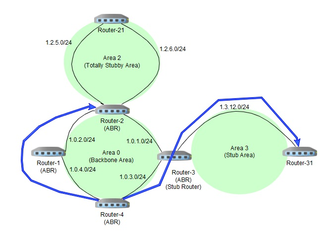

If Router-3 is configured as stub router, routers choose Router-1, Router-2 and
Router-4 as their routing path as possible. For example, consider Router-4. It
chooses Router-1 to route the traffic destined to 1.2.5.0/24 instead of
Router-3. But the traffic destined to 1.3.12.0/24 is still forwarded to
Router-3, because Router-3 is the best path in terms of cost.

=== Configuration Example
The following example configures the router as stub router.

=== Via CLI
Use the 'max-metric router-lsa'command in router configuration mode to set the
router in stub router mode. The stub router mode can be enabled administratively
(meaning indefinitely) or for a time period. In the latter case the stub mode
is only active for period of seconds after startup and/or a period of seconds
prior to shutdown. Use the 'no' form to remove the setting.

If you have configured the stub router mode during shutdown, then when you issue
the `no router ospf` command, the router will advertise router-LSAs with max
metric before stopping the OSPF process. This mechanism also works when the
device reboots except in the case where you have performed a `reload default`
operation as this removes the OSPF configuration.

Syntax::
* max-metric router-lsa { [on-startup <5-86400>] | [on-shutdown <5-100>] |
[administrative] }
* no max-metric router-lsa

Parameter::
* on-startup: Automatically advertise stub router-LSA on startup of OSPF router.
* <5-86400>: Time (seconds) to advertise self as stub router on startup.
* on-shutdown: Advertise stub router prior to full shutdown of OSPF.
* <5-100>: Time (seconds) to advertise self as stub router on shutdown.
* administrative: Administratively applied stub router, for an indefinite period.

Default::
No OSPF stub router is configured.

Example::
Configure OSPF stub router via CLI
[cols="1,4,6"]
|===
| Step | Command | Description

| 1
|# configure terminal
|Enter global configuration mode.

| 2
|(config)# router ospf
|Enable OSPF and enter OSPF router configuration mode.

| 3
|(config-router)# max-metric router-lsa administrative

|Configure the router as stub router.
|===

==== Via Web
.Configure OSPF stub router via Web
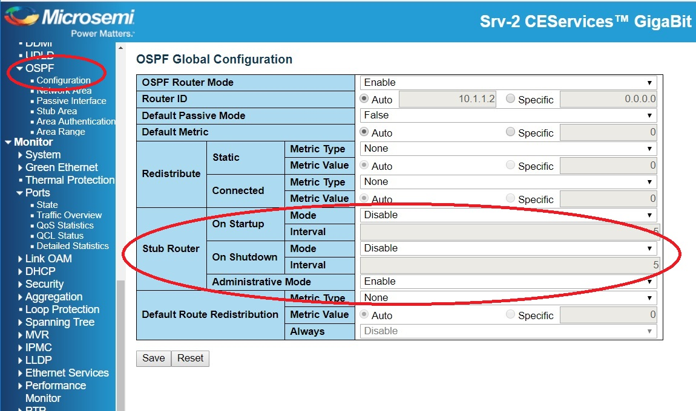

== Clear IP OSPF Process
In a few specific cases, the OSPF routing process may need to restart.

For example, when the OSPF Router ID is re-configured, the OSPF process must be
restarted for this to take effect.

=== Via CLI
Use the 'clear ip ospf process' command in privileged execution mode to reset
the OSPF routing process. The original OSPF database will be cleared before the
latest configuration gets applied.

Syntax::
* clear ip ospf process

Example::
Clear ip ospf process via CLI.
[cols="1,4,6"]
|===
| Index | Command | Description

| 1
|# clear ip ospf process
| Restart the OSPF routing process.
|===

[TIP]
Use the 'show ip ospf' command to verify the current settings. See also
<<General/Area status via CLI>>.

==== Via Web
.Clear ip ospf process via Web
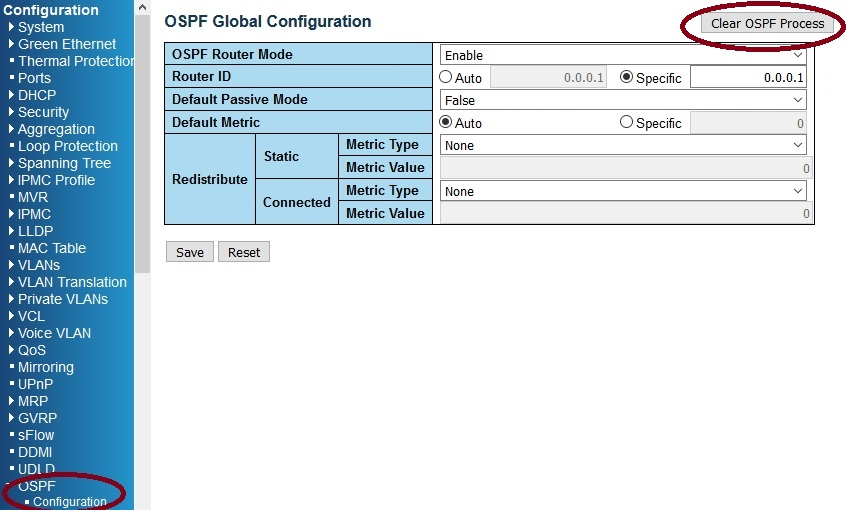

[TIP]
Use the 'OSPF Status' web page to verify the current settings. See also
<<General status via Web>>.

== OSPF Status
=== General/Area Status
==== General/Area Status via CLI
Use the 'show ip ospf' command in global execution mode to show the general OSPF
and area information.

Syntax::
* show ip ospf

Examples::

....
# show ip ospf
Routing Process, with ID 10.10.10.2
 Initial SPF schedule delay 200 msecs
 Minimum hold time between two consecutive SPFs 400 msecs
 Maximum wait time between two consecutive SPFs 10000 msecs
 SPF algorithm last executed 00:00:06 ago
 Minimum LSA interval 5 secs
 Minimum LSA arrival 1000 msecs
 Number of external LSA 2. Checksum Sum 0x00010bf0
 Number of areas in this router is 2
    Area BACKBONE(0.0.0.0)
        Number of active interfaces in this area is 1
        Area has no authentication
        SPF algorithm executed 5 times
        Number of LSA 14
        Number of router LSA 4. Checksum Sum 0x0002527d
        Number of network LSA 3. Checksum Sum 0x0000b348
        Number of summary LSA 5. Checksum Sum 0x0001a09b
        Number of ASBR summary LSA 2. Checksum Sum 0x0001709a
        Number of NSSA LSA 0. Checksum Sum 0x00000000

    Area ID: 0.0.0.1
        Number of active interfaces in this area is 1
        It is an NSSA area
        Perform type-7/type-5 LSA translation
        NSSA translator state is elected
        Area has no authentication
        SPF algorithm executed 2 times
        Number of LSA 7
        Number of router LSA 1. Checksum Sum 0x0000f5fd
        Number of network LSA 0. Checksum Sum 0x00000000
        Number of summary LSA 4. Checksum Sum 0x0001f40f
        Number of ASBR summary LSA 2. Checksum Sum 0x0000bcc4
        Number of NSSA LSA 0. Checksum Sum 0x00000000

....

==== General/Area Status via Web
.OSPF general status
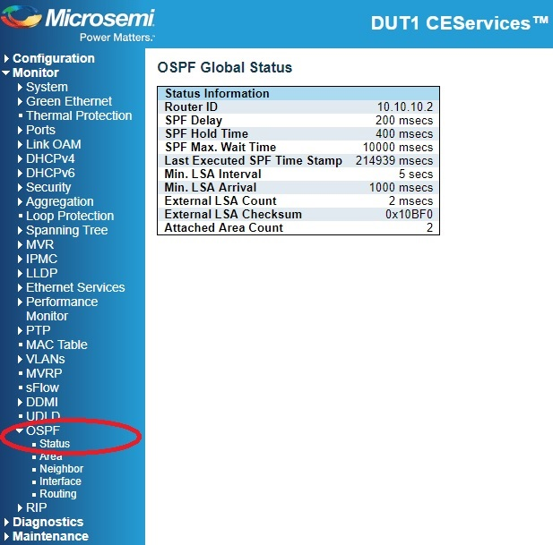

.OSPF area status
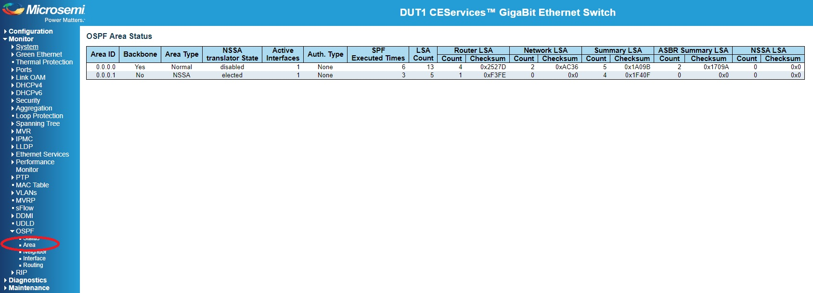

=== Neighbor Status

==== Neighbor Status via CLI
Use the 'show ip ospf neighbor' command in global execution mode to show all
OSPF neighbor information.

Syntax::
* show ip ospf neighbor [detail]

Parameters::
* [detail]: Show detailed information of each neighbor.

Examples::

....
# show ip ospf neighbor
Neighbor ID      Pri  State               Dead Time   Address          Interface
10.9.52.101      1    FULL/DR             33.712sec   10.9.52.101      VLAN 1
20.1.1.2         1    FULL/DR             36.245sec   20.1.1.2         VLAN 200
# show ip ospf neighbor detail
Neighbor 10.9.52.101, interface address 10.9.52.101
    In the area 0.0.0.0 via interface VLAN 1
    Neighbor priority is 1, State is FULL
    DR ID is 10.9.52.101, DR address is 10.9.52.101
    BDR ID is 10.9.52.101, BDR address is 10.9.52.124
    Options 18 *|-|-|EA|-|-|E|-
    Dead timer due in 31.004 sec

Neighbor 20.1.1.2, interface address 20.1.1.2
    In the area 0.0.0.1 via interface VLAN 200
    Neighbor priority is 1, State is FULL
    DR ID is 20.1.1.2, DR address is 20.1.1.2
    BDR ID is 20.1.1.2, BDR address is 20.1.1.1
    Options 2 *|-|-|-|-|-|E|-
    Dead timer due in 33.538 sec

#
....

==== Neighbor status via Web
.OSPF neighbor status
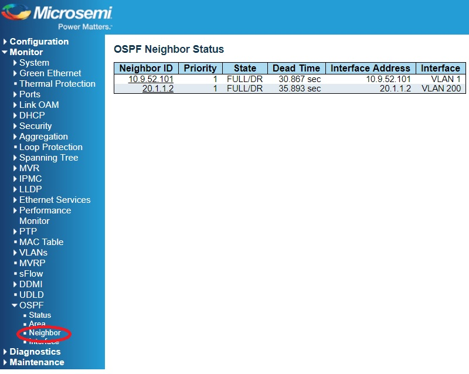

.OSPF neighbor detail status
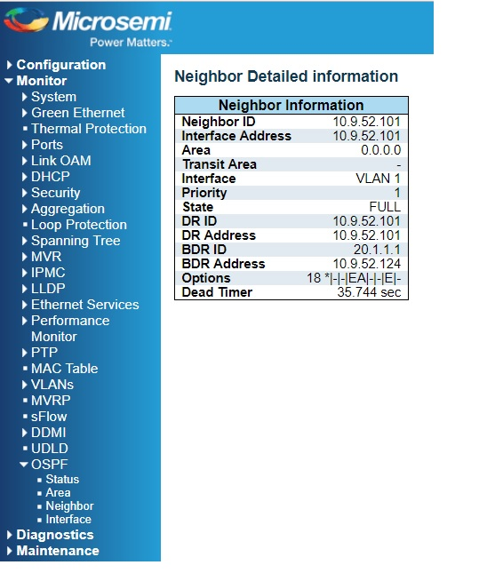

=== Interface Status

==== Interface Status via CLI
Use the 'show ip ospf interface' command in global execution mode to show
specific OSPF interface information. By default, it shows all OSPF interfaces.
'VLAN is down' is shown when OSPF is not running on this interface until the
interface is up.

Syntax::
* show ip ospf interface [vlan <vlan_list>]

Parameters::
* <vlan_list>: The VLAN list can be a single VLAN ID, a range of VLAN IDs (e.g.
20-25), a list of VLAN IDs (e.g. 1,3) or a combination (e.g. 1,3,20-25).

Examples::

....
# show ip ospf interface vlan 1,30,100,200
VLAN 1 is up
  Internet Address 10.9.52.124/24, Area 0.0.0.0
  Router ID 10.1.1.1, Cost: 10
  Transmit Delay is 1 sec, State BDR, Priority 1
  Designated Router (ID) 10.9.52.101, Interface address 10.9.52.101
  Backup Designated router (ID) 10.1.1.1, Interface address 10.9.52.124
  Timer intervals configured, Hello 10, Dead 40, Wait 40, Retransmit 5
    Hello due in 00:00:00
  Neighbor Count is 1, Adjacent neighbor count is 1

VLAN 30 is down
  Internet Address 30.1.1.1/24, Area 0.0.0.1
  Router ID 10.1.1.1, Cost: 10
  Transmit Delay is 1 sec, State DOWN, Priority 1
  No designated router on this network
  No backup designated router on this network
  Timer intervals configured, Hello 10, Dead 40, Wait 40, Retransmit 5
    Hello due in 00:00:00
  Neighbor Count is 0, Adjacent neighbor count is 0

VLAN 100 is up
  Internet Address 10.1.1.1/24, Area 0.0.0.0
  Router ID 10.1.1.1, Cost: 10
  Transmit Delay is 1 sec, State DR, Priority 1
  Designated Router (ID) 10.1.1.1, Interface address 10.1.1.1
  No backup designated router on this network
  Timer intervals configured, Hello 10, Dead 40, Wait 40, Retransmit 5
    No Hellos (Passive interface)
  Neighbor Count is 0, Adjacent neighbor count is 0

VLAN 200 is up
  Internet Address 20.1.1.1/24, Area 0.0.0.1
  Router ID 10.1.1.1, Cost: 10
  Transmit Delay is 1 sec, State BDR, Priority 1
  Designated Router (ID) 20.1.1.2, Interface address 20.1.1.2
  Backup Designated router (ID) 10.1.1.1, Interface address 20.1.1.1
  Timer intervals configured, Hello 10, Dead 40, Wait 40, Retransmit 5
    Hello due in 00:00:03
  Neighbor Count is 1, Adjacent neighbor count is 1
#
....

==== Interface Status via Web
.OSPF interface status
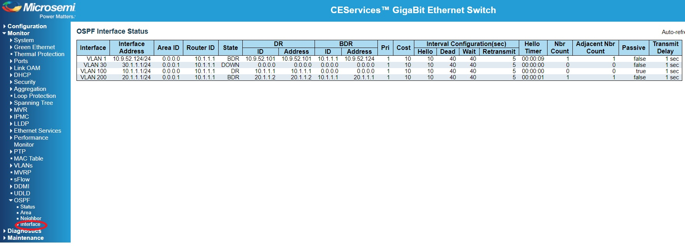

=== Route Status
==== Route Status via CLI
Use the 'show ip route' command in global execution mode to show information
about all routes.

Syntax::
* show ip route

Examples::

....
# show ip route
Codes: C - connected, S - static, O - OSPF,
       * - selected route, D - DHCP installed route

D* 0.0.0.0/0 [254/0] via 10.9.52.200, VLAN 1
C* 10.1.1.0/24 is directly connected, VLAN 100
O  10.1.1.0/24 [110/10] is directly connected, VLAN 100, 00:07:36
C* 10.9.52.0/24 is directly connected, VLAN 1
O  10.9.52.0/24 [110/10] is directly connected, VLAN 1, 00:07:26
C* 20.1.1.0/24 is directly connected, VLAN 200
O  20.1.1.0/24 [110/10] is directly connected, VLAN 200, 00:06:53
....

`Connected`: Specifies the route was learned as a result of configuring the
interface +
`Static`: Specifies the route was explicitly configured using the 'ip route'
command +
`OSPF`: Specifies the route was learned through OSPF +
`DHCP`: DHCP installed route

==== Route Status via Web
.Route status
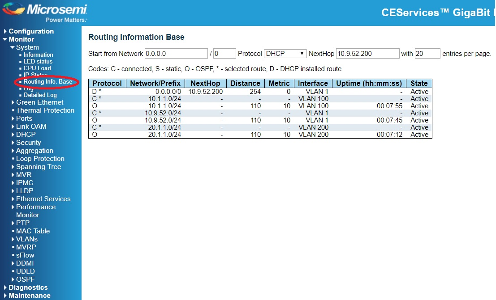

=== OSPF Route Status
==== OSPF Route Status via CLI
Use the 'show ip ospf route' command in global execution mode to show
information about all routes learned from OSPF. Compared to <<_route_status>>,
the user is able to get more detailed OSPF routing information such as the
routes area location: intra-area, inter-area or the outside of the AS. It also
tells users how to reach the ABRs or ASBRs.

Syntax::
* show ip ospf route

Examples::

....
# show ip ospf route

            OSPF Router with ID (0.0.0.4)

    Codes: i - Intra-area Router Path, I - Inter-area Router Path

    Intra-area Route List

    1.0.1.0/24, Intra, cost 20, area 0.0.0.0
      via 1.0.3.3, VLAN 100
    1.0.2.0/24, Intra, cost 20, area 0.0.0.0
      via 1.0.4.1, VLAN 200
    1.0.3.0/24, Intra, cost 10, area 0.0.0.0, Connected
                   VLAN 100
    1.0.4.0/24, Intra, cost 10, area 0.0.0.0, Connected
                   VLAN 200
    1.0.17.0/24, Intra, cost 20, area 0.0.0.0
      via 1.4.14.2, VLAN 300
    1.4.14.0/24, Intra, cost 10, area 0.0.0.4, Connected
                   VLAN 300
    1.4.15.0/24, Intra, cost 10, area 0.0.0.4, Connected
                   VLAN 400

    Inter-area Route List

    1.1.7.0/24, Inter, cost 30, area 0.0.0.0
      via 1.0.4.1, VLAN 200
    1.1.8.0/24, Inter, cost 40, area 0.0.0.0
      via 1.0.4.1, VLAN 200
    1.1.9.0/24, Inter, cost 30, area 0.0.0.0
      via 1.0.4.1, VLAN 200
    1.1.10.0/24, Inter, cost 20, area 0.0.0.0
      via 1.0.4.1, VLAN 200
    1.1.11.0/24, Inter, cost 20, area 0.0.0.0
      via 1.0.4.1, VLAN 200
    1.2.5.0/24, Inter, cost 30, area 0.0.0.0
      via 1.0.3.3, VLAN 100
      via 1.0.4.1, VLAN 200
    1.2.6.0/24, Inter, cost 30, area 0.0.0.0
      via 1.0.3.3, VLAN 100
      via 1.0.4.1, VLAN 200
    1.3.12.0/24, Inter, cost 20, area 0.0.0.0
      via 1.0.3.3, VLAN 100
    1.5.16.0/24, Inter, cost 20, area 0.0.0.0
      via 1.4.15.1, VLAN 400

    Router Path List

i 0.0.0.1 [10] via 1.0.4.1, VLAN 200, ABR, Area 0.0.0.0
i 0.0.0.2 [20] via 1.0.3.3, VLAN 100, ABR/ASBR, Area 0.0.0.0
i 0.0.0.2 [20] via 1.0.4.1, VLAN 200, ABR/ASBR, Area 0.0.0.0
i 0.0.0.3 [10] via 1.0.3.3, VLAN 100, ABR, Area 0.0.0.0
I 0.0.0.15 [30] via 1.0.4.1, VLAN 200, ASBR, Area 0.0.0.0
i 0.0.0.41 [10] via 1.4.15.1, VLAN 400, ABR, Area 0.0.0.0
i 0.0.0.41 [10] via 1.4.15.1, VLAN 400, ABR, Area 0.0.0.4
i 0.0.0.42 [10] via 1.4.14.2, VLAN 300, ABR, Area 0.0.0.0
i 0.0.0.42 [10] via 1.4.14.2, VLAN 300, ABR, Area 0.0.0.4

    External Route List

    1.127.1.0/24, Ext1, cost 40
      via 1.0.3.3, VLAN 100
      via 1.0.4.1, VLAN 200
    1.99.1.0/24, Ext2, cost 20, fwd cost 30
      via 1.0.4.1, VLAN 200
....

==== OSPF Route Status via Web
.OSPF route status
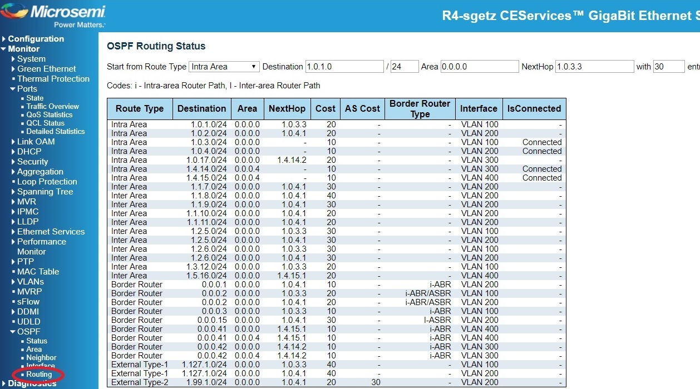

== OSPF Configuration Examples

This section gives some examples of configuring OSPF.

=== Single Area (Backbone Area) Example

.Single Area Example Topology
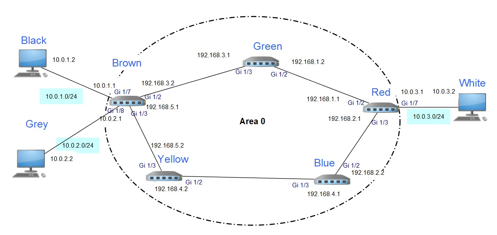

Enable OSPF and add the interfaces to the backbone area on each router.

link:AN1255/AN1255-usecase1.conf[This link] contains the required configuration for all
routers.

=== Multiple Area Example

.Multiple Area Example Topology
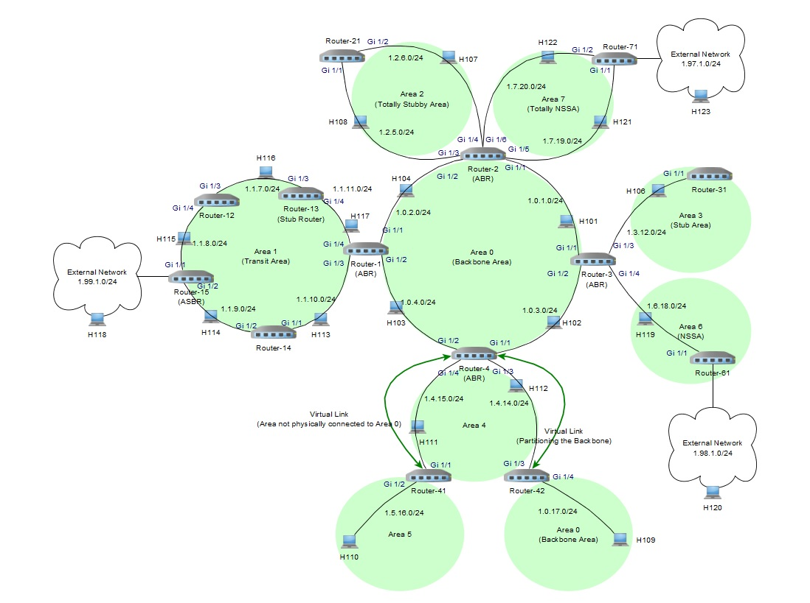

This example shows a more complex setup consisting of a.o.:

* a stub area,
* a totally stubby area,
* an NSSA,
* a totally NSSA,
* virtual link to extend the backbone area,
* virtual link to connect discontiguous backbone areas,
* route summarization, and
* route redistribution

link:AN1255/AN1255-usecase2.conf[This link] contains the required configuration for all
routers.

== Appendices
=== Unsupported List

The following lists features not supported in the current WebStaX OSPF software.

* *No support for multiple OSPF processes/instances*
* *No support for VRF*
* *No support for Policy-Based Routing*
* *No support for tunnels*
* *No support for VRRP*

=== Configuration Considerations
There is no standard OSPF guidelines for the maximum number of routers in an
area or number of neighbors in a network segment. The OSPF process load can be
very heavy under a large and complicated network. The following limitations need
to be considered when a switch device is placed in an OSPF domain.

[cols="2*"]
|===
| Topic | Maximum Support

| OSPF processes/instances
| 1

| OSPF interfaces
| 128

| Ingress packet throttling for OSPF control packets
| 1000 Frames/Second

| Hardware routing entries
| Varies with platform
|===

=== OSPF Commands on Cisco Layer 3 Switch Product (3650/3750)
The following table lists OSPF commands on a Cisco Layer 3 switch product
alongside with the corresponding WebStaX CLI commands.

[cols="2,5,5"]
|===
| Feature | Cisco | WebStaX (- means the same command)

| IP routing
a|* ip routing
a|* -

| OSPF process
a|* [no] router ospf *process-id [vrf vrf-name]*
* clear ip ospf
a|* [no] router ospf
* clear ip ospf process

| OSPF network area
a|* [no] network ip-address wildcard-mask area area-id
a|* -

| OSPF router ID
a|* [no] router-id ip-address
a|* -

| OSPF passive interface
a|* [no] ip ospf passive-interface +
*(in VLAN interface configuration mode)*
a|* [no] passive-interface {default \| vlan <vid_list>} +
*(in router configuration mode)*

| OSPF interface parameters tuning
a|* [no] ip ospf priority number-value
* [no] ip ospf cost interface-cost
* [no] ip ospf dead-interval {seconds \|
minimal hello-multiplier multiplier}
* [no] ip ospf hello-interval seconds
* [no] ip ospf retransmit-interval seconds
a|* -
* -
* -
* -
* -

| OSPF area authentication
a|* [no] area area-id authentication authentication [message-digest]
a|* -

| OSPF interface authentication
a|
* [no] ip ospf authentication [*key-chain name* \|
null \|
message-digest]
* [no] ip ospf authentication-key *password*
* [no] ip ospf message-digest-key key-id *encryption-type* md5 *key*
a|
* [no] ip ospf authentication [null \|
message-digest]
* [no] ip ospf authentication-key *{unencrypted <word1-8> \|
encrypted <word128>}*
* [no] ip ospf message-digest-key <1-255> md5
  *{unencrypted <word1-16> \|
  encrypted <word128>}*

| OSPF virtual link authentication
a|
* [no] area area-id virtual-link router-id authentication [*key-chain name* \|
null \|
message-digest]
* [no] area area-id virtual-link router-id authentication-key *password*
* [no] area area-id virtual-link router-id message-digest-key key-id
  *encryption-type* md5 *key*
a|
* [no] area <area_id> virtual-link <router_id> authentication
  [null \|
  message-digest]
* [no] area <area_id> virtual-link <router_id> authentication-key
  *{unencrypted <word1-8> \|
  encrypted <word128>}*
* [no] area <area_id> virtual-link <router_id> message-digest-key <1-255> md5
  *{unencrypted <word1-16> \|
  encrypted <word128>}*

| OSPF virtual link
a|* [no] area area-id virtual-link router-id [hello-interval seconds]
 [retransmit-interval seconds] [dead-interval seconds]
 *[transmit-delay seconds] [ttl-security hops hop-count]*
a|* [no] area <area_id> virtual-link <router_id> [hello-interval <1-65535>] [retransmit-interval <1-65535>] [dead-interval <1-65535>]

| OSPF stub area
a|* [no] area area-id stub [no-summary]
a|* -

| OSPF NSSA
a|* [no] area area-id nssa [no-summary]
 * [no] area <area_id> nssa translate type7 {always \|
  *suppress-fa*}
a|* -
 * [no] area <area_id> nssa translate type7 {always \|
  *candidate* \|
  *never*}

| OSPF area range
a|* [no] area area-id range prefix-length [advertise \|
not-advertise] [cost cost]
a|* -

|OSPF route redistribution
a|* [no] redistribute {connected \|
static \|
*bgp* \|
*eigrp* \|
*isis* \|
*iso-igrp* \|
*maximum-prefix* \|
*mobile* \|
*odr* \|
*ospf* \|
*ospfv3* \|
*rip* \|
*vrf* }
 *[process-id] {level-1 \|
 level-1-2 \|
 level-2}*
 *[as-number]* [metric {metric-value \|
 *transparent*}] [metric-type type-value]
 *[match {internal \|
 external 1 \|
 external 2}]
 [tag tag-value] [route-map map-tag] [subnets]*

a|* [no] redistribute {static \|
connected \| *rip*}
 [metric <0-16777214> \|
 metric-type {1 \|
 2}]

| OSPF default metric
a|* [no] default-metric metric-value
a|* -

| OSPF administrative distance
a|* [no] distance <1-255>
a|* -

|OSPF status
a|* show ip ospf *[process-id]*
* show ip ospf neighbor [detail]
  *[interface-type interface-number] [ neighbor-id ] [fast-reroute]
  [summary [per-instance]]*
* show ip ospf *[process-id]* interface [type number]
  *[brief] [multicast] [topology {topology-name \|
base}]*

a|* show ip ospf
* show ip ospf neighbor [detail]
* show ip ospf interface [vlan <vlan_list>]
|===

=== Known Issues

==== Link Metric
The link metric value does not match the actual link speed, because VLAN
interfaces represent L2 broadcast domains, which may include more than one
physical port. So if, for example, the VLAN domain consists of a 100M, a 1G and
a 10G port, what would be the correct metric for that VLAN interface? We leave
the question unanswered and report it as a known issue for now.

==== Only the Last Message Digest Key is Applied
Users can configure multiple message digest keys by giving different key IDs,
but only the last one is used in OSPF authentication. For example, if the user
adds keys with ID 6, ID 2, and ID 3 in that order to a specific interface, the
interface will use key ID 3 to authenticate with neighbors.

==== OSPF virtual link configuration affects the connected routes redistribution
If a virtual link is configured on the router, the connected routes are
redistributed only when the virtual link connection is established properly.

Here's an example to perform a virtual link connection on two routers (Router-1
and Router-2). The router configurations are below and notice that no specific
router ID is assigned on Router-2.
----
Router-1
  router ospf
    router-id 192.168.1.1
    redistribute connected
    network 10.9.52.0/24 area 0
    network 192.168.1.0/24 area 24
    area 24 virtual-link 192.168.1.2

Router-2
  router ospf
    redistribute connected
    network 192.168.0.0/24 area 23
    network 192.168.1.0/24 area 24
    area 24 virtual-link 192.168.1.1
----

Use command 'show ip ospf neighbor' to verify the virtual link status.
For example:
----
Router-1# show ip ospf neighbor
Neighbor ID      Pri  State            Dead Time   Address          Interface
192.168.1.2      1    FULL/BDR         38.343sec   24.0.0.2         VLAN 24
192.168.1.2      1    FULL/-           -           24.0.0.2         OSPF-VLINK 1
----

The issue can be observed if the 'auto router ID' algorithm does not choose
'192.168.1.2' as its result on Router-2. Another possible case is user add one
more virtual link configuration but it is not established between two routers.

=== Frequently Asked Questions

==== Why does the OSPF Adjacency State Continuously Switch Between 'ExStart' and 'Exchange'?

This situation may be due to the CPU being too busy to handle the OSPF database
description packets arriving from its neighbors.

A possible solution to this is to increase the retransmit interval value to
prevent a neighboring switch from retransmitting the packets while the switch
is currently handling the previous. The following table lists recommended
retransmission intervals as a function of number of OSPF neighbors.

Use command 'show system cpu status' to check the current CPU load and 'show ip
ospf neighbor' for the neighbor status.

[cols="2*"]
|===
| Number of OSPF neighbors | Retransmit interval suggestion

| 12
| 5

| 24
| 10

| 36
| 15

| 50
| 20
|===

== References
. RS1169-SW_Frr_OSPF
. RFC 2328 https://www.ietf.org/rfc/rfc2328.txt
. Cisco IOS IP Routing: OSPF Command Reference https://www.cisco.com/c/en/us/td/docs/ios-xml/ios/iproute_ospf/command/iro-cr-book/iro-cr-book_CLT_chapter.html

