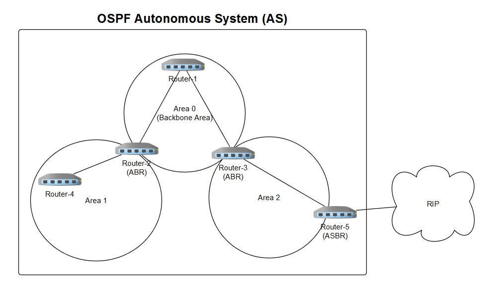
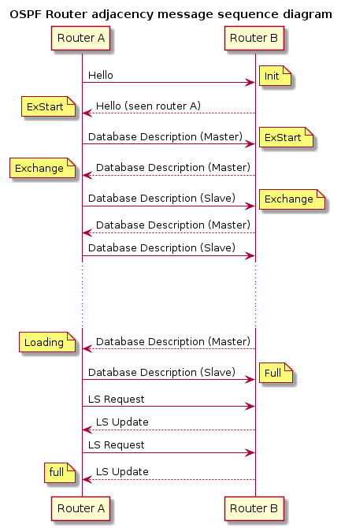
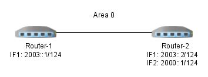
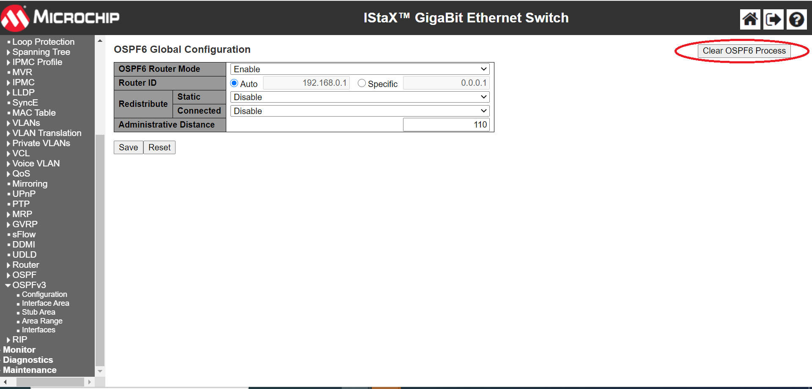
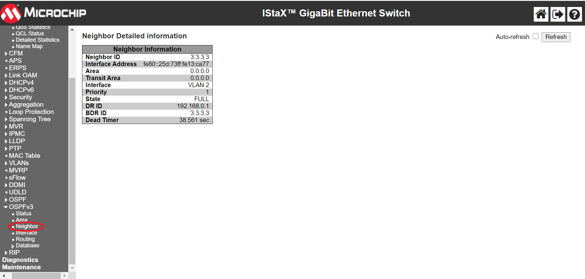

:sectnums:
//:toc: macro
:toc: left
:source-highlighter: pygments
:pygments-linenums-mode: inline
:sectnumlevels: 5
:toclevels: 5

= OSPFv3 Software Configuration Guide

== Disclaimer
Microchip is aware that some terminology used in this technical document is
antiquated and inappropriate. As a result of the complex nature of software
where seemingly simple changes have unpredictable, and often far-reaching
negative results on the software's functionality (requiring extensive retesting
and revalidation) we are unable to make the desired changes in all legacy
systems without compromising our product or our clients' products.

== Introduction

This document gives examples on how to configure OSPFv3 using the Command Line
Interface (CLI).

* Using CLI as the management interface requires a serial console connection
between the device and the management platform. No network connection is
required to use CLI, but a terminal emulator software has to be installed.

== Audience

This document is for software and application developers who need to understand
and use the OSPF functionality in Microchip switch products.

== OSPFv3 Introduction
Open Shortest Path First (OSPF) is a routing protocol for Internet Protocol
(IP) networks. It is an Interior Gateway Protocol (IGP) developed by the OSPF
working group of the Internet Engineering Task Force (IETF). RFC 2328 defines
OSPF Version 2 for IPv4 and RFC 5340 defines OSPF Version 3 for IPv6..

OSPF is a link-state routing protocol and designed to be run internally within
a single Autonomous System. Each router maintains a link-state database
describing the Autonomous System's topology. From this database, each router
constructs a shortest path first tree (SPF tree), from which it determines the
(lowest cost) routes to different networks.

The implementation utilizes an open-source router called Free Range Router
(FRR), which is a fork of the open-source Quagga router. FRR supports a variety
of routing protocol daemons including BGP, IS-IS, LDP, OSPF, PIM, and RIP, of
which OSPFv2, RIPv2 and OSPFv3 are the only ones currently supported in selected
Microchip products.

Before diving into details of configuration setup, some basic concepts of OSPF
networking are needed.

=== AS and Router Types
.AS and Border Router Types

* Autonomous system (AS)
+
A group of networks under a single administrative control. An Interior Gateway
Protocol (IGP) refers to a routing protocol that handles routing within a
single autonomous system. IGPs include RIP, IGRP, EIGRP, and OSPF.

* Area border router (ABR)
+
A router that connects to multiple areas.

* Autonomous system border router (ASBR)
+
A router that connects different ASs, that is, it acts as a gateway between OSPF
and other routing protocols (IGRP, RIP, BGP and etc.)

* Designated router (DR)
+
A designated router is elected on every broadcast network. It generates
link-state packets for the network and synchronizes the link-state database with
all other routers on the network. The designated router concept also reduces
the amount of routing protocol traffic.

* Backup designated router (BDR)
+
The backup designated router also synchronizes the link-state databases with all
other routers on the network but does not generate link-state packets for the
network. When a DR fails, the BDR becomes the new DR. This transition doesn't
need to resynchronize the link-state database which can potentially take quite
some time. The backup designated router concept makes the transition smoother.

=== OSPF Areas

OSPF allows for grouping contiguous networks and hosts into so-called areas. The
topology of an area is invisible from the outside of the area. A router has a
separate link-state database for each area it is connected to. This reduces the
OSPF traffic sent on the network and also the size of the topology database a
router must maintain.

* Backbone Area
+
The OSPF backbone is the central area of an AS and all other areas must be
directly connected to the backbone area. The backbone area distributes routing
information between non-backbone areas. The backbone area needs to be
contiguous.

* Transit Area
+
When an area can carry data traffic that neither originates nor terminates
in the area itself, it's an transit area.

* Stub Area
+
OSPF allows certain areas to be configured as "stub areas". AS external routing
information is not flooded into stub areas. Instead, a default route is
advertised into the stub area through one or more of the stub area's ABRs.

* Not-So-Stubby Area (NSSA)
+
NSSA is similar to the existing OSPF stub area but has the additional capability
of importing AS external routes in a limited fashion. All routers in the NSSA
must agree on the "N" bit (NSSA capable) and  allow to carry AS external route
information 
Note: NSSA is not supported in the current release of FRR for OSPFv3.

=== Link-State Packet Types
There are six major Link-State packet types (LS Types).

.OSPF Link-State Packet Types

* Router LSA (Type 0x2001)
+
Originated by a router. Describes the state and cost of the router's link
(interfaces) to the intra area.

* Network LSA (Type 0x2002)
+
Originated by a DR. Describes all routers attached to the network segment.

* Inter-Area LSA (Type 0x2003 and 0x2004)
+
Originated by an ABR. Describes networks between backbone area and inter area.

* External LSA (Type 0x4005 and 0x2007)
+
Originated by an ASBR. Describes networks outside of the AS.

* Link LSA (Type 0x0008)
+
Originated by a Router. It has the following purposes
    - notify the link-local address of the router's interface to the routers
      attached to the link
    - inform other routers attached to the link of the list of IPv6 prefixes
      to associate with the link
    - allow the router to assert the collection of Option bits to associate
      with the Network LSA that will be originated for the link 
	
* Intra-Area-Prefix LSA (Type 0x2009)
+
Originated by a Router. This LSA carries all IPv6 prefix information that in
IPv4 is included in router-LSAs and network-LSAs

=== DR Election
OSPF Hello packets are exchanged using IP multicast packets on each network
segment. Designated router (DR) and backup designated router (BDR) election is
done via the Hello packet. The router with the highest OSPF priority will be
elected as the DR on the segment and the one with the second-highest OSPF
priority will be elected as the BDR.

[NOTE]
Priority value 0 indicates that an interface is not to be elected as DR or BDR.
This is known as a DROTHER router.

==== Neighbor and Adjacency
OSPF neighbor is the relationship that is established among OSPF intra-area
routers that share a common network segment and area. The states are same as
for OSPFv2.

Adjacencies are created when neighboring routers exchange routing information
with each other. The adjacency states are listed below.

.OSPF Adjacency Example

* Down: The initial state of a conversation when no information has been
exchanged.
* Attempt: Similar to the Down state, but is only used on Non-broadcast
multiple-access (NBMA) networks.
* Init: Hello packet has been received from neighbor. But bidirectional
  communication has not yet been established with the neighbor.
* 2-Way: Communication with neighbor is bidirectional.
* ExStart: Decide a master/slave relationship and an initial sequence number
  for later adjacency building process.
* Exchange: Describe the entire link state database to the neighbor.
* Loading: Request the most recent LSAs from neighbor.
* Full: The adjacency is completed.

== Simple OSPF Configuration Example
In this section we present a simple example to show how to enable OSPF on two
routers in the backbone area. This involves two actions: Enable OSPF process and
enable OSPF on the specified interface.

When OSPF is disabled, no OSPF control frames will be transmitted and the
router will not react to OSPF control frames sent by others. No OSPF status
will be available when disabled.

When OSPF routing is enabled and OSPF is also enabled on a VLAN interface, the
ports that are members of this VLAN will transmit OSPF control frames
periodically, advertising routing updates. The frames received from the
corresponding port(s) will also be processed.

=== Configuration Example
Suppose we have two routers, Router-1 and Router-2, both connected to Area 0
(a.k.a. 0.0.0.0). Router-1 can reach 2003::/124 and Router-2 can reach both
2003::/124 and 2000::/124.

==== Topology Setup
.Simple backbone area topology

==== Via CLI
Use the 'ip routing' command in global configuration mode to enable the IP
routing capability. Use the 'no' form to disable the IP routing capability.

Syntax::
* ip routing
* no ip routing

Default::
IP routing capability is disabled. The default is therefore host mode.

Use the 'router ospf6' command in global configuration mode to enable OSPFv3
routing. Use the 'no' form to disable OSPFv3 routing.

Syntax::
* router ospf6
* no router ospf6

Default::
OSPFv3 routing is disabled.

Use the 'interface area' command in router configuration mode to set the OSPF
area ID for a specific interface. The area ID is typically formatted
as an IPv4 address. Use the 'no' form to remove the setting.
To enable OSPFv3 on multiple network segments you need to issue the command
multiple times.

Syntax::
* interface vlan <vlan_id> area <area_id>
* no interface vlan <vlan_id> area <area_id>

Parameters::
* <vlan_id>: VLAN ID of the interface 

* <area_id>: The OSPF area ID is a 32-bit number used to associate the interface
with a particular area. It can be specified as either an IPv4 address format
(A.B.C.D) or as a decimal value from 0 to 4294967295.

Default::
No area is configured for an interface.

Example::
Step 1 (both Router-1 and Router-2). Enable OSPFv3.
[cols="1,5,5"]
|===
| Step | Command | Description

| 1
|# configure terminal
|Enter global configuration mode.

| 2
|(config)# vlan 2
|Create a VLAN, and enter VLAN configuration mode.

| 3
|(config-vlan)# interface GigabitEthernet 1/4
|Specify the port interface to configure, and enter the interface configuration
mode.

| 4
|(config-if)# switchport access vlan 2
|Set the access mode of the interface to the specified VLAN.

| 5
|(config-if)# interface vlan 2
|Specify the VLAN interface to configure, and enter the VLAN interface
configuration mode.

| 6
| For Router-1: Configure IP address 2003::1/124.

(config-if-vlan)# ipv6 addr 2003::1/124

For Router-2: Configure IP address 2003::2/124.

(config-if-vlan)# ipv6 addr 2003::2/124

|Configure an IP address for a VLAN interface.

| 7
|(config)# router ospf6
|Enable the OSPF routing process and enter the OSPF router configuration mode.

| 9
|(config-router)# interface vlan 2 area 0

|Configure the OSPF interface area.
|===
Step 2 (Router-2, only). Enable OSPF on network 2000::/124 in area 0 via
CLI.

[cols="1,4,6"]
|===
| Step | Command | Description

| 1
|# configure terminal
|Enter global configuration mode.

| 2
|(config)# vlan 3
|Create a VLAN, and enter VLAN configuration mode.

| 3
|(config-vlan)# interface GigabitEthernet 1/2
|Specify the interface to configure, and enter the interface configuration
mode.

| 4
|(config-if)# switchport access vlan 3
|Set the access mode of the interface to the specified VLAN.

| 5
|(config-if)# interface vlan 3
|Specify the interface to configure and enter the VLAN interface configuration
mode.

| 6
|(config-if-vlan)# ipv6 addr 2000::1/124
|Configure an IP address for an interface.

| 7
|(config)# router ospf6
|Enable the OSPF routing process and enter the OSPF router configuration mode.

| 8
|(config-router)# interface vlan 3 area 0

|Add vlan 3 to area 0
|===

[TIP]
Use the 'show ipv6 ospf' command to verify the current settings. See also
<<General/Area Status via CLI>>.

==== Via Web
.Configure VLAN via Web

.Configure IP address and enable IP routing via Web

.Enable OSPFv3 via Web

.Configure OSPFv3 interface area via Web

[TIP]
Use the 'OSPFv3 Status' web page to verify the current settings. See also
<<General/Area Status via Web>>.

== OSPF Router ID
The router ID is a 32-bit number (typically formatted as an IPv4 address)
uniquely identifying the router in the Autonomous System.

When the Router ID is changed, you must restart the OSPF router process. See
<<Clear IPv6 OSPF Process>> for a description of this.

NOTE: It is the user's responsibility to ensure that the ID is unique within the
entire OSPF domain. If the router ID is not set explicitly, then the router will
use the highest active interface IP addresses as its router ID.

=== Configuration Example
Here's an example of configuring router ID 0.0.0.1 for Router-1 and auto mode
router ID for Router-2.

==== Topology Setup
.OSPF router ID example

==== Via CLI
Use the 'router-id' command in OSPF router configuration mode to set the OSPF
router ID. Use the 'no' form to restore the setting to default algorithm.

Syntax::
* router-id <router_id>
* no router-id

Parameter::
* <router_id>: OSPF router-id in IPv4 address format (A.B.C.D). Notice that the
router ID should be unique in the Autonomous System and value '0.0.0.0' is
invalid since it is reserved for the default algorithm. If there is one or more
fully adjacent neighbors in the current OSPF area, the new router ID will take
effect after restarting the OSPF process (using 'clear ipv6 ospf process'.)

Default::
No OSPF router ID is configured. The default algorithm will choose the largest
IPv4 address assigned to the router.

.Configure OSPF Router ID
[cols="1,4,6"]
|===
| Step | Command | Description

| 1
|# configure terminal
|Enter global configuration mode.

| 2
|(config)# router ospf6
|Enable OSPF and enter OSPF router configuration mode.

| 3
|Router-1: Configure Router ID 0.0.0.1 +
(config-router)# router-id 0.0.0.1 +
Router-2: Apply default algorithm (Auto) +
(config-router)# no router-id
|Configure the OSPF router ID.
|===

[TIP]
Use the 'show ipv6 ospf' command to verify the setting. See also
<<General/Area Status via CLI>>.

==== Via Web
.Configure OSPFv3 router ID via Web

[TIP]
Use the 'OSPFv3 Status' web page to verify the setting. See also
<<General/Area Status via Web>>.

== OSPF Interface
=== OSPF Passive Interface
When an interface is configured as a passive interface, transmission of OSPF
routing updates is suppressed. Therefore, the interface does not establish
adjacencies (no OSPF Hellos). The subnet of all interfaces (both passive and
active) is advertised by the OSPF router.

==== Configuration Example
The following example configures VLAN 32 as a passive interface.

===== Via CLI
Use the 'ipv6 ospf passive' command in VLAN interface configuration mode to
suppress OSPF routing updates on a specific interface.

Syntax::
* ipv6 ospf passive
* no ipv6 ospf passive

Default::
No Passive interface is configured 

Example::
Configure OSPF passive interface through CLI.
[cols="1,4,6"]
|===
| Step | Command | Description

| 1
|# configure terminal
|Enter global configuration mode.

| 2
|(config)# interface vlan 32
|Enable VLAN configuration mode.

| 3
|(config-if-vlan)# ipv6 ospf passive
|Mark VLAN 32 as a passive interface.
|===

===== Via Web
.Configure OSPF passive interface via Web

[TIP]
Use the 'OSPFv3 Status' web page to verify the current settings. See also
<<Interface Status via Web>>.

=== Interface Parameter Tuning
This section describes additional parameters allowing for fine-tuning interfaces
to fit real network situations.

==== OSPF Interface Router Priority
The Designated Router is elected by the Hello protocol. A router's Hello packet
contains its Router Priority, which is configurable on a per-interface basis.
The router with the highest priority will be more eligible to become DR.

The router priority is an integer value from 0 to 255 with a default value of 1.

NOTE: When the router priority is set to zero, this router will be ineligible
to become the Designated Router (DR) or Backup Designated Router (BDR).

==== OSPF Interface Cost
The OSPF interface cost is a link state metric. The lower the cost, the more
likely the interface is to be used for forwarding data traffic.

The cost value is used in the router LSAs' metric field and used in the Shortest
Path First (SPF) calculation.

The interface cost is an integer value from 0 to 255 with a default value of 1.

==== OSPF Hello Interval and Dead Interval
If a router does not receive a hello packet from a neighbor within the dead
interval, it will declare the neighbor to be down. Reception of a hello packet
resets the timer.

Both the hello interval and the dead interval must be the same within the
network. They are both included in Hello packets, and if - upon reception -
the values don't match the configured values, the Hello packet is dropped, so
no neighborship will be formed.

[TIP]
It is common practice to set the dead interval to four times the hello interval.

==== OSPF Interface Retransmit Interval
The retransmit interval determines the time until retransmitting a database
description packet or a link-state request when the previous packet has not been
acknowledged. If a router sends a link-state advertisement (LSA) to its neighbor
without acknowledgement within the retransmit interval, the LSA will be sent
again.

The retransmit-interval is an integer value from 3 to 65535 with a default value
of 5 seconds.

==== Configuration Examples
This section provides a series of examples for tuning the OSPF interface
parameters.

===== Via CLI
====== OSPF Interface Router Priority
Use the 'ipv6 ospf priority' command in VLAN interface configuration mode to set
the router priority for that VLAN interface.

Use the 'no' form to restore the setting to default.

Syntax::
* ipv6 ospf priority <0-255>
* no ipv6 ospf priority

Parameters::
* <0-255>: User-specified router priority for the interface.

Default::
The default router priority value is 1.

====== OSPF Interface Cost
Use the 'ipv6 ospf cost' command in VLAN interface configuration mode to set the
cost value for that VLAN interface. The cost value is assigned to router LSAs'
metric field and used in the Shortest Path First (SPF) calculation.

Use the 'no' form to remove the setting.

Syntax::
* ipv6 ospf cost <1-65535>
* no ipv6 ospf cost

Parameters::
* <1-65535>: Link state metric for the interface. This is used in the Shortest
Path First (SPF) algorithm.

Default::
The default is no user-specified cost value. The cost is calculated by the OSPF
process.

====== OSPF Interface Dead Interval
Use the 'ipv6 ospf dead-interval' command in VLAN interface configuration mode
to set the dead interval value (in seconds) for the interface.

Use the 'no' form to restore the setting to default value.

Syntax::
* ipv6 ospf dead-interval <1-65535>
* no ipv6 ospf dead-interval

Parameters::
* <1-65535>: Number of seconds to wait until the neighbor is assumed to be dead.
The timer is restarted whenever a hello packet is received from the neighbor.

Default::
The default dead-interval value is 40 seconds.

[NOTE]
====
The configuration of dead-interval should be used with caution.

Although the benefit of smaller dead intervals is faster detection of neighbor
removals, the downside is higher CPU (and network) utilizations, which in turn
may impact routing performance and other CPU activities.
====

====== OSPF Interface Hello Interval
Use the 'ipv6 ospf hello-interval' command in VLAN interface configuration mode to
set the hello interval value for the interface.

Use the 'no' form to restore the setting to default value.

Syntax::
* ipv6 ospf hello-interval <1-65535>
* no ipv6 ospf hello-interval

Parameters::
* <1-65535>: The time interval (in seconds) between hello packets.

Default::
The default hello interval is 10 seconds.

====== OSPF Interface Retransmit Interval
Use the 'ipv6 ospf retransmit-interval' command in VLAN interface configuration
mode to set the retransmit interval value for the interface.

Use the 'no' form to restore the setting to default value.

Syntax::
* ipv6 ospf retransmit-interval <3-65535>
* no ipv6 ospf retransmit-interval

Parameters::
* <3-65535>: The time interval (in seconds) to wait before retransmitting a
database description packet or a link-state request when it has not been
acknowledged.

Usage Guidelines::
Be aware that the value of retransmit-interval should be greater than the
expected round-trip delay between any two routers on the attached network. The
configuration should also consider needless LSA retransmissions.

NOTE: It is recommended to use the same retransmit interval on neighboring
routers in order to avoid unnecessary LSA retransmissions.

Default::
The default retransmit-interval value is 5 seconds.

Examples::
Configure various OSPF interface parameters via CLI.
[cols="1,4,6"]
|===
| Step | Command | Description

| 1
|# configure terminal
|Enter global configuration mode.

| 2
|(config)# interface vlan 32
|Enter VLAN interface configuration mode.

| 3
|(config-if-vlan)# ipv6 ospf priority 8
|Set the priority to be used to elect the DR for a network.

The OSPF router with the highest router priority becomes the designated router.

| 4
|(config-if-vlan)# ipv6 ospf cost 1
|Specify the cost of sending packets from the interface.

The lower the cost, the more likely the interface is to be used to forward data
traffic.

| 5
|(config-if-vlan)# ipv6 ospf dead-interval 10
|Set the number of seconds during which the router must receive at least one
Hello packet from a neighbor without declaring it down.

| 6
|(config-if-vlan)# ipv6 ospf hello-interval 20
|Set the interval - in seconds - between transmission of Hello packets.

| 7
|(config-if-vlan)# ipv6 ospf retransmit-interval 20
|Set the interval between retransmission of an LSA in case no acknowledgment has
been received.
|===

[TIP]
Use the 'show ipv6 ospf interface' command to verify the current settings. See
also <<Interface Status via CLI>>.

===== Via Web
.Configure OSPF interface parameters via Web

[TIP]
Use the 'OSPF Status' web page to verify the current settings. See also
<<Interface Status via Web>>.

== OSPF Stub Areas
OSPF stub areas are shielded from external routes, so AS-external LSAs are not
flooded into/through it. This reduces the link-state database size and therefore
the memory and CPU utilisations.

To further reduce the memory and CPU consumptions, an area can be configured as
a totally stubby area, where also inter-area-prefix LSAs (Type 0x2003) except
for the default route are blocked.

For a stub area or totally stubby area to reach any destination not reachable by
an intra-area or inter-area path, the stub area's ABR must advertise a default
route into the stub or totally stubby area via inter area LSAs..

[NOTE]
====
* All routers in a stub area must be configured as stub routers. Otherwise the
neighboring routers will refuse to accept Hello packets.
* All routers in a totally stubby area must be configured as stub routers and
only the ABR needs to be configured as a totally stubby router.
* An ASBR cannot be placed inside a stub area or a totally stubby area.
====

The figure below shows an example of a stub area.

.OSPF Stub Area Example
image::RS1191/RS1191-usecase-stub-area.jpg[usecase stub area]

Router-15 is an ASBR connected to external network which is `1010::/64`, so it
originates AS-external-LSAs to advertise the external network information. All
ABRs must flood these LSAs into the area they attach. Finally, all routers have
the external route. For example, the route entries in router-31 are:

----
Codes: C - connected, S - static, O - OSPF,
       * - selected route, D - DHCP installed route

O* 1010::/64 [110/20] via Router-3
O* 9009:7::/64 [110/100] via Router-3
O* 9009:5::/64 [110/100] via Router-3
O* 9000:2::/64 [110/100] via Router-3
O* 9009:3::/64 [110/100] via Router-3
C* 9009:4::/64 [110/100] is directly connected
----

On the other hand, once area 3 is configured as stub area, Router-3 doesn't
flood AS-external-LSAs into area 3 because it is an ABR for stub area 3.
Meanwhile, it also advertises a default route into the stub area. In this
example, the route entries in Router-31 are:

----
Codes: C - connected, S - static, O - OSPF,
       * - selected route, D - DHCP installed route

O* ::/0 [110/100] via Router-3
O* 9009:7::/64 [110/100] via Router-3
O* 9009:5::/64 [110/100] via Router-3
O* 9000:2::/64 [110/100] via Router-3
O* 9009:3::/64 [110/100] via Router-3
C* 9009:4::/64 [110/100] is directly connected
----

The figure below shows an example of a totally stubby area.

.OSPF Totally Stubby Area Example
image::RS1191/RS1191-totally-stub-area-usecase.jpg[usecase totally stubby area]

This topology is almost the same as the above except Router-3 is configured as
a totally stubby router, area 2 is a totally stubby area. Compared to the stub
area, the totally stubby area not only blocks AS-external-LSAs, but also
summary-LSAs. So the area doesn't get any routes from other areas except for the
default route from Router-2. The route entries in Router-31 are:

----
Codes: C - connected, S - static, O - OSPF,
       * - selected route, D - DHCP installed route

O* ::/0 [110/100] via Router-3
C* 9009:4::/64 [110/100] is directly connected
----

=== Stub Area Configuration Example
The following example configures area 2 as a stub area or totally
stubby area.

==== Via CLI
Use the 'area stub' command in OSPF router configuration mode to configure a
stub or totally stubby area.

Use the 'no' form to restore the setting.

Syntax::
* area <area_id> stub [no-summary]
* no area <area_id> stub [no-summary]

Parameters::
* <area_id>: Area ID.
* stub: Configure the area as stub or totally stubby area.
* no-summary: Configure the area as totally stubby area. Leave out to configure
as a stub area.

Default::
Area is neither a stub nor a totally stubby area.

Examples::
Configure OSPF stub area via CLI
[cols="1,4,6"]
|===
| Step | Command | Description

| 1
|# configure terminal
|Enter global configuration mode.

| 2
|(config)# router ospf6
|Enable the OSPF routing process and enter the OSPF router configuration mode.

| 3
|Example 1: Configure Router-3. Set area 2 as a stub area. +
(config-router)# area 0.0.0.2 stub  +
Example 2: Configure Router-3. Set area 2 as a totally stubby area. +
(config-router)# area 0.0.0.2 stub no-summary
|Notice that the 'no-summary' option is required on ABR (Router-3) only.

| 4
|Configure Router-31. Set area 2 as a stub area. +
(config-router)# area 0.0.0.2 stub
|Configure area 2 as a stub area. All routers in a stub area must be configured
as stub routers. Otherwise the neighboring routers will refuse to accept OSPF
hello packets.
|===

[TIP]
Use the 'show ipv6 ospf' command to verify the current settings. See also
<<General/Area Status via CLI>>.

==== Via Web
.Configure OSPF stub area via Web

[TIP]
Use the 'OSPF Status' web page to verify the current settings. See also
<<General/Area Status via Web>>.

== OSPF Area Range

In an OSPF domain, each ABR maintains separate link-state databases and
advertises the summarized routes to other areas. The reasoning behind OSPF area
ranges is to reduce the number of routes advertised through summary-LSAs (Type
3), thereby reducing the size of LSDB in neighboring areas.

When a route matches a configured area range, only the area range is advertised.
In addition, it is possible to filter out the entire advertisement of that
range.

An area range may also come with a user-specified cost.

NOTE: The software will detect overlapping address ranges and deny applying the
configuration.

=== Configuration Example
Here's an example where ABR is configured to summarize the following networks
in area 1 into a single range, namely 2000::/16, 2001::/16
2002::/16, 2003::/16.

==== Topology Setup
.OSPF area range topology

==== Via CLI
Use the 'area range' command in router configuration mode to summarize or
suppress ranges.
Use the 'no' form to remove the setting.

Syntax::
* area <area_id> range <ipv6_subnet> [advertise | not-advertise]
 [cost <0-16777215>]
* no area <area_id> range <ipv6_subnet> [advertise | not-advertise]
 [cost <0-16777215>]

Parameters::
* <area_id>: Area ID.
* <ipv6_subnet>: User-specified address range.
* advertise: Summarize intra-area paths from the address range in one
Inter-Area-Prefix LSA (Type 0x2003) and advertise to other areas (this is
default if not directly specified).
* not-advertise: The intra-area paths from the address range are not advertised
to other areas.
* cost <cost>: User-specified cost (or metric) for this summary route.

Default::
No area range is configured. 'advertise' is default if not specified.
If 'cost' is not specified, the advertised cost for the summarized route will
become the maximum metric among the routes the command summarizes.

Usage Guidelines::
The area range command is used only with ABRs and only router-LSAs (Type 0x2001)
and network-LSAs (Type 0x2002) can be summarized.

AS-external-LSAs (Type 0x4005) cannot be summarized because the scope is OSPF AS.

The NSSA-LSAs(Type 0x2007) cannot be summarized as this feature is not supported
yet.

Example::
Configure OSPF route range via CLI.
[cols="1,4,6"]
|===
| Step | Command | Description

| 1
|# configure terminal
|Enter global configuration mode.

| 2
|(config)# router ospf6
|Enable OSPF routing and enter OSPF router configuration mode.

| 3
|(config-router)# area 1 range 2000::/14
|Summarize intra-area paths on the ABR.

|===

[TIP]
Use the 'show ipv6 ospf' command to verify the current settings. See also
<<General/Area Status via CLI>>.

==== Via Web
.Configure OSPF area range via Web

[TIP]
Use the 'OSPF Status' web page to verify the current settings. See also
<<General/Area Status via Web>>.

== OSPF Administrative Distance
The administrative distance (AD) is used to rank multiple routes for the same
destination which are available via different routing protocols. The lower
administrative distance value takes the higher preference. By default, the
administrative distance value for OSPF and RIP is set to 110 and 120,
respectively, which means that OSPF routes have precedence over RIP routes to
the same destination.

=== Configuration Example
The following example shows how to configure the OSPF administrative distance
value to 100.

==== Via CLI
Use the 'distance' command in router configuration mode to configure the OSPF
administrative distance.

Use the 'no' form to restore to the default setting.

Syntax::
* distance <1-255>
* no distance

Parameters::
* <1-255>: User-specified administrative metric value for the OSPF routing
protocol.

Default::
The default administrative distance value is 110.

Examples::
Configure OSPF administrative distance via CLI
[cols="1,4,6"]
|===
| Step | Command | Description

| 1
|# configure terminal
|Enter global configuration mode.

| 2
|(config)# router ospf6
|Enable the OSPF routing process and enter the OSPF router configuration mode.

| 3
|(config-router)# distance 100
|Configure OSPF administrative distance value to 100.
|===

==== Via Web
.Configure OSPF administrative distance via Web

== OSPF Route Redistribution
OSPF route redistribution is a means to advertise routes coming from other
domains (e.g. RIP and BGP) to an OSPF domain. Use of this feature effectively
makes the router an ASBR.

In the current implementation, only the following "other domains" are supported:

* *Static routes*
* *Interfaces that don't have OSPF enabled*

Redistributed routes are transmitted into the OSPF domain with Type 5 External
LSAs provided the area accepts external routes.

=== Configuration Example
The following example shows how to configure an OSPF router to redistribute
route information into the OSPF domain.

==== Via CLI
===== Route redistribution
Use the 'redistribute' command in OSPF router configuration mode to
enable route redistribution to the OSPF domain. The redistributed routes are
transmitted with the AS-external-LSAs (Type 0x4005 LSAs).

Use the 'no' form to remove the setting.

Syntax::
* redistribute {static | connected}
* no redistribute {static | connected}

Parameters::
* {static | connected}: The OSPF redistributed route protocol type.
The 'static' argument is used to redistribute static routes (those configured
with the 'ip route' command). +
The 'connected' argument is used to redistribute the local interfaces that are
not OSPF enabled.

Default::
No route redistribution is configured.

Example::
Configure OSPF route redistribution for connnected interfaces via CLI.
Assume there are two IP interfaces on the device. One is on VLAN 10 and the
other is on VLAN 11 and only VLAN 10 participates in the OSPF domain, i.e. VLAN
11 doesn't.

For the connected interface VLAN 11, the following configuration will cause the
connected route of VLAN 11 to be distributed into the OSPF domain given by VLAN
10.

[cols="1,4,6"]
|===
| Step | Command | Description

| 1
|# configure terminal
|Enter global configuration mode.

| 2
|(config)# vlan 10,11
|Create VLAN 10 and 11.

| 3
|(config)# interface vlan 10
|Enter VLAN 10 interface configuration mode.

| 4
|(config-if-vlan)# ipv6 address 2000::1/124
|Set IP address on VLAN 10.

| 5
|(config-if-vlan)# interface vlan 11
|Enter VLAN 11 interface configuration mode.

| 6
|(config-if-vlan)# ipv6 address 2001::1/124
|Set IP address on VLAN 11.

| 7
|(config-if-vlan)# interface GigabitEthernet 1/10
|Enter GigabitEthernet 1/10 interface configuration mode.

| 8
|(config-if)# switchport access vlan 10
|Join VLAN 10.

| 9
|(config-if-vlan)# interface GigabitEthernet 1/11
|Enter GigabitEthernet 1/11 interface configuration mode

| 10
|(config-if)# switchport access vlan 11
|Join VLAN 11.

| 11
|(config-if)# router ospf6
|Enable the OSPF routing process and enter OSPF router configuration mode.

| 12
|(config-router)# interface vlan 10 area 0.0.0.0
|Add vlan 10 to area 0.0.0.0

| 13
|(config-router)# redistribute connected
|Redistribute connected route information into OSPF domain.

| 14
|(config-router)# redistribute static
|Redistribute static route information into OSPF domain.
|===

[TIP]
Use the 'show ipv6 ospf' command to verify the current settings. See also
<<General/Area Status via CLI>>.

==== Via Web
.Configure OSPF route redistribution via Web

[TIP]
Use the 'OSPF Status' web page to verify the current settings. See also
<<General/Area Status via Web>>.

== Clear IPv6 OSPF Process
In a few specific cases, the OSPF routing process may need to restart.

For example, when the OSPF Router ID is re-configured, the OSPF process must be
restarted for this to take effect.

=== Via CLI
Use the 'clear ipv6 ospf process' command in privileged execution mode to reset
the OSPF routing process. The original OSPF database will be cleared before the
latest configuration gets applied.

Syntax::
* clear ipv6 ospf process

Example::
Clear ipv6 ospf process via CLI.
[cols="1,4,6"]
|===
| Index | Command | Description

| 1
|# clear ipv6 ospf process
| Restart the OSPF routing process.
|===

[TIP]
Use the 'show ipv6 ospf' command to verify the current settings. See also
<<General/Area status via CLI>>.

==== Via Web
.Clear ipv6 ospf process via Web

[TIP]
Use the 'OSPF Status' web page to verify the current settings. See also
<<General status via Web>>.

== OSPF Status
=== General/Area Status
==== General/Area Status via CLI
Use the 'show ipv6 ospf' command in global execution mode to show the general OSPF
and area information.

Syntax::
* show ipv6 ospf

Examples::

....
# show ipv6 ospf
Routing Process, with ID 192.168.0.1
 Initial SPF schedule delay 200 msecs
 Minimum hold time between two consecutive SPFs 400 msecs
 Maximum wait time between two consecutive SPFs 10000 msecs
 SPF algorithm last executed 00:54:42 ago
 Number of areas in this router is 3
    Area BACKBONE(0.0.0.0)
        Number of interfaces in this area is 1
        SPF algorithm executed 11 times
        Number of LSA 6

    Area ID: 0.0.0.1
        Number of interfaces in this area is 1
        SPF algorithm executed 10 times
        Number of LSA 5

    Area ID: 0.0.0.2
        Number of interfaces in this area is 0
        SPF algorithm executed 0 times
        Number of LSA 2
        Area ranges are
            2000::/124 Passive DoNotAdvertise
....

==== General/Area Status via Web
.OSPF general status

.OSPF area status

=== Neighbor Status

==== Neighbor Status via CLI
Use the 'show ipv6 ospf neighbor' command in global execution mode to show all
OSPF neighbor information.

Syntax::
* show ipv6 ospf neighbor [detail]

Parameters::
* [detail]: Show detailed information of each neighbor.

Examples::

....
# show ipv6 ospf neighbor
Neighbor ID      Pri  State               Dead Time   Address                  Interface
3.3.3.3          1    FULL/BDR            39.935sec   fe80::25d:73ff:fe13:ca77 VLAN 2
192.0.0.2        1    FULL/BDR            31.179sec   fe80::1                  VLAN 3
# show ipv6 ospf neighbor detail
Neighbor 3.3.3.3, interface address fe80::25d:73ff:fe13:ca77
    In the area 0.0.0.0 via interface VLAN 2
    Neighbor priority is 1, State is FULL
    DR ID is 192.168.0.1    BDR ID is 3.3.3.3
    Dead timer due in 36.711 sec

Neighbor 192.0.0.2, interface address fe80::1
    In the area 0.0.0.1 via interface VLAN 3
    Neighbor priority is 1, State is FULL
    DR ID is 192.168.0.1    BDR ID is 192.0.0.2
    Dead timer due in 37.954 sec

#
....

==== Neighbor status via Web
.OSPF neighbor status

.OSPF neighbor detail status

=== Interface Status

==== Interface Status via CLI
Use the 'show ipv6 ospf interface' command in global execution mode to show
specific OSPF interface information. By default, it shows all OSPF interfaces.
'VLAN is down' is shown when OSPF is not running on this interface until the
interface is up.

Syntax::
* show ipv6 ospf interface [vlan <vlan_list>]

Parameters::
* <vlan_list>: The VLAN list can be a single VLAN ID, a range of VLAN IDs (e.g.
20-25), a list of VLAN IDs (e.g. 1,3) or a combination (e.g. 1,3,20-25).

Examples::

....
# show ipv6 ospf interface vlan 2,3
VLAN 2 is up
  Internet Address fe80::201:c1ff:fe00:cf70/64, Area 0.0.0.0
  Router ID 0.0.0.1, Cost: 10
  Transmit Delay is 1 sec, State DR, Priority 1
  Designated Router (ID) 192.168.0.1
  Backup Designated router (ID) 3.3.3.3
  Timer intervals configured, Hello 10, Dead 40, Retransmit 5

VLAN 3 is up
  Internet Address fe80::201:c1ff:fe00:cf70/64, Area 0.0.0.1
  Router ID 0.0.0.1, Cost: 10
  Transmit Delay is 1 sec, State DR, Priority 1
  Designated Router (ID) 192.168.0.1
  Backup Designated router (ID) 192.0.0.2
  Timer intervals configured, Hello 10, Dead 40, Retransmit 5
....

==== Interface Status via Web
.OSPF interface status

=== Route Status
==== Route Status via CLI
Use the 'show ipv6 route' command in global execution mode to show information
about all routes.

Syntax::
* show ipv6 route

Examples::

....
# show ipv6 route
Codes: C - connected, S - static, O - OSPF
       * - FIB route

C* 2003::/124 is directly connected, VLAN 2, 03:16:47
O  2003::/124 [110/10] is directly connected, VLAN 2, 03:16:06
C* 2004::/124 is directly connected, VLAN 3, 02:18:02
O  2004::/124 [110/10] is directly connected, VLAN 3, 02:18:02
O* 2005::/124 [110/11] via fe80::25d:73ff:fe13:ca77, VLAN 2, 03:15:55
C* fe80::/64 is directly connected, VLAN 1, 03:16:41
 *           is directly connected, VLAN 2, 03:16:47
 *           is directly connected, VLAN 3, 02:18:02
....

`Connected`: Specifies the route was learned as a result of configuring the
interface +
`Static`: Specifies the route was explicitly configured using the 'ipv6 route'
command +
`OSPF`: Specifies the route was learned through OSPF +
`DHCP`: DHCP installed route

==== Route Status via Web
.Route status

=== OSPF Route Status
==== OSPF Route Status via CLI
Use the 'show ipv6 ospf route' command in global execution mode to show
information about all routes learned from OSPF. Compared to <<_route_status>>,
the user is able to get more detailed OSPF routing information such as the
routes area location: intra-area, inter-area or the outside of the AS. It also
tells users how to reach the ABRs or ASBRs.

Syntax::
* show ipv6 ospf route

Examples::

....
# show ipv6 ospf route

            OSPF6 Router with ID (192.168.0.1)

    Codes: i - Intra-area Router Path, I - Inter-area Router Path

    Intra-area Route List

    2003::/124, Intra, cost 10, area 0.0.0.0, Connected
                   VLAN 2
    2004::/124, Intra, cost 10, area 0.0.0.1, Connected
                   VLAN 3
....

==== OSPF Route Status via Web
.OSPF route status

=== OSPF Database Status
==== OSPF General database
===== OSPF General database via CLI
Use the "show ipv6 ospf database" command in global configuration mode to show
information about all LSAs available in the database.

Syntax::
* show ipv6 ospf database

Examples::

....
# show ipv6 ospf database

            OSPF6 Router with ID (192.168.0.1)

                Link Link States (Area 0.0.0.0)

Link ID         ADV Router      Age         Seq#
0.0.0.5         192.168.0.1     417         0x80000193
0.0.0.38        3.3.3.3         438         0x80000003

                Router Link States (Area 0.0.0.0)

Link ID         ADV Router      Age         Seq#
0.0.0.0         0.0.0.0         462         0x80000002
0.0.0.0         3.3.3.3         178         0x80001414
0.0.0.0         192.168.0.1     417         0x80000003

                Net Link States (Area 0.0.0.0)

Link ID         ADV Router      Age         Seq#
0.0.0.5         192.168.0.1     417         0x80000002

                Inter Area Prefix Link States (Area 0.0.0.0)

Link ID         ADV Router      Age         Seq#
0.0.0.2         192.168.0.1     405         0x80000002
0.0.0.3         192.168.0.1     405         0x80000002
0.0.0.4         192.168.0.1     405         0x80000002
0.0.0.5         192.168.0.1     405         0x80000002
0.0.0.6         192.168.0.1     405         0x80000002

                Inter Area Router Link States (Area 0.0.0.0)

Link ID         ADV Router      Age         Seq#
1.0.0.1         192.168.0.1     405         0x80000002

                Intra Area Prefix Link States (Area 0.0.0.0)

Link ID         ADV Router      Age         Seq#
0.0.0.0         3.3.3.3         178         0x8000000c
0.0.0.5         192.168.0.1     417         0x80000002

                Link Link States (Area 0.0.0.1)

Link ID         ADV Router      Age         Seq#
0.0.0.0         192.0.0.2       1078        0x80000009
0.0.0.6         192.168.0.1     445         0x80000003

                Router Link States (Area 0.0.0.1)

Link ID         ADV Router      Age         Seq#
0.0.0.0         0.0.0.0         462         0x80000002
0.0.0.0         1.0.0.1         538         0x80000002
0.0.0.0         192.0.0.2       538         0x80000002
0.0.0.0         192.168.0.1     405         0x80000003

                Net Link States (Area 0.0.0.1)

Link ID         ADV Router      Age         Seq#
0.0.0.6         192.168.0.1     405         0x80000002

                Inter Area Prefix Link States (Area 0.0.0.1)

Link ID         ADV Router      Age         Seq#
0.0.0.1         1.0.0.1         538         0x80000002
0.0.0.1         192.168.0.1     357         0x80000004
0.0.0.2         1.0.0.1         538         0x80000002
0.0.0.2         192.168.0.1     412         0x80000003
0.0.0.3         1.0.0.1         538         0x80000002
0.0.0.4         1.0.0.1         538         0x80000002
0.0.0.5         1.0.0.1         538         0x80000002

                Inter Area Router Link States (Area 0.0.0.1)

Link ID         ADV Router      Age         Seq#
3.3.3.3         192.168.0.1     412         0x80000002

                Intra Area Prefix Link States (Area 0.0.0.1)

Link ID         ADV Router      Age         Seq#
0.0.0.1         1.0.0.1         528         0x8000000a
0.0.0.2         1.0.0.1         528         0x8000000a
0.0.0.3         1.0.0.1         528         0x8000000a
0.0.0.4         1.0.0.1         528         0x8000000a
0.0.0.5         1.0.0.1         528         0x8000000a
0.0.0.6         192.168.0.1     405         0x80000002

                AS External Link States

Link ID         ADV Router      Age         Seq#
0.0.0.1         1.0.0.1         398         0x80000003
0.0.0.2         1.0.0.1         398         0x80000003
0.0.0.3         1.0.0.1         398         0x80000003
0.0.0.4         1.0.0.1         398         0x80000003
0.0.0.5         1.0.0.1         398         0x80000003
....

===== OSPF General Database via Web
.OSPF General Database

==== OSPF Detail database
===== OSPF Detail database via CLI
Use the command
"show ipv6 ospf database {router|network|inter-prefix|inter-router|external|link|intra-prefix}"
to display detailed information of all the LSAs available in the database.

Syntax::
* show ipv6 ospf database {router|network|inter-prefix|inter-router|external|link|intra-prefix}

Examples::

....
# show ipv6 ospf database router

            OSPF6 Router with ID (192.168.0.1)

                Router Link States (Area 0.0.0.0)

  LS age: 79
  Options: 0x13 -|R|-|--|E|V6
  LS Type: router-LSA
  Link State ID: 0.0.0.0
  Advertising Router: 0.0.0.0
  LS Seq Number: 0x8000000e
  Checksum: 0x170d
  Length: 24

   Number of Links: 0

  LS age: 1300
  Options: 0x33 DC|R|-|--|E|V6
  LS Type: router-LSA
  Link State ID: 0.0.0.0
  Advertising Router: 3.3.3.3
  LS Seq Number: 0x8000141e
  Checksum: 0x5ecb
  Length: 40

   Number of Links: 1

    Link connected to: a Transit Network
     (Link ID) Net: 0.0.0.5
     (Link Data) : 192.168.0.1
      metrics: 1

  LS age: 34
  Options: 0x13 -|R|-|--|E|V6
  LS Type: router-LSA
  Link State ID: 0.0.0.0
  Advertising Router: 192.168.0.1
  LS Seq Number: 0x8000000f
  Checksum: 0xc760
  Length: 40

   Number of Links: 1

    Link connected to: a Transit Network
     (Link ID) Net: 0.0.0.5
     (Link Data) : 192.168.0.1
      metrics: 10

                Router Link States (Area 0.0.0.1)

  LS age: 79
  Options: 0x13 -|R|-|--|E|V6
  LS Type: router-LSA
  Link State ID: 0.0.0.0
  Advertising Router: 0.0.0.0
  LS Seq Number: 0x8000000e
  Checksum: 0x170d
  Length: 24

   Number of Links: 0

  LS age: 156
  Options: 0x13 -|R|-|--|E|V6
  LS Type: router-LSA
  Link State ID: 0.0.0.0
  Advertising Router: 1.0.0.1
  LS Seq Number: 0x8000000e
  Checksum: 0xd96f
  Length: 40

   Number of Links: 1

    Link connected to: another Router (point-to-point)
     (Link ID) Net: 0.0.0.1
     (Link Data) : 192.0.0.2
      metrics: 1

  LS age: 156
  Options: 0x13 -|R|-|--|E|V6
  LS Type: router-LSA
  Link State ID: 0.0.0.0
  Advertising Router: 192.0.0.2
  LS Seq Number: 0x8000000e
  Checksum: 0x299f
  Length: 56

   Number of Links: 2

    Link connected to: another Router (point-to-point)
     (Link ID) Net: 0.0.0.1
     (Link Data) : 1.0.0.1
      metrics: 1

    Link connected to: a Transit Network
     (Link ID) Net: 0.0.0.6
     (Link Data) : 192.168.0.1
      metrics: 1

  LS age: 22
  Options: 0x13 -|R|-|--|E|V6
  LS Type: router-LSA
  Link State ID: 0.0.0.0
  Advertising Router: 192.168.0.1
  LS Seq Number: 0x8000000f
  Checksum: 0xe73e
  Length: 40

   Number of Links: 1

    Link connected to: a Transit Network
     (Link ID) Net: 0.0.0.6
     (Link Data) : 192.168.0.1
      metrics: 10

# show ipv6 ospf database network

            OSPF6 Router with ID (192.168.0.1)

                Net Link States (Area 0.0.0.0)

  LS age: 85
  Options: 0x33 DC|R|-|--|E|V6
  LS Type: network-LSA
  Link State ID: 0.0.0.5
  Advertising Router: 192.168.0.1
  LS Seq Number: 0x8000000e
  Checksum: 0xbd58
  Length: 32

                Net Link States (Area 0.0.0.1)

  LS age: 73
  Options: 0x13 -|R|-|--|E|V6
  LS Type: network-LSA
  Link State ID: 0.0.0.6
  Advertising Router: 192.168.0.1
  LS Seq Number: 0x8000000e
  Checksum: 0xc0bd
  Length: 32

# show ipv6 ospf database link

            OSPF6 Router with ID (192.168.0.1)

                Link Link States (Area 0.0.0.0)

  LS age: 102
  Options: 0x13 -|R|-|--|E|V6
  LS Type: Link-LSA
  Link State ID: 0.0.0.5
  Advertising Router: 192.168.0.1
  LS Seq Number: 0x8000019f
  Checksum: 0xa747
  Length: 64

   Number of Links: 1

    Prefix Address : 2003::
    Prefix Length: 124
    Prefix Options: 0

  LS age: 1622
  Options: 0x33 DC|R|-|--|E|V6
  LS Type: Link-LSA
  Link State ID: 0.0.0.38
  Advertising Router: 3.3.3.3
  LS Seq Number: 0x8000000d
  Checksum: 0x3e3e
  Length: 64

   Number of Links: 1

    Prefix Address : 2003::
    Prefix Length: 124
    Prefix Options: 0

                Link Link States (Area 0.0.0.1)

  LS age: 764
  Options: 0x13 -|R|-|--|E|V6
  LS Type: Link-LSA
  Link State ID: 0.0.0.0
  Advertising Router: 192.0.0.2
  LS Seq Number: 0x80000015
  Checksum: 0x31f4
  Length: 64

   Number of Links: 1

    Prefix Address : 2004::2
    Prefix Length: 124
    Prefix Options: 1

  LS age: 130
  Options: 0x13 -|R|-|--|E|V6
  LS Type: Link-LSA
  Link State ID: 0.0.0.6
  Advertising Router: 192.168.0.1
  LS Seq Number: 0x8000000f
  Checksum: 0xe19c
  Length: 64

   Number of Links: 1

    Prefix Address : 2004::
    Prefix Length: 124
    Prefix Options: 0

# show ipv6 ospf database intra-prefix

            OSPF6 Router with ID (192.168.0.1)

                Intra Area Prefix Link States (Area 0.0.0.0)

  LS age: 1388
  LS Type: intra-area-prefix-LSA
  Link State ID: 0.0.0.0
  Advertising Router: 3.3.3.3
  LS Seq Number: 0x80000016
  Checksum: 0x64ca
  Length: 52

   Number of Prefixes: 1

    Prefix Address : 2005::
    Prefix Length: 124
    Prefix Options: 0

  LS age: 122
  LS Type: intra-area-prefix-LSA
  Link State ID: 0.0.0.5
  Advertising Router: 192.168.0.1
  LS Seq Number: 0x8000000e
  Checksum: 0x3042
  Length: 52

   Number of Prefixes: 1

    Prefix Address : 2003::
    Prefix Length: 124
    Prefix Options: 0

                Intra Area Prefix Link States (Area 0.0.0.1)

  LS age: 234
  LS Type: intra-area-prefix-LSA
  Link State ID: 0.0.0.1
  Advertising Router: 1.0.0.1
  LS Seq Number: 0x80000016
  Checksum: 0x2c5f
  Length: 44

   Number of Prefixes: 1

    Prefix Address : 2000::
    Prefix Length: 64
    Prefix Options: 0

  LS age: 234
  LS Type: intra-area-prefix-LSA
  Link State ID: 0.0.0.2
  Advertising Router: 1.0.0.1
  LS Seq Number: 0x80000016
  Checksum: 0x3c4d
  Length: 44

   Number of Prefixes: 1

    Prefix Address : 2000:0:0:1::
    Prefix Length: 64
    Prefix Options: 0

  LS age: 234
  LS Type: intra-area-prefix-LSA
  Link State ID: 0.0.0.3
  Advertising Router: 1.0.0.1
  LS Seq Number: 0x80000016
  Checksum: 0x4c3b
  Length: 44

   Number of Prefixes: 1

    Prefix Address : 2000:0:0:2::
    Prefix Length: 64
    Prefix Options: 0

  LS age: 234
  LS Type: intra-area-prefix-LSA
  Link State ID: 0.0.0.4
  Advertising Router: 1.0.0.1
  LS Seq Number: 0x80000016
  Checksum: 0x5c29
  Length: 44

   Number of Prefixes: 1

    Prefix Address : 2000:0:0:3::
    Prefix Length: 64
    Prefix Options: 0

  LS age: 234
  LS Type: intra-area-prefix-LSA
  Link State ID: 0.0.0.5
  Advertising Router: 1.0.0.1
  LS Seq Number: 0x80000016
  Checksum: 0x6c17
  Length: 44

   Number of Prefixes: 1

    Prefix Address : 2000:0:0:4::
    Prefix Length: 64
    Prefix Options: 0

  LS age: 110
  LS Type: intra-area-prefix-LSA
  Link State ID: 0.0.0.6
  Advertising Router: 192.168.0.1
  LS Seq Number: 0x8000000e
  Checksum: 0x541a
  Length: 52

   Number of Prefixes: 1

    Prefix Address : 2004::
    Prefix Length: 124
    Prefix Options: 1

# show ipv6 ospf database inter-prefix

            OSPF6 Router with ID (192.168.0.1)

                Inter Area Prefix Link States (Area 0.0.0.0)

  LS age: 125
  Options: 0 -|-|-|--|-|--
  LS Type: inter-area-prefix-LSA
  Link State ID: 0.0.0.2
  Advertising Router: 192.168.0.1
  LS Seq Number: 0x8000000e
  Checksum: 0xe26e
  Length: 36

        Prefix 2000::/64
        Metric: 12

  LS age: 125
  Options: 0 -|-|-|--|-|--
  LS Type: inter-area-prefix-LSA
  Link State ID: 0.0.0.3
  Advertising Router: 192.168.0.1
  LS Seq Number: 0x8000000e
  Checksum: 0xea64
  Length: 36

        Prefix 2000:0:0:1::/64
        Metric: 12

  LS age: 125
  Options: 0 -|-|-|--|-|--
  LS Type: inter-area-prefix-LSA
  Link State ID: 0.0.0.4
  Advertising Router: 192.168.0.1
  LS Seq Number: 0x8000000e
  Checksum: 0xf25a
  Length: 36

        Prefix 2000:0:0:2::/64
        Metric: 12

  LS age: 125
  Options: 0 -|-|-|--|-|--
  LS Type: inter-area-prefix-LSA
  Link State ID: 0.0.0.5
  Advertising Router: 192.168.0.1
  LS Seq Number: 0x8000000e
  Checksum: 0xfa50
  Length: 36

        Prefix 2000:0:0:3::/64
        Metric: 12

  LS age: 125
  Options: 0 -|-|-|--|-|--
  LS Type: inter-area-prefix-LSA
  Link State ID: 0.0.0.6
  Advertising Router: 192.168.0.1
  LS Seq Number: 0x8000000e
  Checksum: 0x346
  Length: 36

        Prefix 2000:0:0:4::/64
        Metric: 12

                Inter Area Prefix Link States (Area 0.0.0.1)

  LS age: 259
  Options: 0 -|-|-|--|-|--
  LS Type: inter-area-prefix-LSA
  Link State ID: 0.0.0.1
  Advertising Router: 1.0.0.1
  LS Seq Number: 0x8000000e
  Checksum: 0x5c01
  Length: 36

        Prefix 2000:0:0:5::/64
        Metric: 100

  LS age: 77
  Options: 0 -|-|-|--|-|--
  LS Type: inter-area-prefix-LSA
  Link State ID: 0.0.0.1
  Advertising Router: 192.168.0.1
  LS Seq Number: 0x80000010
  Checksum: 0xb654
  Length: 44

        Prefix 2003::/124
        Metric: 10

  LS age: 259
  Options: 0 -|-|-|--|-|--
  LS Type: inter-area-prefix-LSA
  Link State ID: 0.0.0.2
  Advertising Router: 1.0.0.1
  LS Seq Number: 0x8000000e
  Checksum: 0x64f6
  Length: 36

        Prefix 2000:0:0:6::/64
        Metric: 100

  LS age: 132
  Options: 0 -|-|-|--|-|--
  LS Type: inter-area-prefix-LSA
  Link State ID: 0.0.0.2
  Advertising Router: 192.168.0.1
  LS Seq Number: 0x8000000f
  Checksum: 0xcc3b
  Length: 44

        Prefix 2005::/124
        Metric: 11

  LS age: 259
  Options: 0 -|-|-|--|-|--
  LS Type: inter-area-prefix-LSA
  Link State ID: 0.0.0.3
  Advertising Router: 1.0.0.1
  LS Seq Number: 0x8000000e
  Checksum: 0x6cec
  Length: 36

        Prefix 2000:0:0:7::/64
        Metric: 100

  LS age: 259
  Options: 0 -|-|-|--|-|--
  LS Type: inter-area-prefix-LSA
  Link State ID: 0.0.0.4
  Advertising Router: 1.0.0.1
  LS Seq Number: 0x8000000e
  Checksum: 0x74e2
  Length: 36

        Prefix 2000:0:0:8::/64
        Metric: 100

  LS age: 259
  Options: 0 -|-|-|--|-|--
  LS Type: inter-area-prefix-LSA
  Link State ID: 0.0.0.5
  Advertising Router: 1.0.0.1
  LS Seq Number: 0x8000000e
  Checksum: 0x7cd8
  Length: 36

        Prefix 2000:0:0:9::/64
        Metric: 100

# show ipv6 ospf database inter-router

            OSPF6 Router with ID (192.168.0.1)

                Inter Area Router Link States (Area 0.0.0.0)

  LS age: 209
  Options: 0x13 -|R|-|--|E|V6
  LS Type: inter-area-router-LSA
  Link State ID: 1.0.0.1
  Advertising Router: 192.168.0.1
  LS Seq Number: 0x8000000e
  Checksum: 0x5848
  Length: 32

        Destination id: 1.0.0.1
        Metric: 11

                Inter Area Router Link States (Area 0.0.0.1)

  LS age: 216
  Options: 0x33 DC|R|-|--|E|V6
  LS Type: inter-area-router-LSA
  Link State ID: 3.3.3.3
  Advertising Router: 192.168.0.1
  LS Seq Number: 0x8000000e
  Checksum: 0x1954
  Length: 32

        Destination id: 3.3.3.3
        Metric: 10

# show ipv6 ospf database external

            OSPF6 Router with ID (192.168.0.1)

                AS External Link States

  LS age: 213
  Options: 0 -|-|-|--|-|--
  LS Type: AS-external-LSA
  Link State ID: 0.0.0.1
  Advertising Router: 1.0.0.1
  LS Seq Number: 0x8000000f
  Checksum: 0xe0cc
  Length: 36

        Prefix: 2000:0:0:a::/64
        Metric: 1000
        Forward Address: ::

  LS age: 213
  Options: 0 -|-|-|--|-|--
  LS Type: AS-external-LSA
  Link State ID: 0.0.0.2
  Advertising Router: 1.0.0.1
  LS Seq Number: 0x8000000f
  Checksum: 0xe8c2
  Length: 36

        Prefix: 2000:0:0:b::/64
        Metric: 1000
        Forward Address: ::

  LS age: 213
  Options: 0 -|-|-|--|-|--
  LS Type: AS-external-LSA
  Link State ID: 0.0.0.3
  Advertising Router: 1.0.0.1
  LS Seq Number: 0x8000000f
  Checksum: 0xf0b8
  Length: 36

        Prefix: 2000:0:0:c::/64
        Metric: 1000
        Forward Address: ::

  LS age: 213
  Options: 0 -|-|-|--|-|--
  LS Type: AS-external-LSA
  Link State ID: 0.0.0.4
  Advertising Router: 1.0.0.1
  LS Seq Number: 0x8000000f
  Checksum: 0xf8ae
  Length: 36

        Prefix: 2000:0:0:d::/64
        Metric: 1000
        Forward Address: ::

  LS age: 213
  Options: 0 -|-|-|--|-|--
  LS Type: AS-external-LSA
  Link State ID: 0.0.0.5
  Advertising Router: 1.0.0.1
  LS Seq Number: 0x8000000f
  Checksum: 0x1a4
  Length: 36

        Prefix: 2000:0:0:e::/64
        Metric: 1000
        Forward Address: ::
....

===== OSPF Detail Database via Web
.OSPF Detail Database

image::AN1287/AN1287-web_intra_prefix_database.PNG[web_intra_prefix_detail_database]

== Appendices
=== Unsupported List

The following lists features not supported in the current WebStaX OSPF software.

* *No support for multiple OSPF processes/instances*
* *No support for VRF*
* *No support for Policy-Based Routing*
* *No support for ECMP*
* *No support for tunnels*
* *No support for VRRP*
* *No support for virtual links*
* *No support for NSSA*

=== Configuration Considerations
There is no standard OSPF guidelines for the maximum number of routers in an
area or number of neighbors in a network segment. The OSPF process load can be
very heavy under a large and complicated network. The following limitations need
to be considered when a switch device is placed in an OSPF domain.

[cols="2*"]
|===
| Topic | Maximum Support

| OSPF processes/instances
| 1

| OSPF interfaces
| 128

| Ingress packet throttling for OSPF control packets
| 1000 Frames/Second

| Hardware routing entries
| Varies with platform
|===

=== OSPF Commands on Cisco Layer 3 Switch Product (3650/3750)
The following table lists OSPF commands on a Cisco Layer 3 switch product
alongside with the corresponding WebStaX CLI commands.

[cols="2,5,5"]
|===
| Feature | Cisco | WebStaX (- means the same command)

| IP routing
a|* ipv6 routing
a|* ip routing

| OSPF process
a|* [no] router ospfv3 *process-id [vrf vrf-name]*
* clear ipv6 ospf
a|* [no] router ospf6
* clear ipv6 ospf process

| OSPF interface area
a|* [no] ipv6 ospf process-id area area_id

*(in interface configuration mode)*

a|* [no] interface vlan vlan_id area area_id

*(in router configuration mode)*

| OSPF router ID
a|* [no] router-id ip-address
a|* -

| OSPF passive interface
a|* [no] passive-interface {default \| vlan <vid_list>} +
*(in router configuration mode)*
a|* [no] ipv6 ospf passive +
*(in VLAN interface configuration mode)*

| OSPF interface parameters tuning
a|* [no] ipv6 ospf priority number-value
* [no] ipv6 ospf cost interface-cost
* [no] ipv6 ospf dead-interval seconds
* [no] ipv6 ospf hello-interval seconds
* [no] ipv6 ospf retransmit-interval seconds
a|* -
* -
* -
* -
* -

| OSPF stub area
a|* [no] area area-id stub [no-summary]
a|* -

| OSPF area range
a|* [no] area area-id range ipv6-subnet [advertise \|
not-advertise] *[cost cost]*
a|* [no] area area-id range ipv6-subnet [advertise \|
not-advertise]

|OSPF route redistribution
a|* [no] redistribute {connected \|
static \|
*bgp* \|
*eigrp* \|
*isis* \|
*iso-igrp* \|
*maximum-prefix* \|
*mobile* \|
*odr* \|
*ospf* \|
*ospfv3* \|
*rip* \|
*vrf* }
 *[process-id] {level-1 \|
 level-1-2 \|
 level-2}*
 *[as-number]* [metric {metric-value \|
 *transparent*}] [metric-type type-value]
 *[match {internal \|
 external 1 \|
 external 2}]
 [tag tag-value] [route-map map-tag] [subnets]*

a|* [no] redistribute {static \|
connected}

| OSPF administrative distance
a|* [no] distance <1-255>
a|* -

|OSPF status
a|* show ipv6 ospf *[process-id]*
* show ipv6 ospf neighbor [detail]
* show ipv6 ospf *[process-id]* interface [type number]
a|* show ipv6 ospf
* -
* show ipv6 ospf interface [vlan <vlan_list>]
|===

=== Known Issues

==== Link Metric
The link metric value does not match the actual link speed, because VLAN
interfaces represent L2 broadcast domains, which may include more than one
physical port. So if, for example, the VLAN domain consists of a 100M, a 1G and
a 10G port, what would be the correct metric for that VLAN interface? We leave
the question unanswered and report it as a known issue for now.

=== Frequently Asked Questions

==== Why does the OSPF Adjacency State Continuously Switch Between 'ExStart' and 'Exchange'?

This situation may be due to the CPU being too busy to handle the OSPF database
description packets arriving from its neighbors.

A possible solution to this is to increase the retransmit interval value to
prevent a neighboring switch from retransmitting the packets while the switch
is currently handling the previous. The following table lists recommended
retransmission intervals as a function of number of OSPF neighbors.

Use command 'show system cpu status' to check the current CPU load and 'show
ipv6 ospf neighbor' for the neighbor status.

[cols="2*"]
|===
| Number of OSPF neighbors | Retransmit interval suggestion

| 12
| 5

| 24
| 10

| 36
| 15

| 50
| 20
|===

== References
. RS1191-OSPFv3.adoc
. RFC 5340 https://www.ietf.org/rfc/rfc5340.txt
. Cisco OSPF Configuration Guide https://www.cisco.com/c/en/us/td/docs/ios-xml/ios/iproute_ospf/configuration/xe-3se/3650/iro-xe-3se-3650-book.pdf

